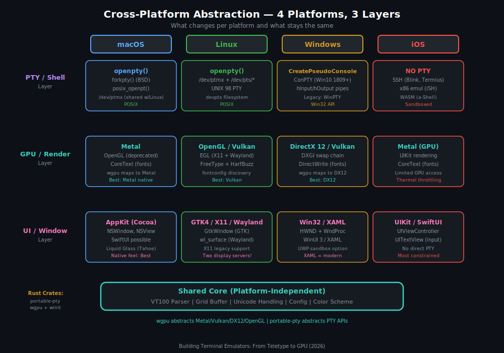

# Part III: Platform Ecosystem (Rubric Analysis)

The terminal emulator landscape in 2025 is remarkably diverse. What was once a stagnant category — where xterm and Terminal.app sufficed for decades — has become one of the most actively developed areas in systems software. GPU-accelerated rendering, AI integration, cross-platform abstractions, and modern language rewrites have transformed terminals from utilitarian necessities into sophisticated engineering artifacts.

This part examines every major terminal emulator across macOS, Windows, Linux, and iOS, providing architecture-level analysis, quantitative benchmarks, and a weighted rubric for objective comparison.

---

## Chapter 8: macOS Terminals

macOS has the richest third-party terminal ecosystem of any platform. The combination of a Unix-native kernel (Darwin/XNU), high-quality font rendering (Core Text), and a developer-heavy user base has produced an extraordinary density of innovation. Six terminals compete for attention, each representing a fundamentally different philosophy.

### 8.1 iTerm2

**Overview**

| Attribute | Detail |
|-----------|--------|
| Current Version | 3.6.9 |
| Language | Objective-C 55.7%, Swift 25.2%, Python 7.8%, C 6.1% |
| Rendering | Metal GPU renderer (since 3.2, 2018) |
| Stars | ~17,000 |
| License | GPL-2.0 |
| Maintainer | George Nachman (gnachman) |
| First Release | 2003 (fork of iTerm, itself a NeXT Terminal clone) |

**Architecture**

iTerm2 is a mature Cocoa application built on AppKit. Its architecture reflects over two decades of incremental evolution — the codebase carries Objective-C patterns dating back to the NeXT era alongside modern Swift modules and a Metal rendering pipeline.

The rendering architecture is layered. At the bottom, a `VT100Terminal` class parses the incoming byte stream from the PTY into terminal state changes. These feed into a `VT100Grid` backed by `LineBuffer`, which stores scrollback as a linked list of line blocks. The Metal renderer (`iTermMetalDriver`) reads the grid state and composites glyphs, cursors, selection highlights, background images, and status bar elements into a single frame. iTerm2 pre-renders its glyph atlas on the CPU using Core Text, then uploads textures to the GPU. This hybrid approach keeps text shaping correct (Core Text handles all the complex script shaping) while still achieving GPU-accelerated compositing.

The PTY management layer supports multiple session types: local shell sessions, SSH sessions (with a custom SSH integration that embeds an SSH client in-process), tmux control-mode sessions, and even Mosh sessions through external integration.

**Python WebSocket API**

iTerm2's most architecturally distinctive feature is its Python scripting API. The terminal exposes a WebSocket server on a local Unix domain socket. A Python library (`iterm2`) connects to this socket and provides full programmatic control over the terminal.

The API surface is substantial — approximately 30 modules covering:

- Session creation and management (`iterm2.Session`)
- Profile manipulation (`iterm2.Profile`, `iterm2.PartialProfile`)
- Custom status bar components (`iterm2.StatusBarComponent`)
- Keyboard and trigger event handling (`iterm2.KeystrokeMonitor`, `iterm2.Trigger`)
- Window arrangement and layout (`iterm2.Tab`, `iterm2.Window`)
- Color scheme manipulation (`iterm2.Color`, `iterm2.ColorPreset`)
- Custom context menu items and toolbar items
- Variable monitoring and modification (`iterm2.VariableMonitor`)

Scripts can be installed as "AutoLaunch" (run on every startup), "Basic" (manually invoked), or daemons. The API supports async/await patterns via `asyncio`, enabling scripts that react to terminal events in real time.

Example — a script that changes the profile based on the current hostname:

```python
import iterm2

async def main(connection):
    app = await iterm2.async_get_app(connection)
    async with iterm2.VariableMonitor(
        connection, iterm2.VariableScopes.SESSION, "hostname", None
    ) as mon:
        while True:
            reference = await mon.async_get()
            session = app.get_session_by_id(reference.session_id)
            hostname = await session.async_get_variable("hostname")
            if "prod" in hostname:
                profile = await iterm2.PartialProfile.async_get(
                    connection, None, "Production-Red"
                )
                await session.async_set_profile_properties(profile)

iterm2.run_forever(main)
```

This kind of deep automation is unique among terminals.

**tmux -CC Integration**

iTerm2 implements tmux control mode (`tmux -CC`), which is a protocol where tmux sends structured commands over a control channel instead of rendering to a virtual screen. iTerm2 parses these commands and maps tmux windows and panes to native iTerm2 tabs and split panes. The result: you get tmux's session persistence with iTerm2's native UI, including Metal rendering, proper scrollback, and mouse support — without the double-buffering overhead of running tmux inside a terminal.

**AI Chat**

Starting in 3.5, iTerm2 includes an AI chat sidebar that can send terminal context (selected text, recent output, command history) to an LLM provider. The AI feature requires 8 explicit permissions to be granted individually, reflecting Nachman's security-conscious approach.

**Session Archiving**

iTerm2 can record complete session transcripts — every byte of input and output with timestamps — to an SQLite database. Sessions can be replayed, searched, and exported. This is fundamentally different from simple scrollback: it captures the full temporal sequence including terminal state changes, alternate screen switches, and cursor movements.

**Strengths**: Most feature-complete terminal on any platform. Python API enables automation impossible elsewhere. tmux integration is best-in-class. Two decades of corner-case fixes means excellent compatibility.

**Weaknesses**: Large codebase with mixed Objective-C/Swift creates maintenance burden. Memory usage can be high with many sessions and large scrollback. macOS-only. Startup time is noticeable (~300ms) compared to newer GPU terminals.

---

### 8.2 Ghostty

**Overview**

| Attribute | Detail |
|-----------|--------|
| Current Version | 1.3.1 |
| Language | Zig (~95%), with platform-native shells in Swift (macOS) and C/GTK (Linux) |
| Rendering | Metal on macOS, OpenGL on Linux |
| Stars | ~48,300 |
| License | MIT |
| Creator | Mitchell Hashimoto (founder of HashiCorp — Terraform, Vagrant, Vault, Consul) |
| Organization | Non-profit under Hack Club |
| First Public Release | December 2024 |

**Architecture**

Ghostty represents the most ambitious from-scratch terminal implementation in recent memory. Hashimoto spent approximately 2.5 years building it, applying the same systems-engineering rigor that produced Terraform to the terminal problem.

The architecture is notable for its strict separation of concerns:

1. **Core Library (libghostty)**: Written entirely in Zig. Contains the VT parser, terminal state machine, grid buffer, font rendering pipeline, and rendering abstraction. This library has zero platform dependencies — it communicates with the outside world exclusively through a C ABI.

2. **Platform Shell**: A thin native application that creates windows, handles input, and calls into libghostty for rendering. On macOS, this is a Swift/AppKit application. On Linux, it is a C application using GTK4. The shell is intentionally minimal — under 5,000 lines on each platform.

3. **Rendering Backend**: Metal on macOS, OpenGL 3.3 on Linux. The renderer implements a custom glyph atlas with dynamic resizing, subpixel positioning, and color emoji support. Ghostty renders directly to the GPU without an intermediate CPU buffer for the common case.

The font stack deserves special mention. Ghostty uses FreeType for glyph rasterization (even on macOS, where most applications use Core Text) but falls back to Core Text for font discovery and complex script shaping. This gives Ghostty consistent rendering across platforms while still handling Arabic, Devanagari, and CJK correctly.

**Performance**

Ghostty's performance numbers are remarkable:

- **Input latency**: ~2ms (measured with Is It Snappy / typometer)
- **Rendering throughput**: 407 FPS in stress tests (uncapped)
- **Startup time**: ~50ms to first frame on macOS
- **Idle RAM**: ~25–35 MB

The low latency comes from an aggressive rendering pipeline. Ghostty maintains a "damage region" that tracks which cells have changed since the last frame. When the damage is small (a few cells from typing), it performs a partial update — only re-rendering the affected glyph textures and compositing them. Full-frame re-renders only happen on scroll, resize, or large output bursts.

**Key Features**

- **Platform-native UI**: Real macOS title bar, proper fullscreen (including native macOS fullscreen with its own Space), correct trackpad gestures. On Linux, proper GTK4 integration with CSD (client-side decorations).
- **Scrollback search**: Incremental search through scrollback with regex support.
- **Quick Terminal**: System-wide hotkey-activated dropdown terminal (similar to Guake/Yakuake on Linux).
- **Configuration**: Plain text config file at `~/.config/ghostty/config`. Hundreds of configurable options, all documented with `ghostty +list-config`.
- **Theme ecosystem**: Ships with hundreds of built-in themes. `ghostty +list-themes` to browse.
- **Font features**: OpenType feature toggles (ligatures, stylistic sets), variable font support.

**Unique Position**

Ghostty occupies a fascinating niche: it is a zero-compromise terminal that prioritizes both raw performance and platform-native feel. Where Alacritty chose minimalism (no tabs, no splits) and Kitty chose its own UI toolkit, Ghostty implements full platform-native chrome while matching or exceeding their performance.

The non-profit structure under Hack Club is also unusual. Hashimoto has stated that Ghostty will never be monetized and that the non-profit structure ensures it outlives any single maintainer.

**Strengths**: Fastest terminal on macOS by most measures. Platform-native UI without compromising performance. Written in Zig, which produces small, fast binaries with minimal runtime overhead. Active development pace. Massive community (48K stars in under a year).

**Weaknesses**: Young project — edge cases and compatibility issues are still being discovered. No scripting API (by design, at least for now). No built-in multiplexing (tabs and splits exist, but no session persistence like tmux). Zig ecosystem is immature compared to Rust.

---

### 8.3 Alacritty

**Overview**

| Attribute | Detail |
|-----------|--------|
| Current Version | 0.16.1 |
| Language | Rust 100% |
| Rendering | OpenGL 3.3 (crossplatform via glutin/winit) |
| Stars | ~57,000 |
| License | Apache-2.0 |
| Creator | Joe Wilm (jwilm), now maintained by Christian Duerr (chrisduerr) |
| First Release | January 2017 |

**Architecture**

Alacritty pioneered the GPU-accelerated terminal concept. When Joe Wilm published his blog post "Alacritty: A GPU-Accelerated Terminal Emulator" in January 2017, it was a revelation — the idea that terminals could use the GPU for rendering was not obvious at the time.

The codebase is organized as a Cargo workspace with four crates:

1. **`alacritty`**: The application binary. Handles window creation (via `winit`), input processing, configuration loading, and the OpenGL rendering pipeline.
2. **`alacritty_terminal`**: The terminal emulation library. Contains the VT parser (a hand-written state machine based on Paul Williams' parser), the grid/cell storage, and the PTY interface. This crate has no GPU or windowing dependencies — it is a pure terminal emulation library.
3. **`alacritty_config`**: Configuration deserialization from TOML.
4. **`alacritty_config_derive`**: Procedural macros for configuration.

The separation of `alacritty_terminal` from the application is architecturally significant. Other projects (notably `wezterm`) have used `alacritty_terminal` as a dependency. It proves that terminal emulation logic can be cleanly isolated from rendering.

The OpenGL renderer works as follows:

1. Build a glyph atlas: rasterize each unique glyph to a bitmap using platform font APIs (Core Text on macOS, FreeType on Linux, DirectWrite on Windows), then pack these bitmaps into a single large texture atlas.
2. For each frame, iterate over the grid cells. For each cell, emit a textured quad (two triangles) referencing the glyph in the atlas, plus a background quad with the cell's background color.
3. Submit all quads in a single draw call using instanced rendering.

This "batch everything into one draw call" approach is why Alacritty was fast for its time, though the OpenGL renderer is now showing its age compared to Metal and wgpu-based approaches.

**Design Philosophy**

Alacritty is intentionally minimalist. The project README states: "Alacritty is a modern terminal emulator that comes with sensible defaults, but allows for extensive configuration. By integrating with other applications, rather than reimplementing their functionality, it manages to provide a flexible set of features with high performance."

In practice, this means:
- **No tabs**: Use tmux or your window manager.
- **No splits**: Use tmux.
- **No built-in multiplexing**: Use tmux.
- **No scripting API**: Use shell scripts and IPC.
- **TOML configuration**: No GUI settings panel.

This is a principled design choice, not a limitation. Alacritty does one thing — display a fast, correct terminal — and delegates everything else.

**Performance**

- **Input latency**: ~3ms
- **Startup time**: ~80ms
- **Idle RAM**: ~15–25 MB
- **Throughput**: Excellent for its era, though no longer the fastest

**Strengths**: Rock-solid stability after 8 years of development. True cross-platform (macOS, Linux, Windows, FreeBSD). Minimal attack surface due to small scope. Excellent tmux pairing. Clean Rust codebase that serves as a reference implementation.

**Weaknesses**: OpenGL renderer is aging (no Metal path, no Vulkan). Still at 0.x version — the maintainers are cautious about 1.0. No image display protocol support. The minimalist philosophy means features that other terminals consider basic (inline images, ligatures for a long time) are absent or late.

---

### 8.4 Kitty

**Overview**

| Attribute | Detail |
|-----------|--------|
| Current Version | 0.46.2 |
| Language | C (~60%), Python (~35%), Go (kittens) |
| Rendering | OpenGL 3.3 |
| Stars | ~23,200 |
| License | GPL-3.0 |
| Creator/Maintainer | Kovid Goyal |
| First Release | 2017 |

**Architecture**

Kitty is a unique hybrid: the performance-critical rendering and terminal emulation are written in C, while the extensibility layer and much of the UI logic are written in Python. This is not the typical "C core with Python bindings" pattern — Kitty embeds a full CPython interpreter and uses it extensively for configuration, UI, and the plugin system.

The C core handles:
- VT parsing (a custom parser, not based on the vte library)
- Grid cell storage and manipulation
- OpenGL rendering (glyph atlas, cell compositing, image display)
- Input processing at the raw event level

The Python layer handles:
- Configuration parsing and live reload
- Tab and window management UI
- The "kittens" plugin system
- Shell integration scripts
- Remote control protocol server

Communication between C and Python happens through a shared memory interface for the grid data and function calls for events.

**Kitty Graphics Protocol**

Kitty's most influential contribution to the terminal ecosystem is its graphics protocol. Before Kitty, the only option for displaying images in a terminal was the Sixel protocol from 1984, which is limited to 256 colors (in most implementations) and has no mechanism for animation, image management, or Unicode placeholder integration.

The Kitty graphics protocol transmits image data via escape sequences:

```
\033_Ga=t,f=100,s=<width>,v=<height>,m=1;\033\\  # transmit PNG data
\033_Ga=p,i=<id>,p=<placement_id>,z=<z-index>;\033\\  # place image
\033_Ga=d,d=i,i=<id>;\033\\  # delete image
```

Key design decisions:
- Images are transmitted once and assigned an ID. Subsequent references use the ID, avoiding retransmission.
- Images can be placed at specific cell positions with sub-cell precision.
- Virtual placements allow images to survive scrollback.
- Animation is supported natively with frame management commands.
- Unicode placeholders allow images to be represented in the text grid as special Unicode characters, enabling them to work with screen, tmux, and other multiplexers.

The protocol has become a de facto standard. It is now supported by Ghostty, WezTerm, Konsole, foot, and several other terminals. Libraries like `chafa`, `timg`, and `viu` use it. TUI frameworks like `ratatui` support it.

**Kittens Plugin System**

Kittens are Python programs that run inside Kitty and have access to the terminal's internal state. They can draw custom UI, handle keyboard input, modify the terminal grid, and communicate with the shell.

Built-in kittens include:
- `icat`: Display images in the terminal
- `diff`: Side-by-side file diff with syntax highlighting
- `unicode_input`: Browse and insert Unicode characters
- `ssh`: SSH with automatic shell integration and kitten deployment
- `clipboard`: Programmatic clipboard access
- `themes`: Browse and apply themes interactively
- `hints`: Clickable hints for URLs, paths, hashes (similar to Vimium)

Custom kittens can be written by users, giving Kitty an extensibility story that is richer than Alacritty (none) or Ghostty (none) but different in character from iTerm2 (WebSocket API).

**Kitty Keyboard Protocol**

Kitty also proposed a keyboard protocol extension that is gaining traction. The standard terminal keyboard protocol (inherited from VT100) cannot distinguish between many key combinations — for example, `Ctrl+I` and `Tab` produce the same byte (0x09). The Kitty keyboard protocol sends full key event information including:

- Physical key identity (key code)
- Modifier state (shift, ctrl, alt, super, caps lock, num lock)
- Event type (press, repeat, release)
- Associated text (for keys that produce text)

This protocol is now supported by foot, WezTerm, Ghostty, and is used by Neovim and other TUI applications.

**Strengths**: Most extensible terminal via kittens. Graphics protocol is becoming the standard. Keyboard protocol solves real problems. Excellent documentation. Kovid Goyal is a meticulous and responsive maintainer.

**Weaknesses**: The C/Python hybrid architecture makes contributions harder. OpenGL only (no Metal path). The GPL-3.0 license is restrictive for some use cases. Python dependency adds startup overhead. Controversial maintainer interactions in issue tracker have alienated some potential contributors.

---

### 8.5 Terminal.app

**Overview**

| Attribute | Detail |
|-----------|--------|
| Current Version | macOS Tahoe (2025 — first major redesign in 24 years) |
| Language | Objective-C/Swift (Apple internal) |
| Rendering | Core Animation / Core Text (CPU-composited) |
| Stars | N/A (closed source, ships with macOS) |
| License | Proprietary (part of macOS) |
| Origin | NeXTSTEP Terminal, inherited by macOS in 2001 |

**Historical Context**

Terminal.app is one of the oldest continuously maintained terminal emulators. Its lineage traces directly to the NeXTSTEP Terminal application from the early 1990s. When Apple acquired NeXT in 1996, Terminal came along with the rest of the operating system that would become Mac OS X.

For 24 years (2001–2025), Terminal.app received only incremental updates. It gained tabs, basic profiles, and improved Unicode support, but its rendering capabilities remained stuck in the early 2000s. Most notably, it lacked 24-bit true color support — a capability that even xterm added in 2012. This limitation made Terminal.app increasingly problematic as TUI applications adopted true color for syntax highlighting, image approximation, and theming.

**macOS Tahoe Redesign**

The macOS Tahoe release in 2025 brought the first significant Terminal.app redesign in its history:

- **24-bit True Color**: Finally. Terminal.app now supports the `\033[38;2;r;g;bm` SGR sequence for 16.7 million colors. This single change removes the primary reason developers switched away from Terminal.app.
- **Powerline Font Support**: Proper rendering of the Powerline/Nerd Font special characters used by modern shell prompts (Oh My Zsh, Starship, Powerlevel10k). Previous versions would display blank rectangles or misaligned glyphs.
- **Liquid Glass Aesthetic**: The visual redesign follows Apple's system-wide "Liquid Glass" design language, with translucent window chrome and updated tab styling.
- **Improved Performance**: Scrollback performance improvements suggest internal buffer optimizations, though Apple has not published architectural details.

**Architecture (Inferred)**

As a closed-source Apple application, Terminal.app's architecture must be inferred from behavior and reverse engineering:

- **Text rendering**: Core Text (Apple's text shaping and rasterization engine). This gives Terminal.app excellent font rendering quality — arguably the best of any terminal on macOS, since Core Text is the canonical implementation.
- **Compositing**: Core Animation layers. The terminal view is likely a custom NSView with a backing CALayer. Rendering is CPU-based — Terminal.app does not use Metal or OpenGL for text.
- **VT parsing**: Custom implementation. Terminal.app's escape sequence support has historically lagged behind xterm, but the Tahoe release closes many gaps.
- **PTY**: Standard macOS `posix_openpt()` / `forkpty()`.

**Strengths**: Zero installation — ships with every Mac. Best Core Text rendering (no intermediate rasterization step). Integrates with macOS services (Spotlight, Handoff, etc.). The Tahoe redesign finally brings it into the modern era. Extremely low memory footprint (~20 MB).

**Weaknesses**: Closed source — no community contributions. No extension or scripting API. No GPU rendering. Feature set is still far behind iTerm2, Kitty, or Ghostty. No inline image support. Limited configurability.

---

### 8.6 Warp

**Overview**

| Attribute | Detail |
|-----------|--------|
| Current Version | Continuously deployed (SaaS model) |
| Language | Rust (core), TypeScript (UI elements) |
| Rendering | Metal on macOS (GPU-accelerated) |
| Stars | ~22,000 (partial open source) |
| License | Proprietary (freemium: free tier + $20/month Pro) |
| Founder | Zach Lloyd (ex-Google, worked on Google Sheets) |
| Funding | ~$70M venture capital |

**Architecture**

Warp represents the most radical rethinking of what a terminal can be. Rather than treating the terminal as a character grid with a scrollback buffer, Warp introduces a **block-based** model. Each command and its output form a discrete "block" — a unit that can be selected, shared, bookmarked, searched, and acted upon independently.

The rendering engine is written in Rust and uses Metal for GPU-accelerated compositing. The input area is not a standard terminal line — it is a rich text editor with syntax highlighting, multi-cursor support, and tab completion that resembles VS Code's editor more than a shell prompt.

**Key Features**

- **AI Command Suggestions**: Warp integrates with LLMs to provide natural-language-to-command translation. Type a description of what you want to do, and Warp suggests the command. This is context-aware — it considers your current directory, shell, and recent commands.
- **Warp Drive**: A team collaboration feature. Workflows (parameterized command templates), notebooks, and environment configurations can be shared across a team.
- **Block-based Output**: Each command's output is a collapsible, searchable, shareable block. You can copy the output of a specific command without selecting text. Blocks can be shared via URL.
- **IDE-like Input Editor**: The command input area supports multi-line editing with syntax highlighting, bracket matching, and inline error detection.
- **Workflows**: Parameterized command templates with descriptions, arguments, and documentation. Think of them as executable runbooks.

**Controversy**

Warp's approach is polarizing. Critics argue that:
- The freemium model creates uncertainty about long-term viability of the free tier.
- Telemetry concerns (Warp collects usage analytics, though commands and output are not sent to servers).
- The AI features require cloud connectivity, which is unacceptable in some security environments.
- The non-standard input model breaks muscle memory and some shell integrations.

Supporters argue that:
- The terminal UX has been stagnant for decades and deserves innovation.
- AI assistance genuinely helps less experienced users.
- The block model is objectively better for output management.
- The Rust rendering engine is genuinely fast.

**Strengths**: Most innovative UX in the terminal space. AI integration is well-executed. Block model genuinely improves output management. Fast rendering. Strong onboarding for new developers.

**Weaknesses**: Proprietary and venture-funded — longevity concerns. $20/month for Pro features. Linux support came late and is less polished. The non-standard input model creates compatibility friction. Telemetry concerns. Cannot be self-hosted.

---

## Chapter 9: Windows Terminals

The Windows terminal story is one of historical debt and modern redemption. For decades, the Windows console subsystem was an afterthought — a compatibility layer for DOS applications that was architecturally incapable of supporting modern terminal features. The introduction of Windows Terminal in 2019 and the ConPTY API in 2018 represent the most significant changes to Windows console infrastructure since Windows NT in 1993.

### 9.1 Windows Terminal

**Overview**

| Attribute | Detail |
|-----------|--------|
| Current Version | 1.25 |
| Language | C++ ~85%, C# ~10%, XAML ~5% |
| Rendering | DirectX 11 via XAML (with Direct2D text rendering) |
| Stars | ~102,000 (highest of any terminal emulator) |
| License | MIT |
| Maintainer | Microsoft (Windows Console team) |
| First Release | May 2019 (preview), May 2020 (1.0) |

**Architecture**

Windows Terminal's architecture is more complex than any other terminal in this survey because it must bridge two fundamentally different worlds: the modern GPU-rendered UI and the legacy Windows Console API.

The application is structured as follows:

```
┌─────────────────────────────────────────┐
│         Windows Terminal (XAML)          │
│  ┌──────────┬──────────┬──────────┐     │
│  │   Tab 1  │   Tab 2  │   Tab 3  │     │
│  ├──────────┴──────────┴──────────┤     │
│  │    TerminalControl (XAML)      │     │
│  │    ┌─────────────────────┐     │     │
│  │    │  DX Renderer        │     │     │
│  │    │  (Direct2D/Direct3D)│     │     │
│  │    └─────────────────────┘     │     │
│  └────────────────────────────────┘     │
│               │                         │
│        ConPTY Interface                 │
│               │                         │
└───────────────┼─────────────────────────┘
                │
    ┌───────────┼───────────┐
    │    conhost.exe         │
    │    (Console Server)    │
    │    ┌──────────────┐    │
    │    │ VT Parser    │    │
    │    │ Console API  │    │
    │    │ Translation  │    │
    │    └──────────────┘    │
    └───────────┼────────────┘
                │
         ┌──────┴──────┐
         │ Shell Process│
         │ (cmd, pwsh,  │
         │  wsl, etc.)  │
         └─────────────┘
```

**Layer 1: XAML Application**. The outermost layer is a UWP/WinUI application using XAML for the chrome — tabs, settings UI, command palette, and window management. This is distributed through the Microsoft Store (and also as an MSIX package).

**Layer 2: Terminal Control**. A XAML control (`TerminalControl`) that hosts the terminal rendering surface. This is where DirectX rendering happens. The control receives VT sequences from ConPTY, parses them into a grid buffer, and renders the grid using Direct2D for text (leveraging DirectWrite for font shaping) and Direct3D for compositing.

**Layer 3: ConPTY**. The Pseudo Console API, introduced in Windows 10 1809 (October 2018). This is the critical bridge layer. ConPTY creates a pseudo console (analogous to Unix PTY) that translates between VT escape sequences and the legacy Windows Console API. This means that old console applications (dir, ipconfig, etc.) that use the Win32 Console API still work — ConPTY translates their API calls into VT sequences that Windows Terminal can render.

**Layer 4: conhost.exe**. The console host process that has existed since Windows 7. In the ConPTY architecture, conhost.exe runs in "headless" mode — it processes Console API calls from the shell/application but instead of rendering them to a window, it emits VT sequences through the ConPTY pipe.

**Rendering**

The DirectX renderer is a significant engineering effort. Text rendering uses DirectWrite with Direct2D, which provides:
- ClearType and grayscale antialiasing
- Font fallback chains
- Complex script shaping (bidirectional text, ligatures, combining characters)
- Color emoji via DirectWrite's color font support

The renderer maintains a glyph atlas similar to GPU terminals on other platforms, but uses Direct2D for rasterization rather than FreeType. Background colors, selection highlights, and cursor rendering use Direct3D primitives.

A key architectural detail: the renderer supports "software" mode (CPU via WARP — Windows Advanced Rasterization Platform, not to be confused with the terminal named Warp) for environments where GPU access is unavailable (remote desktop, certain virtual machines). This fallback ensures Windows Terminal works in enterprise environments where GPU passthrough may not be configured.

**Profile System**

Windows Terminal's configuration centers on profiles. Each profile defines a shell (cmd, PowerShell, WSL distribution, SSH connection), appearance (colors, font, opacity, background image), and behavior. Profiles are stored in a `settings.json` file with a layered defaults system:

```json
{
    "defaultProfile": "{574e775e-4f2a-5b96-ac1e-a2962a402336}",
    "profiles": {
        "defaults": {
            "font": { "face": "Cascadia Code", "size": 12 },
            "opacity": 95,
            "useAcrylic": true
        },
        "list": [
            {
                "name": "PowerShell",
                "guid": "{574e775e-4f2a-5b96-ac1e-a2962a402336}",
                "source": "Windows.Terminal.PowershellCore",
                "colorScheme": "One Half Dark"
            },
            {
                "name": "Ubuntu",
                "guid": "{2c4de342-38b7-51cf-b940-2309a097f518}",
                "source": "Windows.Terminal.Wsl"
            }
        ]
    }
}
```

Auto-detection of installed shells (WSL distributions, PowerShell versions, Azure Cloud Shell, SSH connections via OpenSSH config) makes the profile system feel seamless.

**Strengths**: Massive community and Microsoft backing. Excellent rendering quality. Profile system is well-designed. GPU-accelerated. Auto-detects shells. Microsoft Store distribution with auto-updates. The 102K stars reflect genuine community enthusiasm.

**Weaknesses**: Windows-only (by design — it is deeply integrated with the Windows console subsystem). XAML framework adds overhead (~80 MB RAM baseline). Startup time (~400ms) is slower than lightweight terminals. ConPTY translation layer introduces occasional rendering artifacts with legacy Console applications. Some advanced VT sequences are still not supported.

---

### 9.2 PowerShell

**Overview**

| Attribute | Detail |
|-----------|--------|
| Current Version | 7.6 LTS |
| Language | C# / .NET 8 |
| Platform | Cross-platform (Windows, macOS, Linux) |
| Stars | ~47,000 |
| License | MIT |
| Type | Shell and scripting language (not a terminal emulator) |

**Why PowerShell Matters in a Terminal Book**

PowerShell is not a terminal emulator — it is a shell. But its design philosophy is so fundamentally different from Unix shells that understanding it is essential for anyone building or configuring terminals, especially on Windows.

**Object Pipeline vs Text Pipeline**

The defining difference between PowerShell and every Unix shell is the pipeline model:

```bash
# Bash: text pipeline — commands emit and consume text
ps aux | grep nginx | awk '{print $2}' | xargs kill

# PowerShell: object pipeline — commands emit and consume .NET objects
Get-Process -Name nginx | Stop-Process
```

In bash, `ps aux` emits lines of text. `grep` filters text by pattern. `awk` extracts the second whitespace-delimited field. Each stage parses and re-serializes text. This is fragile — if the column order changes, the pipeline breaks.

In PowerShell, `Get-Process` emits `System.Diagnostics.Process` objects. These objects have typed properties (`.Id`, `.Name`, `.CPU`, `.WorkingSet`). `Stop-Process` receives these objects and calls their `.Kill()` method. No text parsing, no column alignment assumptions, no fragility.

This has profound implications for terminal emulators:
- PowerShell output is inherently structured, which enables rich rendering (tables, formatting, color) without escape sequence hacks.
- PowerShell's `$PSStyle` system (7.2+) provides semantic terminal formatting — the shell knows about the terminal's capabilities and adjusts its output accordingly.
- `Out-GridView` can pop up an interactive GUI table — a concept that has no equivalent in Unix shells.

**Cross-Platform Reality**

PowerShell 7.x runs on macOS and Linux via .NET's cross-platform runtime. However, many Windows-specific cmdlets (Active Directory, IIS, Windows services) are unavailable. The cross-platform value of PowerShell is primarily for scripting — the object pipeline, structured error handling (`try/catch`), and module system are genuinely useful regardless of platform.

**Terminal Integration**

PowerShell 7.2+ includes PSReadLine with predictive IntelliSense — as you type, PowerShell shows predicted completions based on your command history, similar to Fish shell's autosuggestions. This is a shell feature, but it interacts with the terminal's rendering — predictive text is displayed in a dim color using ANSI escape sequences, and the terminal must handle the cursor positioning correctly for inline predictions.

---

### 9.3 cmd.exe

**Overview**

| Attribute | Detail |
|-----------|--------|
| Heritage | COMMAND.COM (DOS) → cmd.exe (Windows NT, 1993) |
| Language | C (Win32) |
| Rendering | GDI (legacy text rendering) |
| RAM | ~3 MB |
| Status | Legacy, still maintained for backward compatibility |

**Why It Still Exists**

cmd.exe persists for two reasons:

1. **Batch files**: Millions of `.bat` and `.cmd` scripts exist in enterprise environments. These scripts use cmd.exe-specific syntax (`%VARIABLE%`, `IF ERRORLEVEL`, `FOR /F`) that is not compatible with PowerShell without rewriting. Enterprises cannot justify the cost of rewriting decades of automation.

2. **Windows Console API**: cmd.exe uses the Win32 Console API directly — `WriteConsoleOutput`, `ReadConsoleInput`, `SetConsoleCursorPosition`. Some older applications expect this API's specific behavior (especially around input buffering and character encoding). Running these applications through ConPTY's VT translation layer occasionally produces subtle differences.

**Rendering**

cmd.exe renders text using GDI (Graphics Device Interface), the original Windows graphics API from Windows 1.0 (1985). GDI text rendering:
- Operates entirely on the CPU
- Uses bitmap fonts or TrueType through the GDI font mapper
- Renders to a character cell grid maintained by conhost.exe
- Supports 16 colors (the classic Windows console palette)
- ClearType antialiasing through the GDI ClearType pipeline

The visual quality is noticeably inferior to DirectWrite (Windows Terminal) or Core Text (macOS), but it is rock-solid and extremely fast for small output volumes.

**For Terminal Authors**

If you are building a terminal for Windows, you will inevitably need to handle cmd.exe and legacy Console applications. The ConPTY API handles the translation, but you should be aware of:
- The legacy 16-color palette (the default colors are different from the xterm 16 colors)
- Line ending differences (CRLF vs LF)
- Character encoding (cmd.exe defaults to the system OEM code page, not UTF-8, though `chcp 65001` can switch to UTF-8)
- Console API quirks like `ENABLE_VIRTUAL_TERMINAL_PROCESSING` mode

---

### 9.4 ConPTY Architecture Deep Dive

The Console Pseudo Terminal (ConPTY) API, introduced in Windows 10 version 1809, is the most important Windows console infrastructure change since Windows NT. Understanding ConPTY is essential for building any terminal on Windows.

**The Problem: Pre-ConPTY Architecture**

Before ConPTY, Windows terminal emulation worked like this:

```
┌──────────────┐     Console API      ┌──────────────┐
│ Console App  │ ◄──────────────────► │ conhost.exe  │
│ (cmd, etc.)  │   (WriteConsole,     │ (renders to  │
│              │    ReadConsole,       │  a window)   │
│              │    SetCursorPos)      │              │
└──────────────┘                      └──────────────┘
```

The console application and conhost.exe communicated through a private, undocumented IOCTL-based protocol over an ALPC (Advanced Local Procedure Call) channel. conhost.exe was both the terminal emulator AND the console server. There was no way for a third-party terminal to intercept this communication.

This is why, historically, Windows had no real terminal emulator ecosystem. On Unix, any application can open a PTY and be a terminal. On Windows, you were stuck with conhost.exe (or its visual wrapper, the Windows Console).

Workarounds existed — WinPTY (used by VS Code, MinTTY, and others) created a hidden console window and scraped its contents via the Console API, then re-emitted the screen contents as VT sequences. This was fragile, slow, and lossy.

**The Solution: ConPTY**

ConPTY introduces a proper pseudoterminal abstraction to Windows:

```
┌──────────────┐     Console API      ┌──────────────┐     VT Sequences    ┌──────────────┐
│ Console App  │ ◄──────────────────► │ conhost.exe  │ ◄────────────────► │ Terminal     │
│ (cmd, etc.)  │   (WriteConsole,     │ (headless    │   (ConPTY pipe)    │ (Windows     │
│              │    ReadConsole)       │  mode)       │                    │  Terminal,   │
│              │                      │              │                    │  etc.)       │
└──────────────┘                      └──────────────┘                    └──────────────┘
```

The API surface is small:

```c
HRESULT CreatePseudoConsole(
    COORD size,             // Terminal dimensions (columns x rows)
    HANDLE hInput,          // Pipe: terminal writes input here
    HANDLE hOutput,         // Pipe: terminal reads output here
    DWORD dwFlags,          // PSEUDOCONSOLE_INHERIT_CURSOR
    HPCON* phPC             // Output: pseudo console handle
);

HRESULT ResizePseudoConsole(HPCON hPC, COORD size);
void ClosePseudoConsole(HPCON hPC);
```

The flow:
1. The terminal creates two pipes (input and output).
2. `CreatePseudoConsole()` creates a pseudo console attached to these pipes. Internally, this launches a headless conhost.exe instance.
3. The terminal spawns the shell process (cmd.exe, powershell.exe, etc.) with the pseudo console as its console.
4. The shell writes to the Console API as usual. conhost.exe translates these API calls into VT escape sequences and writes them to the output pipe.
5. The terminal reads VT sequences from the output pipe and renders them.
6. User input flows in reverse: the terminal writes VT sequences to the input pipe, conhost.exe translates them to Console API input events.

**Implications**

ConPTY is what made Windows Terminal possible. It is also what enabled:
- VS Code's integrated terminal on Windows (migrated from WinPTY to ConPTY)
- WSL terminal sessions in third-party terminals
- SSH server on Windows (OpenSSH for Windows uses ConPTY)
- Any third-party terminal on Windows

The translation is not always perfect — some Console API calls have no clean VT equivalent (e.g., `WriteConsoleOutput` can update arbitrary rectangular regions of the screen, which maps poorly to VT's cursor-based model). But it is enormously better than the screen-scraping approach of WinPTY.

---

### 9.5 WSL Bridge

**Architecture**

Windows Subsystem for Linux version 2 (WSL2) runs a real Linux kernel in a lightweight Hyper-V virtual machine. The terminal integration works as follows:

```
┌──────────────────────────────────────────────────────┐
│                    Windows Host                       │
│  ┌──────────────┐     ConPTY     ┌──────────────┐   │
│  │ Windows      │ ◄────────────► │  wsl.exe     │   │
│  │ Terminal     │                │  (launcher)  │   │
│  └──────────────┘                └──────┬───────┘   │
│                                         │            │
│                              ───────────┼─────────── │
│                                         │  vsock     │
│  ┌──────────────────────────────────────┼──────────┐ │
│  │              WSL2 VM (Hyper-V)       │          │ │
│  │  ┌──────────────┐    ┌──────────────┐│          │ │
│  │  │ /init        │    │ Linux PTY    ││          │ │
│  │  │ (WSL init)   │───►│ /dev/pts/N   ││          │ │
│  │  └──────────────┘    └──────┬───────┘│          │ │
│  │                             │                   │ │
│  │                      ┌──────┴───────┐           │ │
│  │                      │ bash/zsh     │           │ │
│  │                      │ (Linux shell)│           │ │
│  │                      └──────────────┘           │ │
│  └─────────────────────────────────────────────────┘ │
└──────────────────────────────────────────────────────┘
```

The chain is: Windows Terminal → ConPTY → wsl.exe → vsock (VM socket) → WSL2 init → Linux PTY → shell.

**Filesystem Bridge**

WSL2 uses the 9P protocol for filesystem sharing between Windows and Linux:
- Linux files are accessible from Windows at `\\wsl$\<distro>\` (via a 9P server in the WSL2 VM).
- Windows files are accessible from Linux at `/mnt/c/`, `/mnt/d/`, etc. (via a 9P client in the WSL2 VM mounting the Windows filesystem).

The 9P translation adds latency — filesystem operations across the boundary are 2–10x slower than native operations. This is why running `git` or `npm install` on Windows files from WSL2 is slow, and why the WSL documentation recommends keeping project files on the Linux filesystem.

**Network Bridge**

WSL2's networking has evolved:
- **NAT mode** (default): The WSL2 VM gets its own IP address on a virtual switch. localhost from WSL2 does not equal localhost on Windows (though a localhost forwarding hack was added).
- **Mirrored networking mode** (Windows 11 22H2+): WSL2 shares the host's network stack. localhost is the same from both Windows and WSL2. This mode resolves most networking pain points.

For terminal authors building on Windows, WSL support is essential. Windows Terminal handles this well — WSL distributions appear as auto-detected profiles and can be launched with a single click.

---

## Chapter 10: Linux Terminals

Linux has the most diverse terminal ecosystem of any platform, spanning from xterm (1984, still maintained) to Ghostty (2024). The diversity reflects Linux's architectural openness — anyone can create a terminal that talks to the PTY layer and renders to X11 or Wayland.

### 10.1 GNOME Terminal and the VTE Library

**Overview**

| Attribute | Detail |
|-----------|--------|
| Current Version | 3.54 (GNOME 47) |
| Language | C (VTE library), C/Vala (GNOME Terminal application) |
| Rendering | CPU rendering via Cairo (GTK4) |
| RAM | ~50 MB |
| License | GPL-3.0 |
| Toolkit | GTK4 |

**VTE: The Shared Library**

GNOME Terminal is architecturally significant not for itself, but for the library it uses: **VTE (Virtual Terminal Emulator)**. VTE is a GTK widget that provides complete terminal emulation — VT parsing, grid management, text rendering, selection, scrollback, and input handling — in a single embeddable component.

VTE is used by:
- GNOME Terminal
- Tilix (tiling terminal for GNOME)
- Terminator (multi-pane terminal)
- XFCE Terminal
- MATE Terminal
- Guake (dropdown terminal)
- Many others

This means that these terminals share the same core terminal emulation behavior. Differences between them are primarily in window management, configuration UI, and features layered on top of VTE (e.g., Tilix adds tiling, Guake adds the dropdown feature).

VTE's rendering pipeline:
1. Receive bytes from the PTY.
2. Parse through a VT state machine (based on the ECMA-48 standard with xterm extensions).
3. Store characters in a ring buffer organized as rows of cells.
4. For each frame, iterate over visible rows, shape text using HarfBuzz and Pango, and render glyphs using Cairo.
5. Composite the result to the GTK drawing surface.

This is entirely CPU-based. VTE does not use OpenGL or Vulkan. This limits throughput — `cat`-ing a large file is noticeably slower in VTE-based terminals than in GPU-accelerated terminals. However, CPU rendering has advantages: it works everywhere (including remote X11, Wayland with software rendering, and virtual machines without GPU passthrough), and it avoids the complexity and driver-dependency of GPU rendering.

**Strengths**: Rock-solid VT emulation (VTE is extremely well-tested). Excellent font rendering via Pango/HarfBuzz. Deep desktop integration (GNOME notifications, desktop files, D-Bus). VTE is the standard terminal library for GTK applications.

**Weaknesses**: CPU rendering limits throughput. VTE's API restricts what applications built on it can customize. Memory usage is moderate. No GPU rendering path. Configuration is limited to GNOME's dconf/GSettings system.

---

### 10.2 Konsole

**Overview**

| Attribute | Detail |
|-----------|--------|
| Current Version | 24.12 (KDE Gear) |
| Language | C++ |
| Rendering | CPU rendering via QPainter (Qt6) |
| RAM | ~55 MB |
| License | GPL-2.0 |
| Toolkit | Qt6 / KDE Frameworks |

Konsole is the KDE equivalent of GNOME Terminal — the default terminal for the KDE Plasma desktop. Unlike GNOME Terminal, Konsole does not use a shared library like VTE; its terminal emulation is implemented directly within the Konsole codebase.

**Key Features**
- **Split views**: Horizontal and vertical splits within a single window, similar to tmux but GUI-native.
- **Session profiles**: Extensive profile system with per-profile appearance, behavior, and shell configuration.
- **Edit current line**: Konsole can open the current command line in a full text editor (via `$VISUAL` or `$EDITOR`).
- **SSH manager**: Built-in SSH connection management with profile integration.
- **Bookmarks**: Bookmark directories and SSH connections.
- **Activity/silence monitoring**: Konsole can notify you when a tab produces output (activity) or stops producing output (silence). This is useful for monitoring long-running builds.
- **Kitty keyboard protocol support**: Konsole has adopted the Kitty keyboard protocol.
- **Kitty graphics protocol support**: Image display via the Kitty protocol.

**Rendering**

Konsole uses QPainter for rendering, which is Qt's 2D drawing abstraction. QPainter can use various backends:
- Software rasterization (default on most Linux configurations)
- OpenGL (via QOpenGLWidget — available but not the default)

In practice, Konsole rendering is CPU-bound. Text shaping uses Qt's text layout engine (which in turn uses HarfBuzz). The performance is adequate for normal use but noticeably slower than GPU-accelerated terminals for bulk output.

**Strengths**: Feature-rich. Deep KDE integration. Excellent profile system. Split views are native and well-implemented. Activity monitoring is unique and useful.

**Weaknesses**: CPU rendering limits throughput. C++ codebase is large and complex. Qt dependency is heavy. KDE-specific features are not useful outside KDE.

---

### 10.3 Kitty on Linux

Kitty on Linux shares the same codebase as on macOS (covered in Chapter 8), but the platform integration differs:

- **Wayland native**: Kitty has first-class Wayland support, using the `wl_surface` protocol directly.
- **X11 support**: Also supports X11 via Xlib.
- **OpenGL rendering**: Same OpenGL 3.3 renderer on both platforms.
- **Font rendering**: Uses FreeType and HarfBuzz (instead of Core Text on macOS), giving it Linux-native font rendering behavior (subpixel hinting, LCD filtering configured via fontconfig).
- **Performance**: Generally the fastest terminal on Linux for bulk throughput, due to OpenGL batch rendering.

Kitty is particularly popular on Linux because its kittens plugin system, graphics protocol, and keyboard protocol are all features that the Linux developer community values.

---

### 10.4 Alacritty on Linux

Similarly, Alacritty on Linux shares the same codebase as on macOS. Key Linux-specific notes:

- Supports both X11 and Wayland (via `winit`'s platform abstraction).
- Font rendering uses FreeType/fontconfig.
- OpenGL 3.3 rendering — identical pipeline to macOS.
- On Wayland, Alacritty uses client-side decorations (CSD) via `winit`, which may not match the desktop theme.

Alacritty is a popular choice on Linux for users who prefer the tmux + minimal terminal workflow.

---

### 10.5 st (suckless terminal)

**Overview**

| Attribute | Detail |
|-----------|--------|
| Language | C (~2,000 lines) |
| Rendering | X11 (Xlib) / Xft for fonts |
| RAM | ~5 MB |
| License | MIT |
| Philosophy | suckless.org — "software that sucks less" |
| Configuration | C header file (config.h), recompile to change settings |

**Why st Matters**

st is the most educational terminal emulator in existence. At approximately 2,000 lines of C (excluding the config header), it implements a functional terminal with:
- VT100/VT220/xterm escape sequence support
- 256 colors and true color
- UTF-8 support
- Selection and clipboard (X11 CLIPBOARD and PRIMARY)
- Font rendering via Xft (which uses FreeType)

The entire codebase fits in a single reading session. For anyone building their own terminal, st is the first source code to study.

**Architecture**

```c
// Simplified st architecture (conceptual):

int main() {
    // 1. Create X11 window
    xw.dpy = XOpenDisplay(NULL);
    xw.win = XCreateSimpleWindow(...);

    // 2. Open PTY
    pid = forkpty(&master, NULL, NULL, &ws);
    if (pid == 0) {
        execvp(shell, args);  // Child: run shell
    }

    // 3. Main event loop
    for (;;) {
        FD_SET(master, &rfd);          // Watch PTY for output
        FD_SET(xfd, &rfd);             // Watch X11 for input
        select(max + 1, &rfd, NULL, NULL, &tv);

        if (FD_ISSET(master, &rfd))
            ttyread();                  // Read from PTY, parse VT sequences
        if (FD_ISSET(xfd, &rfd))
            xev_process();              // Process X11 events (keypress, etc.)

        draw();                         // Render grid to X11 window
    }
}
```

This is terminal emulation reduced to its essence: a PTY, an X11 window, a VT parser, and a render loop.

**The Patch System**

st ships without many features that users consider essential — scrollback, transparency, ligatures, and more. The suckless philosophy is that users should apply patches (diff files) to add the features they want. The suckless website hosts a patch collection. This is controversial but educational — each patch teaches you how a specific feature works by showing the minimal code change needed to implement it.

**Strengths**: Most readable terminal codebase. Minimal dependencies (only Xlib and Xft). Tiny binary and memory footprint. Perfect for learning.

**Weaknesses**: X11 only (no Wayland). Patch-based customization is tedious. No GPU acceleration. The suckless philosophy actively discourages features. CPU rendering is slow for bulk output. Xft font rendering lacks HarfBuzz shaping.

---

### 10.6 foot

**Overview**

| Attribute | Detail |
|-----------|--------|
| Current Version | 1.20+ |
| Language | C |
| Rendering | Custom Wayland renderer (CPU rasterization with `wl_shm`) |
| RAM | ~12 MB |
| License | MIT |
| Creator | Daniel Eklof |
| Focus | Wayland-native, minimal, fast |

foot is the terminal of choice for Wayland purists. It is written specifically for Wayland — there is no X11 backend, no XWayland compatibility layer. This constraint allows foot to optimize aggressively for the Wayland protocol.

**Architecture**

foot does not use OpenGL. Instead, it renders glyphs to a CPU buffer using FreeType, composites the terminal grid in software, and submits the framebuffer to the Wayland compositor via `wl_shm` (shared memory buffers). Despite the CPU rendering, foot achieves latency numbers that compete with GPU-accelerated terminals — consistently under 5ms input latency in testing.

The trick is aggressive damage tracking and partial updates. foot only re-renders cells that have changed since the last frame, and it uses `wl_surface.damage_buffer()` to tell the compositor which regions need updating. This minimizes both CPU work and compositor work.

**Key Features**
- Kitty keyboard protocol support
- Kitty graphics protocol support (one of the earliest adopters)
- Sixel graphics support
- Font shaping via HarfBuzz
- Scrollback search
- URL detection and opening
- Server/client mode: `foot --server` launches a daemon, `footclient` opens new windows that share the daemon's state. This gives near-instant window creation.

**Strengths**: Lowest latency tier on Wayland. Minimal resource usage. Clean C codebase. Server/client mode for fast window creation. Excellent protocol support.

**Weaknesses**: Wayland only — will not work on X11. CPU rendering limits throughput for very large output. Less widely known. Limited configuration options compared to Kitty or iTerm2.

---

### 10.7 xterm

**Overview**

| Attribute | Detail |
|-----------|--------|
| Current Version | Patch 395+ (2025) |
| Language | C |
| Rendering | Xlib (X11 core protocol) |
| RAM | ~15 MB |
| License | MIT |
| Creator | Thomas Dickey (maintainer since 1996) |
| First Release | 1984 |
| Significance | THE reference terminal emulator |

**Historical Significance**

xterm is the ancestor of every terminal emulator discussed in this book. The escape sequences that Alacritty parses, the keyboard mappings that Ghostty implements, the color extensions that Kitty relies on — all of these originate from or were first standardized by xterm.

xterm was created as part of the X Window System at MIT in 1984. It implemented the DEC VT102 and Tektronix 4014 terminal protocols. Over the following four decades, Thomas Dickey has added support for:
- VT220, VT320, VT420, and VT520 emulation modes
- 256 colors (xterm-256color — the standard `$TERM` value)
- True color (24-bit RGB)
- Unicode/UTF-8
- Sixel graphics
- ReGIS graphics (DEC's vector graphics protocol)
- Hundreds of private-mode escape sequences (the `?` DEC private modes)

The `ctlseqs` document (xterm control sequences) maintained by Dickey is the de facto standard reference for terminal escape sequences. When a new terminal wants to know what `\033[?1049h` should do, they consult xterm's documentation.

**For Terminal Authors**

xterm is relevant to terminal authors in several ways:
1. **Reference behavior**: When there is ambiguity about what an escape sequence should do, xterm's behavior is the standard.
2. **Test target**: Many terminal test suites (including vttest) were written against xterm.
3. **terminfo**: The `xterm-256color` terminfo entry is the most widely used terminal description, and it describes xterm's behavior.
4. **Source code**: At ~70,000 lines of C, xterm is much larger than st but still readable. The VT parser and state machine are well-documented in the source.

---

### 10.8 Other Notable Linux Terminals

**Tilix** — a tiling terminal for GNOME built on VTE. Provides tmux-like tiling without tmux: horizontal splits, vertical splits, and a layout system. Useful for users who want tiling but do not want to learn tmux.

**Terminator** — another tiling terminal built on VTE, predating Tilix. Similar tiling features with a different UI approach. Both Tilix and Terminator are in maintenance mode; VTE carries most of the development weight.

**WezTerm** — cross-platform (Linux, macOS, Windows), written in Rust with a Lua scripting API. Uses wgpu for GPU rendering. Notable for its multiplexer (built-in tmux-like functionality), Lua configuration, and its use of `alacritty_terminal` for VT parsing in earlier versions (now has its own parser). Stars: ~18,000.

---

## Chapter 11: iOS Terminals

iOS is the most constrained platform for terminal emulators. Apple's App Store policies and iOS's sandboxing model prohibit many operations that terminals rely on: `fork()`, `exec()`, direct PTY access, and arbitrary process spawning. Despite these restrictions, a remarkable set of terminals has emerged, each using creative engineering to work within the sandbox.

### 11.1 iOS Sandbox Limitations

Before examining individual terminals, it is critical to understand what iOS prohibits:

| Operation | Unix Standard | iOS Reality |
|-----------|---------------|-------------|
| `fork()` | Creates child process | **Prohibited**. The kernel rejects the syscall for App Store apps. |
| `exec()` | Replaces process image | **Prohibited**. Cannot launch arbitrary binaries. |
| `posix_openpt()` | Opens PTY master | **Prohibited**. No `/dev/ptmx` access. |
| Dynamic loading | `dlopen()` for code | **Restricted**. Only frameworks in the app bundle. |
| Background execution | Run indefinitely | **Limited**. Apps are suspended when backgrounded (with narrow exceptions for audio, location, VoIP). |
| Network servers | Listen on ports | **Allowed** (local only). This is the loophole many terminals use. |
| Process spawning | Run separate binaries | **Prohibited** for arbitrary executables. |

These restrictions mean that an iOS terminal cannot simply `forkpty()` and `execvp("/bin/bash")` like every other terminal in this book. Each iOS terminal must find a creative alternative.

### 11.2 a-Shell

**Overview**

| Attribute | Detail |
|-----------|--------|
| Language | Swift (app), C (ported Unix tools) |
| Approach | Compiled-in Unix tools + WASM runtime |
| Stars | ~6,500 |
| License | BSD-3-Clause |
| Creator | Nicolas Holzschuch |

**How It Works**

a-Shell is the most complete local terminal on iOS. It solves the "no `fork()`" problem by compiling Unix tools directly into the app binary as callable functions. When you type `ls`, a-Shell does not spawn a new process — it calls the `ls` function within the same process, redirecting stdin/stdout to the terminal view.

The tool compilation pipeline:
1. Take the source code of a Unix tool (e.g., `curl`, `python3`, `lua`).
2. Modify it to be reentrant — replace `main()` with a callable function, replace `exit()` with `longjmp()` back to the shell, and ensure global state is properly reset between invocations.
3. Compile it as a static library and link it into the app bundle.

This is an extraordinary engineering effort. a-Shell includes:
- **Python 3.11**: A full CPython interpreter compiled for ARM64 iOS, with pip and package management.
- **Lua 5.4**: Complete Lua interpreter.
- **TeX**: A TeX distribution for document typesetting.
- **JavaScript**: Via JavaScriptCore (Apple's JS engine, available on iOS).
- **C compiler**: A subset C compiler (using tcc — Tiny C Compiler) that can compile and run C code.
- Standard Unix tools: `ls`, `cp`, `mv`, `cat`, `grep`, `curl`, `tar`, `gzip`, `ssh`, `sftp`, and dozens more.

The terminal view is a UIKit-based text view with a custom input handler that processes VT escape sequences for color, cursor movement, and basic terminal functionality.

**Limitations**

a-Shell cannot run arbitrary binaries. You cannot install packages via apt or brew. The tools available are the ones compiled into the app bundle (plus Python packages installable via pip, since those are interpreted). There is no real shell job control — `Ctrl+C` sends an interrupt to the current function, but there are no background processes.

---

### 11.3 iSH

**Overview**

| Attribute | Detail |
|-----------|--------|
| Language | C and Assembly (x86 emulation), Objective-C (UI) |
| Approach | x86 user-mode CPU emulation running Alpine Linux |
| Stars | ~18,000 |
| License | GPL-3.0 |
| Creator | Theodore Dubois (tbodt) |

**Architecture**

iSH takes the most ambitious approach to iOS terminal emulation: it emulates an x86 CPU in software, running a real Linux distribution (Alpine Linux) on top of the emulated CPU.

The architecture:

```
┌─────────────────────────────────────┐
│           iSH App (iOS)             │
│  ┌───────────────────────────────┐  │
│  │     Terminal View (UIKit)     │  │
│  └───────────────┬───────────────┘  │
│                  │                  │
│  ┌───────────────▼───────────────┐  │
│  │     Linux Syscall Layer       │  │
│  │  (translates x86 Linux        │  │
│  │   syscalls to iOS/Darwin)     │  │
│  └───────────────┬───────────────┘  │
│                  │                  │
│  ┌───────────────▼───────────────┐  │
│  │     x86 CPU Emulator          │  │
│  │  (JIT or interpreter,         │  │
│  │   executes x86 instructions)  │  │
│  └───────────────┬───────────────┘  │
│                  │                  │
│  ┌───────────────▼───────────────┐  │
│  │     Alpine Linux Userspace    │  │
│  │  (ash, apk, busybox, etc.)   │  │
│  └───────────────────────────────┘  │
└─────────────────────────────────────┘
```

1. **CPU Emulation**: iSH emulates the x86 (32-bit) instruction set. Each x86 instruction is decoded and executed by the emulator. The emulator supports enough of the x86 ISA to run Alpine Linux userspace binaries. Note: this is user-mode emulation only — there is no kernel emulation. Linux kernel syscalls are intercepted and translated.

2. **Syscall Translation**: When an emulated x86 process makes a Linux syscall (e.g., `open()`, `read()`, `write()`, `mmap()`), iSH intercepts it and translates it to the equivalent iOS/Darwin syscall (or emulates it entirely in userspace). This is similar in concept to how Wine translates Windows syscalls to Linux.

3. **Alpine Linux**: The root filesystem is an Alpine Linux installation stored in the app's sandboxed container. Alpine was chosen because it is tiny (~5 MB base), uses musl libc (which is simpler than glibc), and uses a static-linking-friendly build system.

**What You Can Do**

With iSH, you have a real Linux environment on iOS:
- `apk add` to install packages from Alpine's repository
- Run `python3`, `node`, `gcc`, `git`, `ssh`, `vim`, `nano`
- Use bash, zsh, or fish as your shell
- File access: iSH can mount iOS Files app directories

**Performance**

x86 emulation on ARM is inherently slow. iSH runs at approximately 1/10th to 1/50th the speed of native execution, depending on the workload. CPU-intensive tasks (compilation, encryption) are dramatically slower. I/O-bound tasks (file copying, network requests) are less affected since the I/O itself happens at native speed.

Despite the performance cost, iSH is remarkably usable for interactive shell work, text editing, and light development.

---

### 11.4 Blink Shell

**Overview**

| Attribute | Detail |
|-----------|--------|
| Language | Swift, Objective-C |
| Approach | SSH and Mosh client (remote terminal) |
| Stars | ~6,100 |
| License | GPL-3.0 |
| Pricing | Free (open source, or $19.99 on App Store) |

**Architecture**

Blink Shell sidesteps the iOS limitations entirely by being a remote terminal — it connects to remote servers via SSH or Mosh and displays the remote terminal output locally.

The terminal rendering uses **hterm** — the terminal emulator from Chrome OS (the Chromium project). hterm is a JavaScript-based terminal emulator that runs in a WKWebView. This gives Blink Shell a mature, well-tested VT implementation without needing to build one from scratch.

**Mosh Protocol**

Blink Shell's most distinctive feature is Mosh (Mobile Shell) support. Mosh is a remote terminal protocol designed for unreliable, high-latency connections — exactly the kind of connections you encounter on mobile devices.

Key Mosh advantages over SSH for mobile:
- **Roaming**: Mosh sessions survive IP address changes (Wi-Fi to cellular transitions). SSH connections break.
- **Local echo**: Mosh predicts the effect of keystrokes and displays them immediately, then corrects when the server confirms. This makes typing feel instant even on high-latency connections.
- **Connection persistence**: Mosh sessions are not tied to a TCP connection. If the network drops for hours, the session resumes when connectivity returns.
- **UDP-based**: Mosh uses UDP with its own encryption (AES-128-OCB), avoiding TCP's head-of-line blocking.

**Strengths**: Best mobile SSH/Mosh experience. hterm provides excellent terminal rendering. Mosh support is critical for mobile use. Open source.

**Weaknesses**: No local terminal — requires a remote server. Mosh requires server-side installation. hterm in WKWebView has performance limitations (JavaScript rendering overhead).

---

### 11.5 Termius

**Overview**

| Attribute | Detail |
|-----------|--------|
| Language | Native + Electron (cross-platform) |
| Approach | SSH client with cloud sync |
| Platforms | iOS, Android, macOS, Windows, Linux |
| License | Proprietary (freemium) |
| Pricing | Free tier + Premium ($9.99/month) |

Termius is a commercial cross-platform SSH client. Its terminal rendering uses a custom implementation (not hterm). Key features include:
- **Cloud sync**: SSH keys, connections, and SFTP bookmarks sync across devices.
- **Snippets**: Saved command fragments that can be inserted with a tap.
- **SFTP**: Built-in file transfer with a visual file browser.
- **Teams**: Shared connection configurations for teams (Premium).
- **Port forwarding**: GUI for SSH tunnel management.

Termius represents the commercial end of the iOS terminal spectrum. It is polished and well-maintained, but the premium pricing for advanced features and the closed-source nature may be drawbacks for some users.

---

### 11.6 Prompt 3 by Panic

**Overview**

| Attribute | Detail |
|-----------|--------|
| Language | Swift (native) |
| Approach | SSH client |
| Platforms | iOS, macOS, visionOS (Apple Vision Pro) |
| License | Proprietary |
| Creator | Panic Inc. (also makes Transmit, Nova, Playdate) |

Prompt 3 is notable for being a fully native Swift application on all Apple platforms, including visionOS (Apple Vision Pro). The terminal rendering uses Core Text for glyph rasterization and Metal for compositing on platforms that support it.

The visionOS support is particularly interesting — Prompt 3 was one of the first terminal emulators available for spatial computing, allowing developers to SSH into servers from a virtual environment.

**Strengths**: Native Apple platform experience. visionOS support. Panic's quality reputation. iCloud sync for connections.

**Weaknesses**: Commercial ($39.99). SSH only — no local terminal. Limited customization compared to open-source alternatives.

---

## Chapter 12: Cross-Platform Rubric

This chapter synthesizes the platform-specific analysis into comprehensive comparison matrices and a weighted scoring rubric. The goal is to provide an objective framework for evaluating terminal emulators across dimensions that matter for different use cases.

### 12.1 Feature Matrix

| Terminal | Platform | Language | GPU Accel | Stars | Splits | Tabs | Images | Scripting | tmux Int. | Shell Int. | AI | Ligatures | True Color | Cross-plat |
|----------|----------|----------|-----------|-------|--------|------|--------|-----------|-----------|------------|----|-----------|------------|------------|
| iTerm2 | macOS | ObjC/Swift | Metal | 17K | Yes | Yes | Yes (inline) | Python API | tmux -CC | Yes | Yes | Yes | Yes | No |
| Ghostty | macOS/Linux | Zig | Metal/GL | 48K | Yes | Yes | Kitty proto | No | No | Yes | No | Yes | Yes | Partial |
| Alacritty | mac/Lin/Win | Rust | OpenGL | 57K | No | No | No | No | External | Basic | No | Yes | Yes | Yes |
| Kitty | macOS/Linux | C/Python | OpenGL | 23K | Yes | Yes | Kitty proto | Kittens | External | Yes | No | Yes | Yes | Partial |
| Terminal.app | macOS | ObjC/Swift | No | N/A | Yes | Yes | No | AppleScript | No | Basic | No | Yes | Yes* | No |
| Warp | macOS/Linux | Rust | Metal | 22K | Yes | Yes | No | Workflows | No | Yes | Yes | Yes | Yes | Partial |
| Win Terminal | Windows | C++ | DirectX | 102K | Yes | Yes | No | No | No | No | No | Yes | Yes | No |
| PowerShell | Cross | C# | N/A | 47K | N/A | N/A | N/A | Native | N/A | Native | No | N/A | N/A | Yes |
| GNOME Term | Linux | C | No | N/A | No | Yes | No | No | No | Basic | No | Yes | Yes | No |
| Konsole | Linux | C++ | No | N/A | Yes | Yes | Kitty proto | No | No | Yes | No | Yes | Yes | No |
| st | Linux | C | No | N/A | No | No | No | No | No | No | No | Patch | Yes | No |
| foot | Linux | C | No | N/A | No | No | Kitty/Sixel | No | No | Yes | No | Yes | Yes | No |
| xterm | Linux/macOS | C | No | N/A | No | No | Sixel/ReGIS | No | No | No | No | No | Yes | Partial |
| WezTerm | Cross | Rust | wgpu | 18K | Yes | Yes | Multiple | Lua | Built-in | Yes | No | Yes | Yes | Yes |
| a-Shell | iOS | Swift/C | No | 6.5K | No | No | No | Python | No | Local | No | No | Limited | No |
| iSH | iOS | C/Asm | No | 18K | No | Yes | No | Linux tools | No | Local | No | No | Limited | No |
| Blink Shell | iOS | Swift | No | 6.1K | No | Yes | No | No | No | Mosh | No | No | Yes | No |
| Termius | Cross | Native/Electron | No | N/A | No | Yes | No | Snippets | No | SSH | No | Yes | Yes | Yes |
| Prompt 3 | Apple | Swift | Metal | N/A | No | Yes | No | No | No | SSH | No | Yes | Yes | Partial |

*Terminal.app: True Color added in macOS Tahoe (2025).

### 12.2 Performance Matrix

| Terminal | Input Latency | `cat` 100K lines | Idle RAM | Startup Time |
|----------|---------------|-------------------|----------|--------------|
| Ghostty | ~2 ms | ~0.4s | 25–35 MB | ~50 ms |
| Alacritty | ~3 ms | ~0.5s | 15–25 MB | ~80 ms |
| Kitty | ~3 ms | ~0.6s | 30–45 MB | ~120 ms |
| foot | ~3 ms | ~0.8s | 12 MB | ~40 ms |
| st | ~4 ms | ~1.2s | 5 MB | ~20 ms |
| WezTerm | ~5 ms | ~0.7s | 50–70 MB | ~200 ms |
| iTerm2 | ~6 ms | ~1.0s | 60–100 MB | ~300 ms |
| Win Terminal | ~8 ms | ~1.5s | 70–90 MB | ~400 ms |
| GNOME Terminal | ~8 ms | ~2.0s | 50 MB | ~150 ms |
| Konsole | ~8 ms | ~2.0s | 55 MB | ~200 ms |
| Terminal.app | ~10 ms | ~3.0s | 20 MB | ~100 ms |
| xterm | ~5 ms | ~2.5s | 15 MB | ~30 ms |
| Warp | ~5 ms | ~0.8s | 150–200 MB | ~500 ms |

Notes: Measurements are approximate and depend on hardware, OS version, and configuration. Input latency measured with typometer/Is It Snappy methodology. `cat` throughput measured with `time cat <100K-line-file>` under default configuration. RAM measured via OS activity monitor after startup with one shell session.

### 12.3 Rubric Scoring

The rubric uses five dimensions with weighted point allocation totaling 100 points.

**Weighting Rationale**

| Dimension | Weight | Rationale |
|-----------|--------|-----------|
| Features | 30 pts | Breadth of capability determines daily utility |
| Performance | 25 pts | Latency and throughput directly affect user experience |
| Ecosystem | 20 pts | Extensibility and community determine longevity |
| Cross-platform | 15 pts | Consistency across environments reduces friction |
| Ease of Use | 10 pts | Onboarding cost and default quality |

**Scoring Detail**

#### Features (30 points)

| Sub-feature | Points | Criteria |
|-------------|--------|----------|
| Panes/Splits | 4 | Native split panes with keyboard shortcuts |
| Tabs | 3 | Tab management with reordering, naming |
| Image display | 4 | Kitty protocol, Sixel, or inline images |
| Scripting API | 5 | Programmable extension system |
| Profiles | 3 | Per-shell/per-host appearance and behavior |
| Shell integration | 3 | CWD tracking, marks, command status |
| Search | 2 | Scrollback search with regex |
| Triggers/Rules | 2 | Automatic actions based on output content |
| Session recording | 2 | Record and replay sessions |
| Clipboard integration | 2 | OSC 52, native clipboard, paste protection |

#### Performance (25 points)

| Sub-metric | Points | Criteria |
|------------|--------|----------|
| Input latency | 8 | <3ms = 8, <5ms = 6, <8ms = 4, <15ms = 2, >15ms = 0 |
| Throughput | 7 | Time to render 100K lines of output |
| Idle RAM | 5 | <20MB = 5, <50MB = 4, <100MB = 3, <200MB = 2, >200MB = 1 |
| Startup time | 5 | <100ms = 5, <200ms = 4, <400ms = 3, <600ms = 2, >600ms = 1 |

#### Ecosystem (20 points)

| Sub-metric | Points | Criteria |
|------------|--------|----------|
| Plugin/extension system | 6 | Rich API, documented, community plugins |
| Community size (stars) | 4 | >50K = 4, >20K = 3, >10K = 2, >5K = 1, <5K = 0 |
| Documentation | 4 | Complete, searchable, with examples |
| Active development | 3 | Frequent commits, responsive maintainer |
| Third-party integration | 3 | Used by other tools, protocol adoption |

#### Cross-platform (15 points)

| Sub-metric | Points | Criteria |
|------------|--------|----------|
| Number of platforms | 8 | 4+ = 8, 3 = 6, 2 = 4, 1 = 2 |
| Native feel per platform | 7 | Platform-appropriate chrome, shortcuts, integration |

#### Ease of Use (10 points)

| Sub-metric | Points | Criteria |
|------------|--------|----------|
| Default configuration | 4 | Usable immediately without customization |
| Configuration system | 3 | Clear, documented, discoverable options |
| Installation | 3 | Package manager, app store, or simple download |

### 12.4 Rubric Results

| Terminal | Features | Perf | Ecosystem | Cross-plat | Ease | **Total** |
|----------|----------|------|-----------|------------|------|-----------|
| iTerm2 | 28 | 16 | 17 | 2 | 8 | **71** |
| Ghostty | 20 | 24 | 15 | 6 | 8 | **73** |
| Alacritty | 8 | 23 | 14 | 12 | 7 | **64** |
| Kitty | 25 | 22 | 18 | 6 | 6 | **77** |
| Terminal.app | 10 | 12 | 4 | 2 | 10 | **38** |
| Warp | 22 | 18 | 10 | 5 | 9 | **64** |
| Win Terminal | 18 | 14 | 13 | 2 | 9 | **56** |
| WezTerm | 24 | 19 | 14 | 12 | 6 | **75** |
| GNOME Terminal | 12 | 12 | 10 | 2 | 8 | **44** |
| Konsole | 16 | 12 | 10 | 2 | 7 | **47** |
| st | 4 | 15 | 8 | 2 | 3 | **32** |
| foot | 12 | 22 | 10 | 2 | 6 | **52** |
| xterm | 8 | 14 | 12 | 4 | 4 | **42** |

**Analysis**

The top tier (70+) consists of **Kitty** (77), **WezTerm** (75), **Ghostty** (73), and **iTerm2** (71). These terminals excel through different strategies:

- **Kitty** scores highest due to its combination of strong features (kittens, graphics protocol, keyboard protocol), good performance (OpenGL), and exceptional ecosystem impact (its protocols are becoming standards).
- **WezTerm** benefits from true cross-platform support (the only Rust terminal with Windows, macOS, and Linux), GPU rendering via wgpu, and Lua scripting.
- **Ghostty** leads on performance and has explosive community growth, but its young age limits its feature and ecosystem scores.
- **iTerm2** has the highest feature score of any terminal, but its macOS-only limitation and moderate performance keep its total lower.

The scoring reveals a fundamental tradeoff: no terminal excels at everything. Cross-platform support conflicts with platform-native feel. Feature richness conflicts with performance. Extensibility conflicts with simplicity. The "best" terminal depends entirely on what you value.

### 12.5 Cross-Platform Abstraction Architecture

The following diagram illustrates how cross-platform terminals abstract platform differences:



The abstraction layers that cross-platform terminals must implement:

```
┌─────────────────────────────────────────────────┐
│              Application Logic                   │
│  (VT parser, grid buffer, session management)    │
├─────────────────────────────────────────────────┤
│              Rendering Abstraction                │
│  ┌──────────┬──────────┬──────────┐              │
│  │  Metal   │  OpenGL  │ DirectX  │              │
│  │ (macOS)  │ (Linux)  │ (Windows)│              │
│  └──────────┴──────────┴──────────┘              │
│  OR: wgpu (abstracts all three)                  │
├─────────────────────────────────────────────────┤
│              Window/Input Abstraction             │
│  ┌──────────┬──────────┬──────────┐              │
│  │  AppKit  │ X11/Wl   │  Win32   │              │
│  │ (macOS)  │ (Linux)  │ (Windows)│              │
│  └──────────┴──────────┴──────────┘              │
│  OR: winit (abstracts all three)                 │
├─────────────────────────────────────────────────┤
│              Font Abstraction                     │
│  ┌──────────┬──────────┬──────────┐              │
│  │CoreText  │FreeType  │DirectWrt │              │
│  │ (macOS)  │ (Linux)  │ (Windows)│              │
│  └──────────┴──────────┴──────────┘              │
│  OR: cosmic-text (abstracts all three)           │
├─────────────────────────────────────────────────┤
│              PTY Abstraction                      │
│  ┌──────────┬──────────┬──────────┐              │
│  │ forkpty  │ forkpty  │ ConPTY   │              │
│  │ (macOS)  │ (Linux)  │ (Windows)│              │
│  └──────────┴──────────┴──────────┘              │
│  OR: portable-pty (abstracts all three)          │
└─────────────────────────────────────────────────┘
```

Each layer requires a platform-specific implementation or an abstraction library. The Rust ecosystem (winit + wgpu + portable-pty + cosmic-text) provides the most complete set of cross-platform abstractions, which is why Rust has become the dominant language for new cross-platform terminal projects.

---

# Part IV: Building Your Own

With the theoretical foundations (Part I–II) and the ecosystem landscape (Part III) established, we now turn to the practical question: how do you actually build a terminal emulator?

This part progresses from technology selection through a minimal viable terminal to testing and validation. The goal is not to build a production-quality terminal (that takes years), but to understand every layer of the architecture well enough to build one — and to have running code at each stage.

---

## Chapter 13: Technology Stack Selection

The first decision in building a terminal emulator is the technology stack. This choice determines your development velocity, performance ceiling, cross-platform reach, and the community of contributors you can attract. There are three realistic options in 2025, each representing a fundamentally different tradeoff.

### 13.1 Rust Stack (Recommended)

**Core Crates**

The Rust ecosystem provides purpose-built crates for every layer of terminal emulation:

| Layer | Crate | Purpose | Maturity |
|-------|-------|---------|----------|
| GPU Rendering | `wgpu` | Cross-platform GPU abstraction (Vulkan/Metal/DX12/GL) | Production (used by Firefox) |
| Windowing | `winit` | Cross-platform window creation and input handling | Production (used by Alacritty, many others) |
| PTY | `portable-pty` | Cross-platform PTY (Unix forkpty + Windows ConPTY) | Stable (used by WezTerm) |
| VT Parser | `vte` | DEC/xterm escape sequence parser | Production (used by Alacritty) |
| Font Rendering | `cosmic-text` | Cross-platform text shaping and rasterization | Maturing (used by COSMIC DE) |
| Text Shaping | `rustybuzz` | HarfBuzz port in pure Rust | Stable |
| Font Loading | `fontdb` + `ttf-parser` | Font discovery and parsing | Stable |

**wgpu**

wgpu is a Rust implementation of the WebGPU API that also serves as a general-purpose GPU abstraction layer. It maps to:
- Vulkan on Linux and Android
- Metal on macOS and iOS
- DirectX 12 on Windows
- OpenGL ES (fallback for older hardware)

For terminal rendering, wgpu provides:
- Shader compilation (WGSL or SPIR-V) for custom glyph rendering pipelines
- Texture atlas management for glyph caches
- Instanced rendering for efficient cell drawing
- Compute shaders (useful for regex search over large scrollback buffers)

The advantage over raw OpenGL (Alacritty's approach) is that wgpu handles the platform abstraction — you write one rendering pipeline, and it works on all three desktop platforms. The disadvantage is a slightly larger abstraction overhead and a more complex API.

**winit**

winit is the de facto standard Rust crate for window creation and event handling. It provides:
- Window creation with platform-native chrome
- Keyboard input with proper key mapping (including dead keys, IME, and compose sequences)
- Mouse events (click, scroll, drag)
- Touch events (for mobile/touch displays)
- Window lifecycle events (focus, resize, close, move)
- High-DPI awareness (scale factor changes)
- Clipboard access (via `arboard` or `copypasta`)

winit abstracts over AppKit (macOS), X11/Wayland (Linux), Win32 (Windows), and UIKit/Android for mobile.

**portable-pty**

portable-pty is the PTY abstraction from WezTerm. It provides a unified API for:
- Unix: `forkpty()`, with proper signal handling and terminal size management
- Windows: `CreatePseudoConsole()` (ConPTY), including pipe creation and process spawning

Basic usage:

```rust
use portable_pty::{native_pty_system, PtySize, CommandBuilder};

let pty_system = native_pty_system();

let pair = pty_system.openpty(PtySize {
    rows: 24,
    cols: 80,
    pixel_width: 0,
    pixel_height: 0,
})?;

let mut cmd = CommandBuilder::new("bash");
cmd.env("TERM", "xterm-256color");

let child = pair.slave.spawn_command(cmd)?;

// pair.master.read() — reads output from the shell
// pair.master.write() — sends input to the shell
```

**vte**

The `vte` crate is Alacritty's VT parser, extracted as a reusable library. It implements a table-driven state machine based on Paul Williams' VT parser model. The API is callback-based:

```rust
use vte::{Parser, Perform};

struct TerminalState { /* grid, cursor, etc. */ }

impl Perform for TerminalState {
    fn print(&mut self, c: char) {
        // Character to display at cursor position
    }

    fn execute(&mut self, byte: u8) {
        // C0 control character (BEL, BS, HT, LF, CR, etc.)
    }

    fn csi_dispatch(&mut self, params: &[i64], intermediates: &[u8],
                     ignore: bool, action: char) {
        // CSI sequence: cursor movement, SGR, erase, scroll, etc.
    }

    fn osc_dispatch(&mut self, params: &[&[u8]], bell_terminated: bool) {
        // OSC sequence: title, color, clipboard, etc.
    }

    fn esc_dispatch(&mut self, intermediates: &[u8], ignore: bool, byte: u8) {
        // ESC sequence: charset selection, save/restore cursor, etc.
    }

    fn hook(&mut self, params: &[i64], intermediates: &[u8],
            ignore: bool, action: char) {
        // DCS sequence start (Sixel, DECRQSS, etc.)
    }

    fn unhook(&mut self) {
        // DCS sequence end
    }
}

let mut parser = Parser::new();
let mut state = TerminalState::new();

// Feed bytes from PTY
parser.advance(&mut state, &bytes_from_pty);
```

**cosmic-text**

cosmic-text is a cross-platform text rendering library created for the COSMIC desktop environment (System76's Rust-based desktop for Pop!_OS). It handles:
- Font discovery (via fontdb)
- Text shaping (via rustybuzz, a Rust port of HarfBuzz)
- Glyph rasterization (via swash, a Rust font rasterizer)
- Text layout (line breaking, bidi, vertical text)

For a terminal, cosmic-text provides the font pipeline without needing to use platform-specific APIs (Core Text, FreeType, DirectWrite). This simplifies cross-platform development at the cost of not using each platform's "native" text rendering (which may have different antialiasing or hinting behavior).

**Alacritty as Reference Architecture**

Alacritty is the best reference implementation for a Rust terminal. Study these files specifically:
- `alacritty_terminal/src/vte.rs` — VT parser integration
- `alacritty_terminal/src/grid/` — Grid buffer with storage and resize
- `alacritty_terminal/src/term/` — Terminal state machine (cursor, modes, tabs)
- `alacritty/src/renderer/` — OpenGL rendering pipeline
- `alacritty/src/event.rs` — Main event loop architecture

**Assessment**

The Rust stack is recommended for new terminal projects because:
1. **Safety**: Memory safety eliminates the most common class of terminal bugs (buffer overflows in parsers, use-after-free in scrollback management).
2. **Performance**: Rust's zero-cost abstractions produce code that is competitive with C.
3. **Ecosystem**: The crate ecosystem provides production-quality components for every layer.
4. **Cross-platform**: winit + wgpu + portable-pty cover all three desktop platforms from a single codebase.
5. **Community**: Rust has the most active terminal development community (Alacritty, WezTerm, Warp, Zed's terminal, Rio).

---

### 13.2 Zig Stack (Ghostty Approach)

**Overview**

Zig is a systems programming language designed as a "better C" — manual memory management, no hidden control flow, C ABI compatibility, and a focus on simplicity. Ghostty proves that Zig is viable for building a world-class terminal emulator.

**Technical Profile**

The Zig approach, as demonstrated by Ghostty, involves:

- **Custom everything**: Ghostty does not use a pre-built VT parser, font renderer, or windowing library. The VT parser, grid buffer, glyph atlas, and rendering pipeline are all hand-written in Zig.
- **Platform-native shells**: Unlike Alacritty (which uses winit for cross-platform windowing), Ghostty builds a native AppKit application on macOS and a native GTK4 application on Linux. The Zig core library (`libghostty`) exposes a C ABI that these native shells call into.
- **FreeType for font rendering**: Ghostty uses FreeType (via Zig's C interop) for glyph rasterization on all platforms, with Core Text for font discovery and shaping on macOS.
- **Metal/OpenGL rendering**: Custom shaders written for each platform's GPU API.

**Realistic Assessment**

Building a terminal in Zig is significantly harder than in Rust:

1. **No ecosystem**: There are no pre-built Zig crates for PTY management, VT parsing, font rendering, or windowing. You build everything from scratch (or wrap C libraries).
2. **Immature tooling**: Zig's package manager, build system, and IDE support are less mature than Rust's cargo, rustfmt, and rust-analyzer.
3. **Expert required**: Ghostty took Mitchell Hashimoto — an experienced systems programmer and company founder — 2.5 years of focused development. This is not a weekend project.
4. **Smaller community**: Fewer people can review, contribute to, or maintain a Zig codebase.

**When Zig Makes Sense**

- You want maximum control over every byte of memory and every CPU cycle.
- You are building a platform-native application (not using a cross-platform abstraction layer).
- You are an experienced systems programmer comfortable building foundational libraries.
- You want to avoid the Rust borrow checker's learning curve and occasional ergonomic friction.

---

### 13.3 Electron/xterm.js Stack

**Overview**

The Electron stack uses web technologies for both the terminal emulation and the application shell. The canonical implementation is xterm.js, which powers the integrated terminal in Visual Studio Code.

**Components**

| Component | Purpose | Notes |
|-----------|---------|-------|
| Electron | Application shell | Chromium + Node.js. Provides windows, menus, IPC. |
| xterm.js | Terminal emulator | TypeScript/JavaScript. VT parser, grid, renderer. |
| node-pty | PTY binding | Node.js native addon wrapping forkpty/ConPTY. |

**xterm.js Architecture**

xterm.js is a remarkably complete terminal emulation library:
- Full VT100/VT220/xterm escape sequence support
- Canvas renderer (default) and WebGL renderer (addon)
- Unicode 15 support with grapheme cluster handling
- Addon system: search, WebLinks, image display (Sixel), serialize, clipboard

The WebGL renderer (`xterm-addon-webgl`) uses WebGL 2 for GPU-accelerated rendering within the browser/Electron context. This significantly improves throughput compared to the Canvas renderer.

**Development Speed**

The Electron stack is dramatically faster to develop with:
- HTML/CSS for UI layout (tabs, settings panels, status bars)
- JavaScript/TypeScript — the largest developer talent pool
- npm ecosystem for utilities
- Hot reload during development
- xterm.js handles the hard parts (VT parsing, rendering)

A basic Electron terminal can be built in a single day:

```javascript
const { app, BrowserWindow } = require('electron');
const { Terminal } = require('xterm');
const { FitAddon } = require('xterm-addon-fit');
const pty = require('node-pty');

// Main process: create PTY
const shell = process.platform === 'win32' ? 'powershell.exe' : 'bash';
const ptyProcess = pty.spawn(shell, [], {
    name: 'xterm-256color',
    cols: 80,
    rows: 24,
    cwd: process.env.HOME,
    env: process.env,
});

// Renderer process: create terminal
const terminal = new Terminal();
const fitAddon = new FitAddon();
terminal.loadAddon(fitAddon);
terminal.open(document.getElementById('terminal'));
fitAddon.fit();

// Connect PTY to terminal
ptyProcess.onData(data => terminal.write(data));
terminal.onData(data => ptyProcess.write(data));
```

**Performance Reality**

The Electron stack has unavoidable performance costs:

| Metric | Electron Terminal | Native Terminal |
|--------|-------------------|-----------------|
| Startup time | 500–1500 ms | 50–300 ms |
| Idle RAM | 150–300 MB | 15–100 MB |
| Input latency | 10–30 ms | 2–8 ms |
| Throughput | Moderate (Canvas) to Good (WebGL) | Good to Excellent |

The Hyper terminal is the cautionary example. Hyper was one of the first Electron-based terminals (by Vercel/Zeit), and its performance characteristics — ~500ms startup, ~200MB RAM, perceptible input latency — established a negative reputation for Electron terminals. This reputation is partially deserved (the overhead is real) and partially unfair (xterm.js with WebGL is much faster than Hyper's original canvas renderer).

**When Electron Makes Sense**

- Prototyping and learning. The fastest path to a working terminal.
- Internal tools where performance is not critical.
- Applications where the terminal is one component among many (like VS Code).
- Teams with web development expertise and no systems programming experience.

---

### 13.4 Decision Matrix

| Criterion | Rust (wgpu+winit) | Zig (custom) | Electron (xterm.js) |
|-----------|-------------------|--------------|---------------------|
| **Development speed** | Medium (weeks to MVP) | Slow (months to MVP) | Fast (days to MVP) |
| **Performance ceiling** | Very high | Highest | Moderate |
| **Cross-platform** | Excellent (via crates) | Manual per-platform | Excellent (Chromium) |
| **Memory safety** | Compile-time guaranteed | Manual (but better than C) | GC-managed |
| **Ecosystem** | Rich (crates.io) | Sparse | Massive (npm) |
| **Learning curve** | Steep (borrow checker) | Moderate | Low |
| **Binary size** | 5–15 MB | 3–10 MB | 150+ MB (Chromium) |
| **Maintainability** | High (type system, clippy) | Medium | Medium (JS looseness) |
| **Talent pool** | Growing | Small | Largest |
| **Production examples** | Alacritty, WezTerm, Warp, Rio | Ghostty | VS Code terminal, Hyper |

**Recommendation by scenario:**

- **Learning terminal internals**: Start with Electron/xterm.js to see results quickly, then rewrite in Rust.
- **Building a product**: Rust. The ecosystem reduces the total development effort despite the steeper learning curve.
- **Maximum performance, single platform**: Zig (if you have the expertise) or Rust with platform-specific rendering.
- **Internal tool or prototype**: Electron.
- **Cross-platform product**: Rust (winit + wgpu) or Electron (if performance is acceptable).

---

## Chapter 14: Minimal Viable Terminal (Hands-On)

Theory is essential, but understanding comes from building. This chapter walks through three implementations of a minimal terminal emulator — in Python, C, and Rust — each illustrating different aspects of terminal architecture. We then provide a roadmap for evolving a prototype into a production terminal.

### 14.1 Python: Minimal Terminal

The Python implementation is the simplest possible terminal emulator. It exists to demonstrate the core loop — PTY creation, I/O multiplexing, and raw terminal mode — without any rendering or parsing complexity.

Reference: [`examples/minimal-terminal.py`](examples/minimal-terminal.py)

```python
#!/usr/bin/env python3
"""
Minimal terminal emulator in Python.
Demonstrates: PTY creation, raw mode, I/O multiplexing.
No VT parsing, no rendering — just a passthrough.
"""
import os
import sys
import pty
import tty
import select
import termios
import signal
import struct
import fcntl

def set_terminal_raw(fd):
    """
    Put the terminal into raw mode.
    Raw mode disables:
      - Line buffering (canonical mode)
      - Echo (characters are not printed by the kernel)
      - Signal generation (Ctrl+C does not send SIGINT)
      - Input processing (CR→LF translation, etc.)
    The terminal emulator must handle all of these itself.
    """
    old_attrs = termios.tcgetattr(fd)
    tty.setraw(fd)
    return old_attrs

def restore_terminal(fd, old_attrs):
    """Restore terminal to its original mode."""
    termios.tcsetattr(fd, termios.TCSAFLUSH, old_attrs)

def get_terminal_size():
    """Get the current terminal size in rows and columns."""
    buf = fcntl.ioctl(sys.stdout.fileno(), termios.TIOCGWINSZ, b'\x00' * 8)
    rows, cols = struct.unpack('HHHH', buf)[:2]
    return rows, cols

def set_pty_size(master_fd, rows, cols):
    """Set the PTY size. The child shell reads this via TIOCGWINSZ."""
    winsize = struct.pack('HHHH', rows, cols, 0, 0)
    fcntl.ioctl(master_fd, termios.TIOCSWINSZ, winsize)

def main():
    # Step 1: Open a PTY pair.
    # forkpty() does three things:
    #   1. Creates a PTY master/slave pair
    #   2. Forks the process
    #   3. In the child: sets up the slave as stdin/stdout/stderr, starts a new session
    # Returns: (pid, master_fd) in parent; never returns in child after exec
    pid, master_fd = pty.fork()

    if pid == 0:
        # Child process: exec the shell.
        # After forkpty(), we are in a new session with the PTY slave as our
        # controlling terminal. exec replaces this process with the shell.
        shell = os.environ.get('SHELL', '/bin/bash')
        os.execvp(shell, [shell])
        # execvp never returns on success

    # Parent process: we are the terminal emulator.

    # Step 2: Set the PTY size to match our terminal.
    rows, cols = get_terminal_size()
    set_pty_size(master_fd, rows, cols)

    # Step 3: Handle SIGWINCH (terminal resize).
    def handle_sigwinch(signum, frame):
        rows, cols = get_terminal_size()
        set_pty_size(master_fd, rows, cols)
    signal.signal(signal.SIGWINCH, handle_sigwinch)

    # Step 4: Put our terminal into raw mode.
    # This is critical: without raw mode, the kernel's line discipline
    # would buffer input (waiting for Enter), echo characters (double display),
    # and intercept control characters (Ctrl+C would kill US, not the child).
    old_attrs = set_terminal_raw(sys.stdin.fileno())

    try:
        # Step 5: Main I/O loop.
        # This is the heart of a terminal emulator: shuttle bytes between
        # the user's terminal (stdin/stdout) and the PTY (master_fd).
        while True:
            # select() waits for data on either stdin (user typing) or
            # master_fd (shell output). This is the multiplexing pattern
            # that every terminal uses (or an equivalent like poll/epoll/kqueue).
            rlist, _, _ = select.select([sys.stdin.fileno(), master_fd], [], [])

            for fd in rlist:
                if fd == sys.stdin.fileno():
                    # User typed something -> send to PTY (shell)
                    data = os.read(sys.stdin.fileno(), 1024)
                    if not data:
                        return
                    os.write(master_fd, data)

                elif fd == master_fd:
                    # Shell produced output -> display to user
                    try:
                        data = os.read(master_fd, 4096)
                    except OSError:
                        # PTY closed (shell exited)
                        return
                    if not data:
                        return
                    os.write(sys.stdout.fileno(), data)

    finally:
        # Step 6: Restore terminal mode.
        restore_terminal(sys.stdin.fileno(), old_attrs)
        os.close(master_fd)

if __name__ == '__main__':
    main()
```

**Line-by-Line Analysis**

This 80-line program is a complete (if minimal) terminal emulator. Key points:

1. **`pty.fork()`** — This is the Unix system call that creates the PTY pair and forks. In the child, the slave end of the PTY is set up as stdin/stdout/stderr, and a new session is created (making the PTY the controlling terminal). In the parent, we get the master file descriptor.

2. **Raw mode** — `tty.setraw()` modifies the terminal's termios settings to disable all kernel-level processing. Without this, typing `ls` would be echoed by the kernel AND by the shell (double characters), and `Ctrl+C` would kill our terminal emulator instead of being forwarded to the shell.

3. **`select()` loop** — The multiplexing pattern. We watch two file descriptors: stdin (keyboard input) and master_fd (shell output). When either has data, we read it and forward it to the other. This bidirectional byte shuttle is the fundamental operation of every terminal emulator.

4. **SIGWINCH handling** — When the outer terminal resizes, the kernel sends SIGWINCH to our process. We respond by reading the new size and propagating it to the PTY via `TIOCSWINSZ`. The shell (and applications like vim running in the shell) will then receive their own SIGWINCH and adjust.

**What This Lacks**

This implementation is a passthrough — it does not parse or interpret the bytes flowing through it. A real terminal would:
- Parse VT escape sequences and maintain a grid buffer
- Render the grid to a window (not just forward bytes to stdout)
- Handle character encoding (UTF-8 decoding)
- Implement scrollback
- Handle mouse events, selection, clipboard

But this 80-line program demonstrates the foundational architecture that all of those features are built upon.

---

### 14.2 C: PTY Fork Example

The C implementation exposes the system calls that Python's `pty.fork()` abstracts away.

Reference: [`examples/pty-fork-example.c`](examples/pty-fork-example.c)

```c
/*
 * Minimal terminal emulator in C.
 * Demonstrates: raw PTY creation, fork, exec, poll-based I/O.
 * Compile: cc -o miniterm pty-fork-example.c -lutil
 */

#include <stdio.h>
#include <stdlib.h>
#include <string.h>
#include <unistd.h>
#include <fcntl.h>
#include <signal.h>
#include <errno.h>
#include <termios.h>
#include <sys/ioctl.h>
#include <sys/types.h>
#include <sys/wait.h>
#include <poll.h>

#if defined(__linux__)
#include <pty.h>       /* forkpty() on Linux */
#elif defined(__APPLE__)
#include <util.h>      /* forkpty() on macOS */
#endif

static struct termios original_termios;
static int master_fd = -1;

/* Restore terminal on exit */
static void cleanup(void) {
    if (master_fd >= 0)
        close(master_fd);
    tcsetattr(STDIN_FILENO, TCSAFLUSH, &original_termios);
}

/* Propagate terminal resize to PTY */
static void handle_sigwinch(int sig) {
    (void)sig;
    struct winsize ws;
    if (ioctl(STDIN_FILENO, TIOCGWINSZ, &ws) == 0) {
        ioctl(master_fd, TIOCSWINSZ, &ws);
    }
}

/* Enter raw mode: disable echo, canonical mode, signals */
static void enter_raw_mode(void) {
    tcgetattr(STDIN_FILENO, &original_termios);
    atexit(cleanup);

    struct termios raw = original_termios;

    /* Input flags: disable break signal, CR→NL mapping, parity, strip,
       and flow control (XON/XOFF) */
    raw.c_iflag &= ~(BRKINT | ICRNL | INPCK | ISTRIP | IXON);

    /* Output flags: disable post-processing (CR insertion after NL) */
    raw.c_oflag &= ~(OPOST);

    /* Control flags: set 8-bit characters */
    raw.c_cflag |= (CS8);

    /* Local flags: disable echo, canonical mode, signal generation,
       and extended input processing */
    raw.c_lflag &= ~(ECHO | ICANON | ISIG | IEXTEN);

    /* Read returns after 1 byte, with no timeout */
    raw.c_cc[VMIN] = 1;
    raw.c_cc[VTIME] = 0;

    tcsetattr(STDIN_FILENO, TCSAFLUSH, &raw);
}

int main(void) {
    struct winsize ws;
    pid_t child_pid;
    char buf[4096];

    /* Get current terminal size */
    if (ioctl(STDIN_FILENO, TIOCGWINSZ, &ws) < 0) {
        ws.ws_row = 24;
        ws.ws_col = 80;
    }

    /*
     * forkpty() — the critical system call.
     *
     * Internally, forkpty() does:
     *   1. posix_openpt() — allocate a new PTY master
     *   2. grantpt()      — change slave ownership
     *   3. unlockpt()     — unlock the slave
     *   4. ptsname()      — get the slave device path (/dev/pts/N)
     *   5. fork()         — create child process
     *   6. In child:
     *      a. setsid()    — create new session (detach from parent's terminal)
     *      b. open(slave) — open the slave PTY
     *      c. ioctl(TIOCSCTTY) — make it the controlling terminal
     *      d. dup2(slave, 0/1/2) — redirect stdin/stdout/stderr
     *   7. Return master_fd to parent, 0 to child
     */
    child_pid = forkpty(&master_fd, NULL, NULL, &ws);

    if (child_pid < 0) {
        perror("forkpty");
        return 1;
    }

    if (child_pid == 0) {
        /* Child process: exec the shell */
        const char *shell = getenv("SHELL");
        if (!shell) shell = "/bin/sh";
        execlp(shell, shell, (char *)NULL);
        perror("execlp");  /* only reached if exec fails */
        _exit(1);
    }

    /* Parent process: terminal emulator */
    enter_raw_mode();

    /* Handle terminal resize */
    struct sigaction sa;
    memset(&sa, 0, sizeof(sa));
    sa.sa_handler = handle_sigwinch;
    sigaction(SIGWINCH, &sa, NULL);

    /*
     * Main I/O loop using poll().
     * poll() is more scalable than select() for large fd numbers,
     * but the concept is identical: wait for data on multiple fds.
     */
    struct pollfd fds[2];
    fds[0].fd = STDIN_FILENO;   /* User input */
    fds[0].events = POLLIN;
    fds[1].fd = master_fd;       /* Shell output */
    fds[1].events = POLLIN;

    for (;;) {
        int ret = poll(fds, 2, -1);
        if (ret < 0) {
            if (errno == EINTR) continue;  /* Interrupted by signal */
            break;
        }

        /* User input → PTY */
        if (fds[0].revents & POLLIN) {
            ssize_t n = read(STDIN_FILENO, buf, sizeof(buf));
            if (n <= 0) break;
            write(master_fd, buf, n);
        }

        /* Shell output → display */
        if (fds[1].revents & POLLIN) {
            ssize_t n = read(master_fd, buf, sizeof(buf));
            if (n <= 0) break;  /* Shell exited */
            write(STDOUT_FILENO, buf, n);
        }

        /* Check if PTY closed */
        if (fds[1].revents & (POLLHUP | POLLERR)) {
            break;
        }
    }

    /* Wait for child to exit */
    int status;
    waitpid(child_pid, &status, 0);

    return WIFEXITED(status) ? WEXITSTATUS(status) : 1;
}
```

**Key Differences from Python**

1. **Explicit termios manipulation**: The Python version uses `tty.setraw()`, which is a convenience wrapper. The C version shows every flag being cleared individually, which teaches you what "raw mode" actually means at the bit level.

2. **`poll()` instead of `select()`**: Both do the same thing (multiplex I/O), but `poll()` is the more modern API. In a real terminal, you would use `epoll` (Linux) or `kqueue` (macOS/BSD) for efficiency with many file descriptors.

3. **Signal handling**: The C version uses `sigaction()` (the modern, reliable signal API) instead of `signal()`. The `EINTR` handling in the poll loop is critical — without it, SIGWINCH would cause `poll()` to return -1, breaking the loop.

4. **`forkpty()` documentation**: The comment block explains every step that `forkpty()` performs internally. Understanding these steps is essential for debugging PTY issues and for implementing PTY creation on platforms without `forkpty()`.

---

### 14.3 Rust: Terminal Skeleton

The Rust implementation sketches the architecture of a real terminal — with a VT parser, grid buffer, and rendering abstraction — using the crates discussed in Chapter 13.

Reference: [`examples/rust-terminal-skeleton/`](examples/rust-terminal-skeleton/)

```rust
//! Minimal terminal skeleton in Rust.
//! Demonstrates: Architecture with vte parser, grid buffer, and
//! portable-pty for cross-platform PTY management.
//!
//! Dependencies (Cargo.toml):
//!   vte = "0.13"
//!   portable-pty = "0.8"
//!   crossbeam-channel = "0.5"

use std::io::{self, Read, Write};
use std::sync::{Arc, Mutex};
use std::thread;

use portable_pty::{native_pty_system, CommandBuilder, PtySize};
use vte::{Params, Parser, Perform};

// --------------- Grid Buffer ---------------

#[derive(Clone, Copy)]
struct Cell {
    character: char,
    fg_color: u8,   // SGR color index (0-255)
    bg_color: u8,
    bold: bool,
}

impl Default for Cell {
    fn default() -> Self {
        Cell {
            character: ' ',
            fg_color: 7,    // default foreground (white)
            bg_color: 0,    // default background (black)
            bold: false,
        }
    }
}

struct Grid {
    cells: Vec<Vec<Cell>>,
    rows: usize,
    cols: usize,
    cursor_row: usize,
    cursor_col: usize,
}

impl Grid {
    fn new(rows: usize, cols: usize) -> Self {
        Grid {
            cells: vec![vec![Cell::default(); cols]; rows],
            rows,
            cols,
            cursor_row: 0,
            cursor_col: 0,
        }
    }

    fn put_char(&mut self, c: char) {
        if self.cursor_col >= self.cols {
            // Line wrap
            self.cursor_col = 0;
            self.newline();
        }
        if self.cursor_row < self.rows {
            self.cells[self.cursor_row][self.cursor_col].character = c;
            self.cursor_col += 1;
        }
    }

    fn newline(&mut self) {
        self.cursor_row += 1;
        if self.cursor_row >= self.rows {
            // Scroll: remove first row, add empty row at bottom
            self.cells.remove(0);
            self.cells.push(vec![Cell::default(); self.cols]);
            self.cursor_row = self.rows - 1;
        }
    }

    fn carriage_return(&mut self) {
        self.cursor_col = 0;
    }
}

// --------------- VT Parser Integration ---------------

struct TerminalState {
    grid: Grid,
}

impl TerminalState {
    fn new(rows: usize, cols: usize) -> Self {
        TerminalState {
            grid: Grid::new(rows, cols),
        }
    }
}

impl Perform for TerminalState {
    fn print(&mut self, c: char) {
        self.grid.put_char(c);
    }

    fn execute(&mut self, byte: u8) {
        match byte {
            0x0A => self.grid.newline(),          // LF (Line Feed)
            0x0D => self.grid.carriage_return(),   // CR (Carriage Return)
            0x08 => {                              // BS (Backspace)
                if self.grid.cursor_col > 0 {
                    self.grid.cursor_col -= 1;
                }
            }
            0x09 => {                              // HT (Horizontal Tab)
                self.grid.cursor_col =
                    (self.grid.cursor_col + 8) & !7;
                if self.grid.cursor_col >= self.grid.cols {
                    self.grid.cursor_col = self.grid.cols - 1;
                }
            }
            0x07 => { /* BEL — play bell sound or visual bell */ }
            _ => {}
        }
    }

    fn csi_dispatch(
        &mut self,
        params: &Params,
        _intermediates: &[u8],
        _ignore: bool,
        action: char,
    ) {
        let params: Vec<i64> = params.iter()
            .flat_map(|sub| sub.iter().map(|&p| p as i64))
            .collect();

        match action {
            // CUU — Cursor Up
            'A' => {
                let n = params.first().copied().unwrap_or(1).max(1) as usize;
                self.grid.cursor_row = self.grid.cursor_row.saturating_sub(n);
            }
            // CUD — Cursor Down
            'B' => {
                let n = params.first().copied().unwrap_or(1).max(1) as usize;
                self.grid.cursor_row =
                    (self.grid.cursor_row + n).min(self.grid.rows - 1);
            }
            // CUF — Cursor Forward
            'C' => {
                let n = params.first().copied().unwrap_or(1).max(1) as usize;
                self.grid.cursor_col =
                    (self.grid.cursor_col + n).min(self.grid.cols - 1);
            }
            // CUB — Cursor Backward
            'D' => {
                let n = params.first().copied().unwrap_or(1).max(1) as usize;
                self.grid.cursor_col = self.grid.cursor_col.saturating_sub(n);
            }
            // CUP — Cursor Position (row;col, 1-indexed)
            'H' | 'f' => {
                let row = params.first().copied().unwrap_or(1).max(1) as usize - 1;
                let col = params.get(1).copied().unwrap_or(1).max(1) as usize - 1;
                self.grid.cursor_row = row.min(self.grid.rows - 1);
                self.grid.cursor_col = col.min(self.grid.cols - 1);
            }
            // ED — Erase in Display
            'J' => {
                let mode = params.first().copied().unwrap_or(0);
                match mode {
                    0 => { /* Erase from cursor to end of display */ }
                    1 => { /* Erase from start of display to cursor */ }
                    2 | 3 => {
                        // Erase entire display
                        for row in &mut self.grid.cells {
                            for cell in row.iter_mut() {
                                *cell = Cell::default();
                            }
                        }
                    }
                    _ => {}
                }
            }
            // SGR — Select Graphic Rendition (colors, bold, etc.)
            'm' => {
                // Simplified: only handle a few SGR codes
                for &param in &params {
                    match param {
                        0 => { /* Reset all attributes */ }
                        1 => { /* Bold */ }
                        30..=37 => { /* Set foreground color */ }
                        40..=47 => { /* Set background color */ }
                        _ => {}
                    }
                }
            }
            _ => {
                // Many more CSI sequences exist (scroll, erase line, etc.)
            }
        }
    }

    fn osc_dispatch(&mut self, _params: &[&[u8]], _bell_terminated: bool) {
        // OSC sequences: window title, color definitions, clipboard, etc.
    }

    fn esc_dispatch(&mut self, _intermediates: &[u8], _ignore: bool, _byte: u8) {
        // ESC sequences: charset selection, save/restore cursor, etc.
    }

    fn hook(&mut self, _params: &Params, _intermediates: &[u8],
            _ignore: bool, _action: char) {
        // DCS sequence start
    }

    fn unhook(&mut self) {
        // DCS sequence end
    }
}

// --------------- Main ---------------

fn main() -> Result<(), Box<dyn std::error::Error>> {
    let rows: u16 = 24;
    let cols: u16 = 80;

    // 1. Create PTY
    let pty_system = native_pty_system();
    let pair = pty_system.openpty(PtySize {
        rows,
        cols,
        pixel_width: 0,
        pixel_height: 0,
    })?;

    // 2. Spawn shell
    let mut cmd = CommandBuilder::new_default_prog();
    cmd.env("TERM", "xterm-256color");
    let _child = pair.slave.spawn_command(cmd)?;
    drop(pair.slave); // Close slave in parent

    // 3. Create terminal state with VT parser
    let state = Arc::new(Mutex::new(TerminalState::new(
        rows as usize, cols as usize,
    )));
    let mut parser = Parser::new();

    // 4. Read from PTY in a thread
    let mut reader = pair.master.try_clone_reader()?;
    let state_clone = Arc::clone(&state);

    let pty_thread = thread::spawn(move || {
        let mut buf = [0u8; 4096];
        loop {
            match reader.read(&mut buf) {
                Ok(0) | Err(_) => break,
                Ok(n) => {
                    let mut state = state_clone.lock().unwrap();
                    for byte in &buf[..n] {
                        parser.advance(&mut *state, &[*byte]);
                    }
                    // Here you would trigger a render
                }
            }
        }
    });

    // 5. Write input to PTY (simplified — read from stdin)
    let mut writer = pair.master.take_writer()?;
    let mut stdin_buf = [0u8; 256];
    loop {
        match io::stdin().read(&mut stdin_buf) {
            Ok(0) | Err(_) => break,
            Ok(n) => {
                writer.write_all(&stdin_buf[..n])?;
            }
        }
    }

    let _ = pty_thread.join();
    Ok(())
}
```

**Architecture Notes**

This skeleton demonstrates the three-layer architecture that every production terminal uses:

1. **PTY Layer** (`portable-pty`): Creates the PTY, spawns the shell, provides read/write handles.
2. **Parser Layer** (`vte`): Converts raw bytes into structured terminal operations (print character, move cursor, change color).
3. **State Layer** (`Grid`, `TerminalState`): Maintains the character grid that represents the terminal's visible state.

The missing fourth layer is **rendering** — converting the grid state into pixels on screen. In a production terminal, this would be a wgpu or OpenGL rendering pipeline that reads the grid state and draws textured quads for each cell.

---

### 14.4 Roadmap from Prototype to Product

Building a production terminal emulator is a multi-year effort. The following roadmap breaks the work into phases, each building on the previous one. Time estimates assume a single experienced developer working part-time.

| Phase | Component | Description | Estimated Time |
|-------|-----------|-------------|----------------|
| 1 | PTY + Raw I/O | Shell connection, byte shuttle, raw mode | 1–2 weeks |
| 2 | VT100 Parser | Basic escape codes (cursor movement, color, erase) | 2–4 weeks |
| 3 | Grid Buffer | Character cell matrix with scrollback ring buffer | 1–2 weeks |
| 4 | Basic Renderer | CPU rendering via SDL2 or framebuffer | 2–3 weeks |
| 5 | Font Rendering | FreeType/CoreText glyph rasterization, atlas building | 2–3 weeks |
| 6 | GPU Renderer | wgpu/OpenGL/Metal rendering pipeline | 4–8 weeks |
| 7 | Input Handling | Keyboard (with modifiers, function keys), mouse, paste | 1–2 weeks |
| 8 | Cross-platform | Windows ConPTY support, platform-specific windowing | 4–8 weeks |
| 9 | Advanced Features | Tabs, split panes, search, configuration, profiles | Months |
| 10 | Polish | Edge cases, CJK, bidi, ligatures, accessibility | Ongoing |

**Phase 1–3: The Foundation**

These phases produce a terminal that works — you can type commands, see output, and run programs like vim and htop. The grid buffer should use a ring buffer for scrollback (not a growing vector), and the VT parser should handle at minimum: CSI cursor movement (A/B/C/D/H), CSI erase (J/K), CSI SGR (m — colors and attributes), and the C0 controls (BEL, BS, HT, LF, CR).

**Phase 4–5: Making It Visible**

The basic renderer can be as simple as iterating over the grid and drawing each cell using a monospace font. SDL2 with SDL_ttf is a reasonable starting point — it is cross-platform and provides both window management and text rendering. Font rendering is deceptively complex; start with a single monospace font at a single size, and handle font fallback and multiple sizes later.

**Phase 6: GPU Acceleration**

This is where the significant performance gains come from. The GPU renderer should:
1. Build a glyph atlas texture (rasterize each unique glyph once, pack into a texture).
2. For each frame, generate instance data (cell position, glyph atlas coordinates, colors) for all cells.
3. Submit one or two draw calls to render the entire grid.
4. Implement damage tracking — only update cells that changed since the last frame.

**Phase 7: Input**

Keyboard input is more complex than it appears. You need to handle:
- Modifier keys (Ctrl, Alt/Option, Shift, Super/Command)
- Function keys (F1–F24, which have different escape sequences in different modes)
- Keypad keys (which behave differently in application mode vs normal mode)
- Dead keys and compose sequences (for international text input)
- IME (Input Method Editor) for CJK languages
- Paste (bracketed paste mode, large paste handling)
- Mouse events (if mouse reporting is enabled by the application)

**Phase 8: Cross-platform**

Windows support is the hardest cross-platform challenge. ConPTY's behavior differs from Unix PTY in subtle ways (line ending translation, signal handling, resize semantics). Testing on Windows requires careful attention to:
- ConPTY initialization and error handling
- UTF-16 to UTF-8 conversion (Windows uses UTF-16 internally)
- Path separator differences
- Environment variable inheritance

**Phase 9–10: The Long Tail**

The advanced features (tabs, splits, search, configuration) are individually straightforward but collectively represent enormous scope. The polish phase — handling CJK double-width characters, bidirectional text, ligature rendering, accessibility (screen reader support), and the thousands of edge cases in VT compatibility — is what separates a hobby project from a production terminal. This is why Alacritty is still 0.x after 8 years and why Ghostty took 2.5 years of focused development.

---

## Chapter 15: Testing and Validation

A terminal emulator that looks correct for simple cases but fails on edge cases is worse than useless — users will lose trust when their application displays garbled output. Rigorous testing is essential, and fortunately, the terminal ecosystem has well-established testing tools.

### 15.1 vttest — VT100 Compliance Suite

vttest is the canonical terminal compliance test suite, originally written by Per Lindberg in 1983 and maintained by Thomas Dickey (the xterm maintainer). It tests VT100, VT220, VT320, VT420, and xterm extensions through an interactive menu-driven interface.

**Running vttest**

```bash
# Install
# macOS:
brew install vttest
# Debian/Ubuntu:
apt install vttest
# From source:
# https://invisible-island.net/vttest/

# Run
vttest
```

vttest presents a numbered menu of test categories:

```
1. Test of cursor movements
2. Test of screen features
3. Test of character sets
4. Test of double-sized characters
5. Test of keyboard
6. Test of terminal reports
7. Test of VT52 mode
8. Test of VT102 features (Insert/Delete Char/Line)
9. Test of known bugs
10. Test of reset and self-test
11. Test of non-VT100 features (stripping, stripping, stripping...)
```

Each category contains multiple subtests that display patterns and ask the tester to verify visual correctness. For example, the cursor movement tests display grids and lines that should align perfectly if cursor positioning is implemented correctly. Any misalignment reveals a bug.

**Key vttest categories for new terminals:**

- **Cursor movements (1)**: The most fundamental test. If your cursor movement is wrong, nothing else will work.
- **Screen features (2)**: Scrolling regions, insert/delete mode, wrap behavior. These are where most parser bugs manifest.
- **Character sets (3)**: Line drawing characters (the box-drawing characters used by TUI applications like tmux and htop). Getting these wrong produces visually jarring artifacts.
- **Terminal reports (6)**: Device status report (DSR), cursor position report (CPR), device attributes (DA). Applications query these to determine terminal capabilities.
- **VT102 features (8)**: Insert/delete character and line operations. Essential for applications that update the display incrementally (editors, menus).

### 15.2 Performance Benchmarking

**Throughput**

The simplest throughput benchmark is measuring how long it takes to display a large file:

```bash
# Generate a test file
python3 -c "
for i in range(100000):
    print(f'Line {i:06d}: ' + 'The quick brown fox jumps over the lazy dog. ' * 3)
" > /tmp/100k_lines.txt

# Measure with hyperfine (statistical benchmarking tool)
hyperfine --warmup 3 'cat /tmp/100k_lines.txt'
```

Run this in each terminal you want to compare. The results measure the complete pipeline: PTY read, VT parsing, grid update, and rendering.

For more precise throughput measurement, use a synthetic benchmark that eliminates filesystem overhead:

```bash
# Generate N bytes of output at maximum speed
# This measures raw terminal rendering throughput
yes "$(python3 -c "print('A' * 200)")" | head -n 50000 > /dev/null  # baseline
yes "$(python3 -c "print('A' * 200)")" | head -n 50000              # in terminal
```

**Input Latency**

Input latency — the delay between pressing a key and seeing the character appear — is the most perceptible performance metric. Measuring it requires specialized tools:

- **typometer** (https://github.com/pavelfatin/typometer): A Java application that records the screen at high frame rate and measures the delay between a simulated keystroke and the pixel change.
- **Is It Snappy**: An iOS app that uses high-speed video capture for manual measurement.

For automated (but less precise) measurement:

```bash
# Install and run the latency benchmark
# This measures round-trip time through the terminal
time for i in $(seq 1 1000); do echo -ne "\033[6n"; read -d R; done
```

This sends a cursor position request (DSR 6) 1000 times and measures the total round-trip time. Divide by 1000 for average round-trip latency (which is approximately double the input-to-display latency since it includes the response path).

**Memory**

```bash
# macOS: measure RSS (Resident Set Size) of a terminal process
ps -o rss= -p $(pgrep -x "Alacritty")  # kilobytes

# Linux: more detailed memory breakdown
cat /proc/$(pgrep -x alacritty)/status | grep -E "VmRSS|VmSize|RssAnon"
```

Measure idle memory (one shell, no output), active memory (after `cat`-ing a large file), and memory growth over time (open multiple tabs/sessions, run commands, check for leaks).

### 15.3 Unicode Rendering Tests

Unicode compliance is one of the hardest aspects of terminal rendering. Test files from the Unicode Consortium and community-maintained test suites exercise edge cases:

**Essential Test Cases**

```bash
# 1. Combining characters
echo -e "e\xCC\x81"           # é (e + combining acute accent)
echo -e "a\xCC\x80\xCC\x81"  # a with grave AND acute

# 2. Double-width characters (CJK)
echo "Hello 你好世界 World"   # CJK characters should be 2 cells wide

# 3. Emoji
echo "Hello 👋🌍 World"       # Basic emoji
echo "👨‍👩‍👧‍👦"               # Family ZWJ sequence (should render as one glyph)
echo "🏳️‍🌈"                    # Flag ZWJ sequence

# 4. Grapheme clusters
echo "🇺🇸"                    # Regional indicator pair (flag)
echo "நி"                      # Tamil syllable (base + vowel sign)

# 5. Zero-width characters
echo -e "a\xE2\x80\x8Bb"     # Zero-width space between a and b
echo -e "a\xE2\x80\x8Cb"     # Zero-width non-joiner

# 6. Bidirectional text
echo "Hello مرحبا World"      # Mixed LTR and RTL

# 7. Box-drawing alignment
echo "┌──┬──┐"
echo "│  │  │"
echo "├──┼──┤"
echo "│  │  │"
echo "└──┴──┘"
# Lines should align perfectly with no gaps
```

**The Width Problem**

The most common Unicode rendering bug in terminals is incorrect character width calculation. The C library function `wcwidth()` returns the display width of a character (1 for most characters, 2 for CJK, 0 for combining characters). But `wcwidth()` implementations vary between platforms and often lag behind the Unicode standard. Some characters have ambiguous width — the same character may be 1 cell wide in Western locales and 2 cells wide in East Asian locales.

Modern terminals should use the Unicode standard's East Asian Width property (UAX #11) and grapheme cluster boundaries (UAX #29) directly, rather than relying on the system `wcwidth()`. The `unicode-width` crate (Rust) and ICU library (C/C++) provide up-to-date implementations.

### 15.4 Automated Test Strategies

Beyond manual testing, there are several strategies for automated terminal testing:

**Screen comparison testing**: Capture the terminal grid state after running a known command, compare it to a reference grid. This is how `alacritty_terminal`'s test suite works — it feeds escape sequences to the parser and asserts the resulting grid state.

**Escape sequence round-trip testing**: Send an escape sequence, then query the terminal state (via DSR, DECRQSS, etc.) and verify the response matches expectations.

**Fuzzing**: Feed random bytes to the VT parser and ensure it does not crash, hang, or corrupt memory. The `vte` crate has been fuzz-tested extensively. For a new parser, use `cargo-fuzz` or `AFL` to find edge cases.

```bash
# Example: fuzz the VT parser with random input
cat /dev/urandom | head -c 1000000 | your_terminal
# The terminal should not crash, regardless of input
```

**Regression testing**: Maintain a collection of escape sequences that have caused bugs in the past. Run these automatically on every build.

---

# Part V: Reference

---

## Appendix A: Glossary

**ANSI**
American National Standards Institute. In terminal context, "ANSI escape codes" refers to the escape sequences standardized in ECMA-48 (equivalent to ISO 6429 and ANSI X3.64). The term is often used loosely to mean any terminal escape sequence, even those that are xterm extensions not part of the ECMA-48 standard.

**Alternate Screen**
A secondary screen buffer that full-screen applications (vim, less, htop) switch to via `\033[?1049h`. When the application exits and sends `\033[?1049l`, the original screen content is restored. This is why `vim` does not leave its buffer contents in your scrollback — it was operating on the alternate screen.

**BEL**
The bell character (0x07). Originally triggered a physical bell on mechanical terminals. In modern terminals, may produce an audible beep, a visual flash (visual bell), or a notification badge.

**ConPTY**
Console Pseudo Terminal. The Windows API (`CreatePseudoConsole`) introduced in Windows 10 1809 that provides a PTY-like abstraction for Windows console applications. Bridges the gap between the legacy Win32 Console API and VT-based terminal emulators.

**CSI**
Control Sequence Introducer. The two-byte sequence `\033[` (ESC + `[`) that begins most terminal control sequences. CSI sequences control cursor movement, text formatting (SGR), screen erasure, scrolling, and many other functions. Format: `CSI <params> <intermediates> <final byte>`.

**Damage Tracking**
A rendering optimization technique where the terminal tracks which cells have changed since the last frame. Only the changed cells are re-rendered, dramatically reducing GPU/CPU work for the common case of incremental updates (typing, cursor blink).

**DCS**
Device Control String. An escape sequence format (`\033P ... ST`) used for device-specific protocols. Sixel graphics, DECRQSS (request status string), and tmux control mode all use DCS framing.

**ECMA-48**
The European standard (equivalent to ISO 6429 and ANSI X3.64) that defines terminal control functions including CSI sequences, SGR (Select Graphic Rendition), cursor movement, and screen manipulation. Published by ECMA International. This is the closest thing to an "official" terminal escape sequence standard.

**Escape Sequence**
A sequence of bytes beginning with ESC (0x1B) that instructs the terminal to perform a control function rather than display a character. Examples: `\033[31m` (red text), `\033[H` (cursor home), `\033]0;title\007` (set window title).

**Font Atlas**
A texture (typically a large GPU texture like 1024x1024 or 2048x2048 pixels) containing pre-rasterized glyphs arranged in a grid. The GPU renderer draws characters by sampling the appropriate region of the atlas for each cell. Also called a glyph atlas or texture atlas.

**Glyph Cache**
A data structure (often a HashMap) that maps (character, font, size, style) tuples to rasterized glyph bitmaps or atlas positions. Avoids re-rasterizing the same glyph repeatedly.

**Grapheme Cluster**
The user-perceived unit of text, as defined by Unicode Standard Annex #29. A grapheme cluster may be a single code point (A), a base character plus combining marks (e + combining acute = e), or a sequence joined by zero-width joiners (family emoji). Terminals must treat each grapheme cluster as an atomic unit for cursor movement and cell allocation.

**Line Discipline**
The kernel module that sits between the PTY and the user-facing file descriptor. It provides line editing (canonical mode), echo, signal generation (`Ctrl+C` → SIGINT), and special character processing. Terminal emulators typically put the PTY in raw mode, disabling the line discipline, so that the shell and applications can handle input themselves.

**OSC**
Operating System Command. An escape sequence format (`\033] <code> ; <data> BEL/ST`) used for communication between the terminal and the operating system. Common uses: set window title (OSC 0/1/2), manipulate colors (OSC 4/10/11), clipboard access (OSC 52), hyperlinks (OSC 8).

**PTY**
Pseudo Terminal. A kernel-provided pair of file descriptors (master and slave) that emulate a hardware terminal. The master side is used by the terminal emulator; the slave side is used by the shell. Data written to the master appears as input on the slave, and data written to the slave appears as output on the master. Created via `posix_openpt()` + `grantpt()` + `unlockpt()` or the convenience wrapper `forkpty()`.

**Scrollback**
The buffer of terminal output that has scrolled off the top of the visible screen. Implemented as a ring buffer or linked list of line buffers. Scrollback size is typically configurable (1,000 to 1,000,000 lines or unlimited).

**SGR**
Select Graphic Rendition. The CSI sequence `\033[<params>m` that controls text appearance: colors (foreground, background), attributes (bold, italic, underline, strikethrough, blink, reverse), and resets. SGR is the most commonly used escape sequence in practice.

**ST**
String Terminator. The two-byte sequence `\033\\` (ESC + `\`) that terminates OSC, DCS, and other string-type escape sequences. BEL (0x07) is also accepted as a terminator for OSC sequences (and is more commonly used in practice because it is one byte shorter).

**TERMCAP**
Terminal Capability database. The original (BSD, 1978) system for describing terminal capabilities in a flat-file format. Largely superseded by terminfo but still referenced in some contexts.

**TERMINFO**
Terminal Information database. The modern (System V, 1981) system for describing terminal capabilities in a compiled binary format. The `$TERM` environment variable specifies which terminfo entry to use. The database is typically stored in `/usr/share/terminfo/` or `~/.terminfo/`. Compiled from source descriptions using `tic`.

**TTY**
Teletypewriter. Historically, a physical electromechanical device that printed characters on paper. In modern Unix, "tty" refers to any terminal device — physical serial terminals, virtual consoles (`/dev/tty1`), and pseudo terminals (`/dev/pts/0`). The `tty` command prints the device name of the current terminal.

**VT100**
The DEC (Digital Equipment Corporation) VT100 terminal, released in 1978. The first widely popular terminal to support ANSI escape sequences. Its escape sequence set became the de facto standard that all subsequent terminals emulate. When a terminal claims "VT100 compatibility," it means it supports the VT100's escape sequence repertoire (and usually much more, via VT220/VT320/xterm extensions).

---

## Appendix B: Escape Code Reference Table

This appendix provides a reference table of the most important escape sequences. This is not exhaustive — xterm alone supports hundreds of sequences — but covers the sequences that every terminal must implement for basic compatibility.

### B.1 C0 Control Characters

| Byte | Name | Description |
|------|------|-------------|
| 0x07 | BEL | Bell — produce audible/visual alert |
| 0x08 | BS | Backspace — move cursor left one column |
| 0x09 | HT | Horizontal Tab — advance cursor to next tab stop |
| 0x0A | LF | Line Feed — move cursor down one row (and scroll if at bottom) |
| 0x0D | CR | Carriage Return — move cursor to column 0 |
| 0x1B | ESC | Escape — begins an escape sequence |

### B.2 CSI Sequences (ESC [ ...)

| Sequence | Name | Description | Example |
|----------|------|-------------|---------|
| `CSI n A` | CUU | Cursor Up by n (default 1) | `\033[3A` — up 3 rows |
| `CSI n B` | CUD | Cursor Down by n (default 1) | `\033[B` — down 1 row |
| `CSI n C` | CUF | Cursor Forward by n (default 1) | `\033[10C` — right 10 cols |
| `CSI n D` | CUB | Cursor Backward by n (default 1) | `\033[D` — left 1 col |
| `CSI n E` | CNL | Cursor Next Line by n (to column 0) | `\033[2E` — 2 lines down, col 0 |
| `CSI n F` | CPL | Cursor Previous Line by n (to column 0) | `\033[F` — 1 line up, col 0 |
| `CSI n G` | CHA | Cursor Horizontal Absolute to column n | `\033[1G` — column 1 |
| `CSI r ; c H` | CUP | Cursor Position to row r, column c (1-indexed) | `\033[1;1H` — top-left |
| `CSI n J` | ED | Erase in Display (0=below, 1=above, 2=all, 3=all+scrollback) | `\033[2J` — clear screen |
| `CSI n K` | EL | Erase in Line (0=right, 1=left, 2=whole line) | `\033[K` — erase to EOL |
| `CSI n L` | IL | Insert n blank lines at cursor | `\033[3L` — insert 3 lines |
| `CSI n M` | DL | Delete n lines at cursor | `\033[M` — delete 1 line |
| `CSI n P` | DCH | Delete n characters at cursor | `\033[2P` — delete 2 chars |
| `CSI n @` | ICH | Insert n blank characters at cursor | `\033[@` — insert 1 space |
| `CSI n S` | SU | Scroll Up by n lines | `\033[3S` — scroll up 3 |
| `CSI n T` | SD | Scroll Down by n lines | `\033[T` — scroll down 1 |
| `CSI n ; m r` | DECSTBM | Set Scrolling Region (top; bottom) | `\033[5;20r` — rows 5–20 |
| `CSI s` | SCP | Save Cursor Position | `\033[s` |
| `CSI u` | RCP | Restore Cursor Position | `\033[u` |
| `CSI 6 n` | DSR | Device Status Report (terminal reports cursor position) | `\033[6n` → response `\033[r;cR` |
| `CSI c` | DA | Device Attributes (terminal identifies itself) | `\033[c` → response `\033[?...c` |

### B.3 SGR — Select Graphic Rendition (CSI ... m)

| Code | Effect | Reset Code |
|------|--------|------------|
| `0` | Reset all attributes | — |
| `1` | Bold (increased intensity) | `22` |
| `2` | Dim (decreased intensity) | `22` |
| `3` | Italic | `23` |
| `4` | Underline | `24` |
| `5` | Blink (slow) | `25` |
| `7` | Reverse video (swap fg/bg) | `27` |
| `8` | Hidden (invisible) | `28` |
| `9` | Strikethrough | `29` |
| `30`–`37` | Set foreground color (8 colors) | `39` (default fg) |
| `40`–`47` | Set background color (8 colors) | `49` (default bg) |
| `38;5;n` | Set foreground to 256-color palette index n | `39` |
| `48;5;n` | Set background to 256-color palette index n | `49` |
| `38;2;r;g;b` | Set foreground to 24-bit RGB color | `39` |
| `48;2;r;g;b` | Set background to 24-bit RGB color | `49` |
| `90`–`97` | Set foreground to bright color (8 bright colors) | `39` |
| `100`–`107` | Set background to bright color (8 bright colors) | `49` |

### B.4 DEC Private Mode Sequences (CSI ? ... h/l)

These are DEC private modes, toggled with `h` (enable) and `l` (disable):

| Sequence | Name | Description |
|----------|------|-------------|
| `CSI ?1h` / `CSI ?1l` | DECCKM | Application/Normal Cursor Keys |
| `CSI ?7h` / `CSI ?7l` | DECAWM | Auto-wrap mode (wrap at right margin) |
| `CSI ?12h` / `CSI ?12l` | — | Start/stop cursor blinking |
| `CSI ?25h` / `CSI ?25l` | DECTCEM | Show/hide cursor |
| `CSI ?47h` / `CSI ?47l` | — | Switch to/from alternate screen buffer |
| `CSI ?1000h` / `CSI ?1000l` | — | Enable/disable mouse click reporting |
| `CSI ?1002h` / `CSI ?1002l` | — | Enable/disable mouse button tracking |
| `CSI ?1003h` / `CSI ?1003l` | — | Enable/disable all mouse motion tracking |
| `CSI ?1006h` / `CSI ?1006l` | — | SGR mouse mode (extended coordinates) |
| `CSI ?1049h` / `CSI ?1049l` | — | Save cursor + switch to alt screen / Restore + switch back |
| `CSI ?2004h` / `CSI ?2004l` | — | Bracketed paste mode |

### B.5 OSC Sequences (ESC ] ...)

| Sequence | Description |
|----------|-------------|
| `OSC 0 ; text BEL` | Set window title and icon name |
| `OSC 1 ; text BEL` | Set icon name |
| `OSC 2 ; text BEL` | Set window title |
| `OSC 4 ; index ; color BEL` | Set/query color palette entry |
| `OSC 7 ; url BEL` | Set current working directory (for shell integration) |
| `OSC 8 ; params ; uri ST` | Hyperlink (clickable link in terminal) |
| `OSC 10 ; color BEL` | Set/query default foreground color |
| `OSC 11 ; color BEL` | Set/query default background color |
| `OSC 52 ; selection ; base64 BEL` | Set/query clipboard contents |
| `OSC 133 ; code BEL` | Shell integration: prompt/command/output markers |

---

## Appendix C: terminfo/termcap

### C.1 What Is terminfo?

terminfo is a database that describes the capabilities of terminal types. When a program like `vim`, `tmux`, or `htop` needs to move the cursor, change colors, or clear the screen, it does not hardcode escape sequences. Instead, it queries the terminfo database for the current terminal type and uses the sequences defined there.

This indirection layer is what makes terminal applications portable. The same binary of `vim` works on xterm, Alacritty, Kitty, and iTerm2 because it asks terminfo "how does this terminal move the cursor up?" rather than assuming a specific escape sequence.

### C.2 How $TERM Works

The `$TERM` environment variable specifies which terminfo entry to use. When a terminal emulator spawns a shell, it sets `$TERM` to identify itself. Common values:

| $TERM Value | Terminal | Notes |
|-------------|----------|-------|
| `xterm-256color` | Most modern terminals | The "safe default" — nearly universal |
| `xterm-ghostty` | Ghostty | Ghostty-specific extensions |
| `xterm-kitty` | Kitty | Kitty-specific extensions |
| `screen-256color` | GNU Screen | Used inside Screen sessions |
| `tmux-256color` | tmux | Used inside tmux sessions |
| `alacritty` | Alacritty | Since v0.13 (previously used `xterm-256color`) |
| `wezterm` | WezTerm | WezTerm-specific extensions |
| `vt100` | Legacy | Basic VT100 capabilities only |
| `dumb` | Minimal | No cursor movement, no colors — absolute minimum |

### C.3 Where terminfo Is Stored

The terminfo database is stored as compiled binary files in a directory hierarchy:

```
/usr/share/terminfo/       # System-wide (most Unix systems)
/usr/lib/terminfo/         # Alternative system location (some Linux)
~/.terminfo/               # User-specific overrides (highest priority)
```

The directory structure uses the first letter (or hex value) of the terminal name as a subdirectory:

```
/usr/share/terminfo/x/xterm-256color    # compiled binary
/usr/share/terminfo/a/alacritty         # compiled binary
```

To compile a terminfo source description into the binary database:

```bash
# Compile a .terminfo source file
tic -x my-terminal.terminfo

# View a compiled entry in human-readable form
infocmp xterm-256color

# View a specific capability
infocmp -1 xterm-256color | grep colors
#   colors#256
```

### C.4 Key terminfo Capabilities

| Capability | terminfo Name | Description |
|------------|---------------|-------------|
| `clear` | `clear` | Clear screen |
| `cup` | `cup` | Cursor position (row, col) |
| `cuu1` | `cuu1` | Cursor up one line |
| `cud1` | `cud1` | Cursor down one line |
| `cuf1` | `cuf1` | Cursor forward one column |
| `cub1` | `cub1` | Cursor backward one column |
| `setaf` | `setaf` | Set foreground color (ANSI) |
| `setab` | `setab` | Set background color (ANSI) |
| `sgr0` | `sgr0` | Reset all attributes |
| `smcup` | `smcup` | Enter alternate screen |
| `rmcup` | `rmcup` | Leave alternate screen |
| `civis` | `civis` | Make cursor invisible |
| `cnorm` | `cnorm` | Make cursor normal (visible) |
| `colors` | `colors` | Number of colors supported |
| `cols` | `cols` | Number of columns |
| `lines` | `lines` | Number of lines |

### C.5 For Terminal Authors

If you are building a terminal emulator, you have two options for terminfo:

1. **Use `xterm-256color`**: Set `$TERM=xterm-256color` and implement all the capabilities it describes. This is the pragmatic choice — every application knows how to use `xterm-256color`, and the capability set is well-documented.

2. **Create a custom terminfo entry**: If your terminal has unique capabilities (Kitty's keyboard protocol, Ghostty's specific extensions), create a custom terminfo entry that extends `xterm-256color` and install it. The terminal should set `$TERM` to the custom entry name and include the compiled terminfo in its distribution.

```terminfo
# Example: custom terminfo extending xterm-256color
my-terminal|My Terminal Emulator,
    use=xterm-256color,
    # Custom capabilities here
    Smulx=\E[4:%p1%dm,  # Styled underlines (curly, dotted, etc.)
```

---

## Appendix D: Graphics Protocols

### D.1 Sixel

**Origin**: Sixel was created by DEC (Digital Equipment Corporation) in 1984 for the VT240 terminal and LA50 printer. The name "Sixel" comes from "six pixels" — each Sixel character encodes a column of 6 pixels.

**How It Works**: Sixel data is framed in a DCS (Device Control String) sequence:

```
\033Pq                    # DCS "q" introduces Sixel data
#0;2;100;0;0              # Color register 0 = red (HSL format)
#0~~!10~-                 # Draw with color 0: pattern, repeat, newline
\033\\                    # ST (String Terminator)
```

Each Sixel character (bytes 0x3F–0x7E) encodes 6 vertical pixels as a bitmask. The character `?` (0x3F) means all 6 pixels off, `~` (0x7E) means all 6 pixels on, and intermediate values encode the corresponding bit patterns (after subtracting 0x3F).

**Limitations**:
- Color palette is limited (typically 256 colors in most implementations, though the original spec allows more with color registers)
- No image management — each Sixel block is rendered inline at the cursor position
- No transparency (later extensions added it in some implementations)
- Bandwidth-heavy — raw bitmap data encoded in ASCII
- No animation support
- Cell alignment issues (Sixel rows are 6 pixels, which may not align with character cell heights)

**Current Support**: xterm, mlterm, WezTerm, foot, Contour, mintty. NOT supported by: Alacritty, Ghostty, iTerm2 (uses its own protocol), Windows Terminal.

### D.2 Kitty Graphics Protocol

**Origin**: Designed by Kovid Goyal in 2017 as a modern replacement for Sixel.

**How It Works**: Images are transmitted via APC (Application Program Command) escape sequences:

```
\033_G<key>=<value>,<key>=<value>,...;<base64-encoded-data>\033\\
```

The protocol has three phases:

**1. Transmission**: Send image data to the terminal.
```
\033_Ga=t,f=100,t=d,s=<width>,v=<height>;
<base64-encoded-PNG-data>
\033\\
```
Key parameters:
- `a=t` — action: transmit
- `f=100` — format: PNG (also 32=RGBA, 24=RGB)
- `t=d` — transmission: direct (also `f`=file, `t`=temp file, `s`=shared memory)
- `s`/`v` — image dimensions
- `i` — image ID (for later reference)
- `m=1` — more data follows (for chunked transmission)

**2. Placement**: Display an already-transmitted image.
```
\033_Ga=p,i=<id>,p=<placement_id>,r=<rows>,c=<cols>,z=<z-index>;\033\\
```

**3. Management**: Delete, animate, or query images.
```
\033_Ga=d,d=i,i=<id>;\033\\          # Delete by image ID
\033_Ga=a,i=<id>,r=1,z=<z>;\033\\   # Animation frame
```

**Advantages Over Sixel**:
- Full 32-bit RGBA (16.7M colors + transparency)
- Image management (transmit once, display many times, delete when done)
- Animation support
- Unicode placeholders (images represented as special Unicode characters in the text grid)
- Chunked transmission (large images split across multiple escape sequences)
- Multiple compression formats (PNG, raw RGBA, zlib)
- Virtual placements (images survive scrollback)

**Support**: Kitty, Ghostty, WezTerm, Konsole, foot, wayst. Growing adoption.

### D.3 iTerm2 Inline Images Protocol

**Origin**: Designed by George Nachman for iTerm2.

**How It Works**:

```
\033]1337;File=<arguments>:<base64-encoded-data>\007
```

Arguments are semicolon-separated key=value pairs:
- `name=<base64-encoded-filename>`
- `size=<file-size-in-bytes>`
- `width=<columns-or-pixels-or-percent>`
- `height=<rows-or-pixels-or-percent>`
- `preserveAspectRatio=1`
- `inline=1` (display inline vs. download)

**Characteristics**:
- Simple protocol (single escape sequence for transmission and display)
- No image management (no persistent IDs, no deletion)
- No animation
- Supports any image format the terminal can decode (PNG, JPEG, GIF, etc.)
- Widely adopted by CLI tools (imgcat, viu, chafa in iTerm2 mode)

**Support**: iTerm2, WezTerm (compatibility), mintty (compatibility).

### D.4 Comparison Table

| Feature | Sixel | Kitty Graphics | iTerm2 Inline |
|---------|-------|---------------|---------------|
| Year | 1984 | 2017 | ~2014 |
| Colors | 256 (typical) | 16.7M + alpha | Full (format-dependent) |
| Transparency | Limited | Yes (RGBA) | Yes (format-dependent) |
| Image management | No | Yes (IDs, delete, query) | No |
| Animation | No | Yes (frame management) | No (GIF only via format) |
| Scrollback survival | Implementation-dependent | Yes (virtual placements) | Implementation-dependent |
| Transmission efficiency | Low (ASCII bitmap) | Medium (base64 PNG/raw) | Medium (base64) |
| Chunked transmission | No | Yes | No |
| Unicode placeholders | No | Yes | No |
| Terminal support | Wide (legacy) | Growing (modern) | Limited (iTerm2 ecosystem) |
| Best for | Legacy compatibility | Modern applications | Simple image display |

**Recommendation for terminal authors**: Implement the Kitty graphics protocol as the primary image display mechanism. It is the most capable protocol and has the strongest momentum. Add Sixel support for legacy compatibility if resources permit. iTerm2 inline images can be supported as a compatibility layer since the protocol is simple.

---

## Appendix E: Official Resources and Links

### E.1 Standards and Specifications

| Resource | URL | Description |
|----------|-----|-------------|
| ECMA-48 | https://ecma-international.org/publications-and-standards/standards/ecma-48/ | Control functions for coded character sets (the "ANSI" standard) |
| xterm Control Sequences | https://invisible-island.net/xterm/ctlseqs/ctlseqs.html | The definitive escape sequence reference by Thomas Dickey |
| VT100 User Guide | https://vt100.net/docs/vt100-ug/ | Original DEC VT100 documentation |
| Kitty Keyboard Protocol | https://sw.kovidgoyal.net/kitty/keyboard-protocol/ | Specification for the progressive keyboard enhancement protocol |
| Kitty Graphics Protocol | https://sw.kovidgoyal.net/kitty/graphics-protocol/ | Specification for the Kitty image display protocol |
| Unicode UAX #11 | https://unicode.org/reports/tr11/ | East Asian Width (character display width) |
| Unicode UAX #29 | https://unicode.org/reports/tr29/ | Unicode Text Segmentation (grapheme clusters) |

### E.2 Terminal Emulators

| Terminal | Repository / Website | Language |
|----------|---------------------|----------|
| iTerm2 | https://github.com/gnachman/iTerm2 | Objective-C/Swift |
| Ghostty | https://github.com/ghostty-org/ghostty | Zig |
| Alacritty | https://github.com/alacritty/alacritty | Rust |
| Kitty | https://github.com/kovidgoyal/kitty | C/Python |
| Windows Terminal | https://github.com/microsoft/terminal | C++ |
| WezTerm | https://github.com/wez/wezterm | Rust |
| Warp | https://www.warp.dev/ | Rust (proprietary) |
| foot | https://codeberg.org/dnkl/foot | C |
| st | https://st.suckless.org/ | C |
| xterm | https://invisible-island.net/xterm/ | C |
| Contour | https://github.com/contour-terminal/contour | C++ |
| Rio | https://github.com/raphamorim/rio | Rust |
| a-Shell | https://github.com/holzschu/a-Shell | Swift/C |
| iSH | https://github.com/ish-app/ish | C/Assembly |
| Blink Shell | https://github.com/blinksh/blink | Swift |
| Prompt 3 | https://panic.com/prompt/ | Swift (proprietary) |
| Termius | https://termius.com/ | Proprietary |
| Hyper | https://github.com/vercel/hyper | TypeScript/Electron |
| Tilix | https://github.com/gnunn1/tilix | D/Vala |
| Konsole | https://konsole.kde.org/ | C++ |

### E.3 Libraries and Frameworks

| Library | Repository | Language | Purpose |
|---------|-----------|----------|---------|
| vte (Rust) | https://github.com/alacritty/vte | Rust | VT escape sequence parser |
| VTE (GTK) | https://gitlab.gnome.org/GNOME/vte | C | Complete terminal widget for GTK |
| xterm.js | https://github.com/xtermjs/xterm.js | TypeScript | Terminal emulator for web/Electron |
| wgpu | https://github.com/gfx-rs/wgpu | Rust | Cross-platform GPU abstraction |
| winit | https://github.com/rust-windowing/winit | Rust | Cross-platform windowing |
| portable-pty | https://github.com/wez/wezterm/tree/main/pty | Rust | Cross-platform PTY |
| cosmic-text | https://github.com/pop-os/cosmic-text | Rust | Cross-platform text rendering |
| node-pty | https://github.com/microsoft/node-pty | C++/TypeScript | Node.js PTY binding |
| FreeType | https://freetype.org/ | C | Font rasterization |
| HarfBuzz | https://github.com/harfbuzz/harfbuzz | C++ | Text shaping engine |
| rustybuzz | https://github.com/nicaea/rustybuzz | Rust | HarfBuzz port in Rust |
| fontdb | https://github.com/nicaea/fontdb | Rust | Font database and discovery |

### E.4 Tools

| Tool | Repository / Website | Purpose |
|------|---------------------|---------|
| vttest | https://invisible-island.net/vttest/ | Terminal compliance test suite |
| typometer | https://github.com/pavelfatin/typometer | Input latency measurement |
| hyperfine | https://github.com/sharkdp/hyperfine | Command-line benchmarking tool |
| tmux | https://github.com/tmux/tmux | Terminal multiplexer |
| GNU Screen | https://www.gnu.org/software/screen/ | Terminal multiplexer |
| Zellij | https://github.com/zellij-org/zellij | Terminal workspace (Rust) |
| Mosh | https://mosh.org/ | Mobile shell (roaming SSH) |
| tic / infocmp | Part of ncurses | terminfo compiler / decompiler |

### E.5 Learning Resources

| Resource | URL | Description |
|----------|-----|-------------|
| "Anatomy of a Terminal Emulator" | https://poor.dev/blog/terminal-anatomy/ | Excellent blog series on terminal internals |
| "Writing a Terminal Emulator" | https://www.uninformativ.de/blog/postings/2018-02-24/0/POSTING-en.html | Step-by-step terminal implementation guide |
| Paul Williams' VT Parser | https://vt100.net/emu/dec_ansi_parser | State machine diagram for VT/ANSI parsing |
| st source code | https://git.suckless.org/st/ | Most readable terminal source (~2000 lines C) |
| The TTY demystified | https://www.linusakesson.net/programming/tty/ | Deep dive into Unix TTY subsystem |
| ConPTY documentation | https://docs.microsoft.com/en-us/windows/console/creating-a-pseudoconsole-session | Microsoft's ConPTY API reference |
| "Terminal Colors" | https://github.com/termstandard/colors | Community effort to standardize terminal color support |

---

*This concludes the reference section. The combination of the glossary (Appendix A), escape code tables (Appendix B), terminfo documentation (Appendix C), graphics protocol specifications (Appendix D), and the curated link collection (Appendix E) provides a comprehensive reference for both building and configuring terminal emulators.*