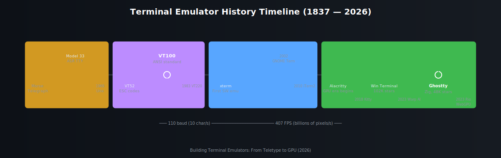
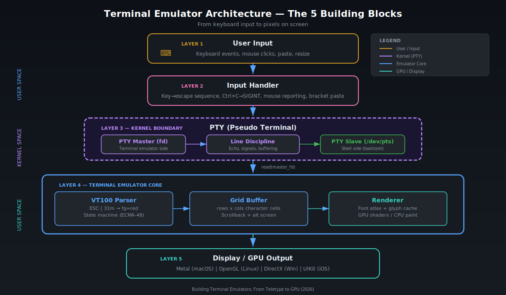
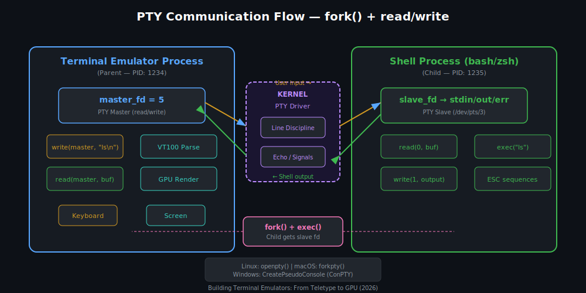
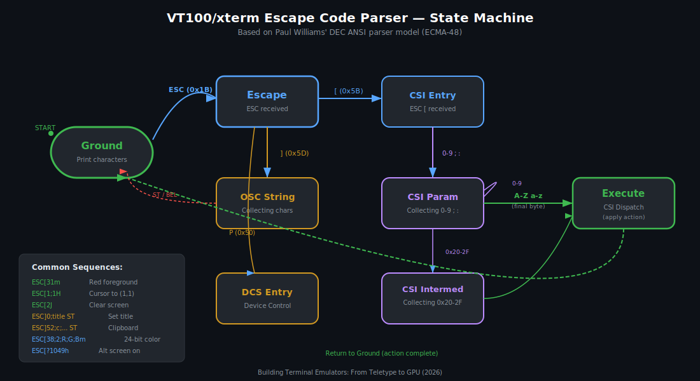
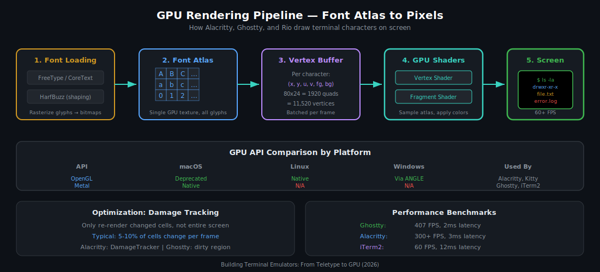
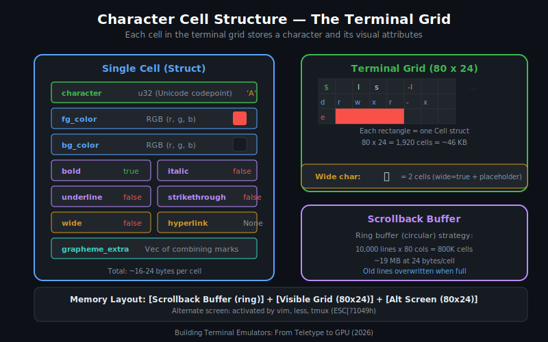

# Building Terminal Emulators: From Teletype to GPU

### A Complete Technical Guide

> *From 110 baud teletypes to 407 FPS GPU-accelerated terminals — everything you need to know to build your own terminal emulator for macOS, Linux, Windows, and iOS.*

**Version:** 1.1.0 | **Date:** March 2026 | **License:** MIT | **Review:** 5-agent skeptical guardian reviewed

[](#part-iii-platform-ecosystem)
[](#chapter-13-technology-stack-selection)
[](#svg-diagram-index)

---

## Table of Contents

### [Part I: Foundations](#part-i-foundations)
- [Chapter 1: What Is a Terminal?](#chapter-1-what-is-a-terminal)
- [Chapter 2: History — From Teletype to GPU (1837–2026)](#chapter-2-history--from-teletype-to-gpu-18372026)
- [Chapter 3: Architecture Overview — The 5 Building Blocks](#chapter-3-architecture-overview--the-5-building-blocks)

### [Part II: Deep Dive — Core Components](#part-ii-deep-dive--core-components)
- [Chapter 4: PTY — Talking to the Shell](#chapter-4-pty--talking-to-the-shell)
- [Chapter 5: VT100/xterm Escape Code Parser](#chapter-5-vt100xterm-escape-code-parser)
- [Chapter 6: Rendering — Drawing Characters on Screen](#chapter-6-rendering--drawing-characters-on-screen)
- [Chapter 7: Grid Buffer and Unicode](#chapter-7-grid-buffer-and-unicode)

### [Part III: Platform Ecosystem](#part-iii-platform-ecosystem)
- [Chapter 8: macOS Terminals](#chapter-8-macos-terminals)
- [Chapter 9: Windows Terminals](#chapter-9-windows-terminals)
- [Chapter 10: Linux Terminals](#chapter-10-linux-terminals)
- [Chapter 11: iOS Terminals](#chapter-11-ios-terminals)
- [Chapter 12: Cross-Platform Rubric](#chapter-12-cross-platform-rubric)

### [Part IV: Building Your Own](#part-iv-building-your-own)
- [Chapter 13: Technology Stack Selection](#chapter-13-technology-stack-selection)
- [Chapter 14: Minimal Viable Terminal (Hands-On)](#chapter-14-minimal-viable-terminal-hands-on)
- [Chapter 15: Testing and Validation](#chapter-15-testing-and-validation)
- [Chapter 16: Cutting-Edge Topics (2026)](#chapter-16-cutting-edge-topics-2026)

### [Part V: Reference](#part-v-reference)
- [Appendix A: Glossary](#appendix-a-glossary)
- [Appendix B: Escape Code Reference](#appendix-b-escape-code-reference)
- [Appendix C: terminfo/termcap](#appendix-c-terminfotermcap)
- [Appendix D: Graphics Protocols](#appendix-d-graphics-protocols)
- [Appendix E: Resources and Links](#appendix-e-resources-and-links)

### [SVG Diagram Index](#svg-diagram-index)

---

## How to Read This Book

This project contains three levels of content:

| File | Lines | Purpose |
|------|-------|---------|
| **README.md** (this file) | ~1,600 | Complete overview — read this first |
| **PART-I-II-EXTENDED.md** | ~2,600 | Deep dive into Chapters 1-7 with full code, GLSL/MSL/WGSL shaders, detailed parser implementation |
| **PART-III-IV-V-EXTENDED.md** | ~3,000 | Deep dive into Chapters 8-15 with detailed per-terminal analysis, full rubric methodology, comprehensive appendices |

**Recommended reading order:**
1. Read this README start to finish for the complete picture
2. When you want to implement something, consult the extended files for that chapter
3. Use the code in `examples/` to experiment hands-on

---

# Part I: Foundations

## Chapter 1: What Is a Terminal?

### Terminal vs Shell vs Console

These three terms are often confused. Here is the precise distinction:

| Term | What It Is | Examples |
|------|-----------|---------|
| **Terminal Emulator** | A GUI application that draws characters on screen and connects to a shell via PTY | iTerm2, Ghostty, Alacritty, Windows Terminal |
| **Shell** | A command-line interpreter that reads commands and executes programs | bash, zsh, fish, PowerShell |
| **Console** | The physical hardware or system-level terminal (historical) | Linux virtual console (`/dev/tty1`), macOS Recovery Terminal |

The terminal emulator is the **window** — it handles drawing, keyboard input, colors, fonts, and scrolling. The shell is the **brain** — it parses commands, manages processes, and runs programs. They communicate through the PTY (pseudo-terminal), which acts as a **virtual serial wire** between them.

```
┌─────────────────────────────────────────────┐
│              Terminal Emulator               │
│   (draws pixels, handles keyboard/mouse)    │
├─────────────────────────────────────────────┤
│                   PTY                        │
│        (kernel virtual serial link)          │
├─────────────────────────────────────────────┤
│                  Shell                       │
│   (parses commands, runs programs)           │
│   → ls, grep, vim, git, python...           │
└─────────────────────────────────────────────┘
```

### Why the Name "TTY"?

The command `tty` on your system right now returns something like `/dev/ttys003`. The name **TTY** comes directly from **Teletype** — the electromechanical printing machines used as computer terminals in the 1960s-70s. The Teletype Model 33 ASR (Automatic Send-Receive), manufactured in 1963, was the primary interface to early Unix systems at Bell Labs.

```bash
$ tty
/dev/ttys003    # "teletype serial device 003"

$ ls /dev/tty*
/dev/tty       # Controlling terminal
/dev/ttys000   # First pseudo-terminal
/dev/ttys001   # Second pseudo-terminal
...
```

The entire Unix terminal architecture — `/dev/tty`, line discipline, raw mode, cooked mode, SIGINT, SIGTSTP — was designed around the physical characteristics of the Teletype machine. These conventions, over 50 years old, are still the foundation of every terminal emulator you use today.

### Why Build Your Own Terminal?

| Motivation | What You Learn |
|------------|---------------|
| **Education** | OS internals, process management, GPU rendering, Unicode |
| **Performance** | GPU programming, memory optimization, latency reduction |
| **Customization** | Build exactly the features you want |
| **Career** | Systems programming skills valued in industry |
| **Fun** | One of the most rewarding systems programming projects |

---

## Chapter 2: History — From Teletype to GPU (1837–2026)



### 2.1 Electromechanical Era (1837–1960s)

The terminal's ancestry begins with telecommunications, not computers.

**1837 — Morse Telegraph:** Samuel Morse's telegraph transmitted coded electrical impulses over wire. This was the first machine-to-machine text communication.

**1870s — Baudot Code:** Emile Baudot developed a 5-bit character encoding representing 32 symbols — the first machine character set.

**1963 — Teletype Model 33 ASR:** The most important device in terminal history. This electromechanical teleprinter operated at **110 baud** (~10 characters/second), used **7-bit ASCII**, and introduced conventions that persist to this day:

| Control | ASCII | Origin |
|---------|-------|--------|
| **CR** (Carriage Return) | `0x0D` | Physically moved the print head back to column 1 |
| **LF** (Line Feed) | `0x0A` | Advanced the paper by one line |
| **BEL** (Bell) | `0x07` | Rang an actual physical bell on the machine |
| **BS** (Backspace) | `0x08` | Moved the print head one position left |
| **DEL** (Delete) | `0x7F` | On paper tape, punched all 7 holes to obliterate a character |
| **HT** (Tab) | `0x09` | Advanced to the next tab stop |

**Why does Windows use CR+LF while Unix uses LF?** The Teletype required *two* physical operations: return the carriage (CR), then feed the paper (LF). Unix designers at Bell Labs decided the kernel would handle the translation, storing only LF internally. Windows preserved the original two-character convention. This artifact of 1960s electromechanics affects every text file in 2026.

### 2.2 Hardware Video Terminals (1970s)

The transition from paper to CRT screens was revolutionary — suddenly the "screen" could be updated, erased, and repositioned.

**1975 — DEC VT52:** Introduced **escape sequences** — the ESC character (`0x1B`) as a prefix to create commands:

```
ESC A  → Cursor up         ESC H  → Cursor home
ESC B  → Cursor down       ESC J  → Erase to end of screen
ESC C  → Cursor right      ESC K  → Erase to end of line
ESC D  → Cursor left       ESC Y row col → Direct cursor addressing
```

**1978 — DEC VT100:** The terminal that changed everything. The VT100 defined the **ANSI standard** (ANSI X3.64, later ECMA-48) that every terminal emulator still implements:

| Feature | VT100 Specification |
|---------|-------------------|
| **Display** | 80 columns x 24 rows (still the default!) |
| **Character Set** | US-ASCII + Special Graphics |
| **Escape Codes** | CSI sequences (`ESC [`) — the foundation of modern terminal control |
| **Colors** | Not yet (added in VT241) |
| **Speed** | 300-19200 baud |
| **Cost** | $3,500 (1978 dollars, ~$17,000 in 2026) |

The VT100's 80x24 grid became the universal standard. Even today, `$COLUMNS` defaults to 80 and `$LINES` to 24 on most systems.

**1983 — DEC VT220:** Added 8-bit control codes, additional character sets, and user-defined keys.

### 2.3 Software Emulators (1984–2010s)

**1984 — xterm:** The first software terminal emulator for the X Window System. Still maintained (v395+) and still the reference implementation for escape code behavior. When terminal developers ask "what should this escape code do?", the answer is often "whatever xterm does."

**1999 — PuTTY:** The first widely used SSH terminal for Windows. For over a decade, PuTTY was the *only* way most Windows users connected to Unix servers.

**2003 — GNOME Terminal:** Built on the VTE (Virtual Terminal Emulator) library, which became the shared foundation for many Linux terminals (Terminator, Tilix, XFCE Terminal).

**2009 — iTerm2:** George Nachman's replacement for iTerm (itself a replacement for Terminal.app). Introduced split panes, profiles, triggers, and later the Python API — the most feature-rich terminal ever built.

### 2.4 GPU Revolution (2016–2026)

**2016 — Alacritty:** Joe Wilm's "fastest terminal emulator in existence" — written in Rust with OpenGL rendering. Alacritty proved that GPU acceleration makes a dramatic difference in terminal performance. Today at 57,000+ GitHub stars.

**2018 — Kitty:** Kovid Goyal's C/Python terminal with the Kitty graphics protocol (now a de facto standard for terminal image display) and the "kittens" plugin system.

**2019 — Windows Terminal:** Microsoft's modern terminal — DirectX rendering, XAML UI, ConPTY backend. At **102,000+ stars**, it's the most-starred terminal project on GitHub.

**2023 — Warp:** AI-powered terminal with block-based UI. Introduced AI command suggestions and Warp Drive workflows. Freemium model ($20/month Build plan).

**2024 — Ghostty:** Mitchell Hashimoto (HashiCorp founder) released Ghostty — written in Zig with Metal rendering on macOS. Reached **48,300+ stars** in under 15 months. Performance: **~2ms key-to-screen latency**, **407 FPS** — the fastest terminal ever measured. Non-profit under Hack Club 501(c)(3).

**2025 — Rio:** Rust + WebGPU (wgpu) terminal with custom shaders and SIMD-accelerated UTF-8 validation.

| Era | Speed | Interface |
|-----|-------|-----------|
| 1963 Teletype | 110 baud (10 char/s) | Paper printout |
| 1978 VT100 | 19,200 baud | 80x24 CRT |
| 2016 Alacritty | 300+ FPS | GPU-rendered window |
| 2024 Ghostty | 407 FPS, 2ms latency | Metal-rendered native app |

---

## Chapter 3: Architecture Overview — The 5 Building Blocks



A terminal emulator is a **userspace application** — it does NOT require kernel-level programming. It consists of 5 distinct layers:

### Layer 1: User Input
Keyboard events, mouse clicks, paste operations, and window resize events enter here. The terminal converts physical key presses into the appropriate bytes or escape sequences.

### Layer 2: Input Handler
Translates user input into the format the shell expects:

| Input | Sent to Shell |
|-------|--------------|
| Letter `a` | Byte `0x61` |
| Enter | `\r` (0x0D) or `\n` (0x0A) |
| Ctrl+C | `0x03` (ETX → SIGINT) |
| Ctrl+D | `0x04` (EOT → EOF) |
| Arrow Up | `ESC [ A` (3 bytes) |
| F1 | `ESC O P` (3 bytes) |
| Paste text | Bracketed: `ESC [200~ text ESC [201~` |

### Layer 3: PTY (Pseudo Terminal)
The **kernel-provided** bridge between the terminal emulator and the shell. The PTY has two sides:
- **Master side:** Owned by the terminal emulator — reads shell output, writes user input
- **Slave side:** Presented to the shell as `/dev/pts/N` — the shell thinks it's talking to a real hardware terminal

The kernel's **line discipline** sits between master and slave, providing echo, signal generation (Ctrl+C → SIGINT), and buffering.

### Layer 4: Terminal Emulator Core
The heart of the system, with three sub-components:

1. **VT100 Parser:** A state machine that interprets escape codes. Input: raw bytes from PTY. Output: structured commands (set color, move cursor, clear screen).
2. **Grid Buffer:** A 2D matrix of character cells (typically 80x24). Each cell stores a Unicode character plus visual attributes (color, bold, underline). Includes scrollback buffer (thousands of historical lines).
3. **Renderer:** Converts the grid buffer into pixels on screen — either via CPU (NSTextView, GDI) or GPU (OpenGL, Metal, Vulkan, WebGPU).

### Layer 5: Display
The final output — pixels on your monitor. GPU-based terminals submit draw calls to Metal (macOS), OpenGL (Linux), DirectX (Windows), or WebGPU (cross-platform via wgpu).

### Data Flow

```
Keyboard → Input Handler → write(master_fd) → [KERNEL PTY] → Shell executes command
                                                    ↓
Screen ← Renderer ← Grid Buffer ← VT100 Parser ← read(master_fd) ← Shell output
```

---

# Part II: Deep Dive — Core Components

## Chapter 4: PTY — Talking to the Shell



The PTY (Pseudo Terminal) is the **communication channel** between your terminal emulator and the shell. It's provided by the operating system kernel — you don't implement it, you *use* it.

### 4.1 Linux PTY

Linux uses the **UNIX 98** PTY mechanism. The master device is `/dev/ptmx` (pseudo-terminal multiplexer), and slave devices are dynamically created at `/dev/pts/*`.

**Opening sequence:**

```c
#include <stdlib.h>
#include <fcntl.h>

// Step 1: Open the master
int master_fd = posix_openpt(O_RDWR | O_NOCTTY);

// Step 2: Grant access to the slave device
grantpt(master_fd);

// Step 3: Unlock the slave
unlockpt(master_fd);

// Step 4: Get slave device name
char *slave_name = ptsname(master_fd);  // e.g., "/dev/pts/3"

// Step 5: Open the slave
int slave_fd = open(slave_name, O_RDWR);
```

**Convenience function (recommended):**

```c
#include <pty.h>  // Linux
// or
#include <util.h> // macOS

int master_fd, slave_fd;
pid_t pid = forkpty(&master_fd, NULL, NULL, NULL);

if (pid == 0) {
    // CHILD: slave is stdin/stdout/stderr
    // Already set up by forkpty()
    execvp("/bin/zsh", (char*[]){"/bin/zsh", NULL});
} else {
    // PARENT: use master_fd to communicate
    char buf[4096];
    ssize_t n = read(master_fd, buf, sizeof(buf));  // Read shell output
    write(master_fd, "ls\n", 3);                     // Send command to shell
}
```

**Line Discipline:** The kernel module between master and slave that provides:
- **Echo:** Characters typed are automatically sent back to the terminal for display
- **Line editing:** Backspace, Ctrl+W (delete word), Ctrl+U (delete line)
- **Signal generation:** Ctrl+C → SIGINT, Ctrl+Z → SIGTSTP, Ctrl+\ → SIGQUIT
- **Canonical mode:** Input buffered until Enter (vs raw mode: every keystroke sent immediately)

In **raw mode** (what terminal emulators use), all of these are disabled — the terminal handles everything itself.

**See example:** [pty-fork-example.c](examples/pty-fork-example.c)

### 4.2 macOS PTY

macOS, being BSD-derived, shares the same POSIX API:

```c
#include <util.h>  // macOS uses util.h, not pty.h

int master_fd;
pid_t pid = forkpty(&master_fd, NULL, NULL, NULL);
```

**Key differences from Linux:**
- Header: `<util.h>` instead of `<pty.h>`
- No `/dev/ptmx` filesystem — macOS uses its own kernel PTY driver
- BSD PTYs still available (not deprecated like on Linux)
- `TIOCSWINSZ` ioctl for window resize works identically

### 4.3 Windows ConPTY

Prior to Windows 10 version 1809 (2018), Windows had **no PTY-like abstraction**. Console applications communicated directly with `conhost.exe` through the Win32 Console API. ConPTY (Pseudo Console) changed this.

```c
#include <windows.h>

// Create pipes for communication
HANDLE hInput, hOutput;
CreatePipe(&hInput, /* ... */);
CreatePipe(/* ... */, &hOutput);

// Create the pseudo-console
HPCON hPC;
COORD size = {80, 24};
HRESULT hr = CreatePseudoConsole(size, hInput, hOutput, 0, &hPC);

// Spawn a process (cmd.exe, powershell, wsl)
STARTUPINFOEX si = { sizeof(si) };
// ... attach hPC to si via PROC_THREAD_ATTRIBUTE_PSEUDOCONSOLE ...
CreateProcess(NULL, L"cmd.exe", /* ... */);

// Read output from hOutput, write input to hInput
// Same read/write pattern as Unix PTY
```

**Architecture comparison:**

| Aspect | Unix PTY | Windows ConPTY |
|--------|---------|----------------|
| API | `openpty()` / `forkpty()` | `CreatePseudoConsole()` |
| Master side | File descriptor (fd) | HANDLE (pipe) |
| Slave side | `/dev/pts/N` | Inherited by child process |
| Resize | `ioctl(TIOCSWINSZ)` | `ResizePseudoConsole()` |
| Cleanup | `close(fd)` | `ClosePseudoConsole()` |
| Available since | Always (POSIX) | Windows 10 1809 (2018) |

**Legacy:** Before ConPTY, terminal emulators on Windows used **WinPTY** — a userspace library that translated between Unix-style PTY semantics and the Win32 Console API. Windows Terminal, when released in 2019, was the first major consumer of ConPTY.

### 4.4 iOS — No PTY

iOS has **no PTY device** and **no `fork()` system call**. The iOS sandbox prevents creating child processes. Terminal apps on iOS use creative workarounds:

| App | Approach | How It Works |
|-----|----------|-------------|
| **a-Shell** | WASM + built-in commands | Unix tools compiled to WebAssembly, runs in-process |
| **iSH** | x86 user-mode emulation | Emulates x86 CPU in userspace, runs Alpine Linux |
| **Blink Shell** | SSH / Mosh | Connects to remote servers, no local shell |
| **Termius** | SSH client | Remote-only, cross-platform |
| **Prompt 3** | SSH | Native Swift, also on visionOS |

**Why no local terminal on iOS?**
1. No `fork()` — App Store apps cannot create child processes
2. No `exec()` — Cannot replace process image
3. No `/dev/pts/*` — No PTY device in iOS kernel
4. Sandbox — Apps cannot access other apps' filesystems
5. Code signing — Only Apple-signed or developer-signed code can execute

**See example:** [minimal-terminal.py](examples/minimal-terminal.py) (Linux/macOS only)

### 4.5 Window Resize (SIGWINCH)

When the user resizes the terminal window, the terminal emulator must inform the shell:

```c
// Unix: ioctl to update PTY window size
struct winsize ws = { .ws_row = new_rows, .ws_col = new_cols };
ioctl(master_fd, TIOCSWINSZ, &ws);
// Kernel automatically sends SIGWINCH to the shell process group

// Windows: ConPTY resize
COORD size = { new_cols, new_rows };
ResizePseudoConsole(hPC, size);
```

### Try It Now: Your First Terminal in 30 Seconds

Before diving deeper, run this to see PTY in action:

```bash
# On macOS or Linux:
python3 examples/minimal-terminal.py

# Or inline — a 10-line terminal:
python3 -c "
import os, pty, sys, tty, select, termios
old = termios.tcgetattr(sys.stdin)
try:
    master, slave = pty.openpty()
    pid = os.fork()
    if pid == 0:
        os.close(master); os.setsid()
        os.dup2(slave,0); os.dup2(slave,1); os.dup2(slave,2)
        os.execvp(os.environ.get('SHELL','/bin/bash'),['/bin/bash'])
    os.close(slave); tty.setraw(sys.stdin)
    while True:
        r,_,_ = select.select([master, sys.stdin],[],[],0.1)
        if master in r:
            d = os.read(master, 4096)
            if not d: break
            sys.stdout.buffer.write(d); sys.stdout.flush()
        if sys.stdin in r: os.write(master, os.read(sys.stdin.fileno(), 4096))
finally: termios.tcsetattr(sys.stdin, termios.TCSADRAIN, old)
"
# Press Ctrl+D to exit
```

You just built a terminal emulator. It has no colors, no scroll, no GPU — but it demonstrates the core: PTY + fork + raw I/O relay. Everything else in this book builds on this foundation.

---

## Chapter 5: VT100/xterm Escape Code Parser



The escape code parser is the **most complex component** of a terminal emulator. It transforms raw bytes from the PTY into structured commands that update the grid buffer.

### 5.1 Standards

| Standard | Year | Description |
|----------|------|-------------|
| **ECMA-48** (ISO 6429) | 1976+ | International standard for control functions |
| **ANSI X3.64** | 1979 | American national standard (based on ECMA-48) |
| **DEC VT100** | 1978 | De facto standard from hardware terminal |
| **xterm ctlseqs** | 1984+ | Extended standard (de facto modern reference) |

The xterm control sequences document (`ctlseqs`) is the practical reference. When in doubt, "do what xterm does."

### 5.2 CSI Sequences (Control Sequence Introducer)

Format: `ESC [ <params> <intermediate> <final>`

The CSI is the workhorse of terminal control. Here are the most important sequences:

**Cursor Movement:**

| Sequence | Name | Description |
|----------|------|-------------|
| `ESC[A` | CUU | Cursor Up (default: 1) |
| `ESC[B` | CUD | Cursor Down |
| `ESC[C` | CUF | Cursor Forward (right) |
| `ESC[D` | CUB | Cursor Back (left) |
| `ESC[H` | CUP | Cursor Position (`ESC[row;colH`) |
| `ESC[s` | SCP | Save Cursor Position |
| `ESC[u` | RCP | Restore Cursor Position |

**Erase:**

| Sequence | Name | Description |
|----------|------|-------------|
| `ESC[J` | ED | Erase in Display (0=below, 1=above, 2=all, 3=all+scrollback) |
| `ESC[K` | EL | Erase in Line (0=right, 1=left, 2=entire line) |

**Scrolling:**

| Sequence | Name | Description |
|----------|------|-------------|
| `ESC[S` | SU | Scroll Up (default: 1 line) |
| `ESC[T` | SD | Scroll Down |
| `ESC[r` | DECSTBM | Set Scrolling Region (`ESC[top;bottomr`) |

**Mode Setting:**

| Sequence | Description |
|----------|-------------|
| `ESC[?1049h` | Enable alternate screen buffer (vim, less, tmux) |
| `ESC[?1049l` | Disable alternate screen buffer |
| `ESC[?25h` | Show cursor |
| `ESC[?25l` | Hide cursor |
| `ESC[?1000h` | Enable mouse reporting |
| `ESC[?2004h` | Enable bracketed paste mode |

### 5.3 OSC Sequences (Operating System Command)

Format: `ESC ] Ps ; Pt BEL` or `ESC ] Ps ; Pt ESC \`

| Sequence | Description |
|----------|-------------|
| `ESC]0;titleBEL` | Set window title |
| `ESC]52;c;base64BEL` | Set clipboard contents |
| `ESC]8;;urlBEL text ESC]8;;BEL` | Create hyperlink (OSC 8) |
| `ESC]1337;...BEL` | iTerm2 proprietary (images, etc.) |
| `ESC]9;messageBEL` | Desktop notification (Windows Terminal) |

### 5.4 SGR — Colors and Text Attributes

Format: `ESC [ <params> m`

**Text Attributes:**

| Code | Effect | Reset |
|------|--------|-------|
| `0` | Reset all | — |
| `1` | **Bold** | `22` |
| `2` | Dim/faint | `22` |
| `3` | *Italic* | `23` |
| `4` | Underline | `24` |
| `5` | Blink (slow) | `25` |
| `7` | Reverse video | `27` |
| `8` | Hidden | `28` |
| `9` | ~~Strikethrough~~ | `29` |

**16 Standard Colors:**

| Foreground | Background | Color |
|-----------|-----------|-------|
| `30` | `40` | Black |
| `31` | `41` | Red |
| `32` | `42` | Green |
| `33` | `43` | Yellow |
| `34` | `44` | Blue |
| `35` | `45` | Magenta |
| `36` | `46` | Cyan |
| `37` | `47` | White |
| `90-97` | `100-107` | Bright variants |

**256-Color Mode:**
```
ESC[38;5;Nm    # Foreground (N = 0-255)
ESC[48;5;Nm    # Background
```
- 0-7: Standard colors
- 8-15: Bright colors
- 16-231: 6x6x6 RGB cube
- 232-255: 24 grayscale shades

**24-Bit True Color:**
```
ESC[38;2;R;G;Bm    # Foreground (R,G,B = 0-255 each)
ESC[48;2;R;G;Bm    # Background
```

Example: `ESC[38;2;255;128;0m` → Orange foreground

### 5.5 State Machine Design

The parser is a **finite state machine** based on the Paul Williams DEC ANSI parser model. Key states:

| State | Enters When | Does |
|-------|------------|------|
| **Ground** | Default / after action | Prints characters to grid |
| **Escape** | ESC received (0x1B) | Waits for next byte to determine sequence type |
| **CsiEntry** | `[` after ESC | Begins CSI sequence |
| **CsiParam** | Digit (0-9) in CSI | Collects numeric parameters |
| **CsiIntermediate** | 0x20-0x2F in CSI | Collects intermediate bytes |
| **OscString** | `]` after ESC | Collects OSC string until BEL/ST |
| **DcsEntry** | `P` after ESC | Device Control String |

**Transition example for `ESC[31m` (red foreground):**

```
Byte  State           Action
'E'   Ground          → print 'E' (if standalone)
0x1B  Ground          → transition to Escape
'['   Escape          → transition to CsiEntry
'3'   CsiEntry        → transition to CsiParam, collect '3'
'1'   CsiParam        → stay in CsiParam, collect '1' (param = 31)
'm'   CsiParam        → CSI Dispatch: SGR(31) → set fg = red
      → back to Ground
```

### 5.6 Implementation

**Option A: Use existing parser (recommended for production)**

```rust
// Rust: vte crate (used by Alacritty)
use vte::{Parser, Perform};

struct MyHandler;
impl Perform for MyHandler {
    fn print(&mut self, c: char) { /* add to grid */ }
    fn execute(&mut self, byte: u8) { /* handle \n, \r, etc. */ }
    fn csi_dispatch(&mut self, params: &Params, intermediates: &[u8],
                    ignore: bool, action: char) {
        match action {
            'm' => { /* SGR: colors and attributes */ }
            'H' => { /* CUP: cursor position */ }
            'J' => { /* ED: erase display */ }
            _ => {}
        }
    }
}

let mut parser = Parser::new();
let mut handler = MyHandler;
for byte in pty_output {
    parser.advance(&mut handler, byte);
}
```

**Option B: Hand-roll (for learning)**

```rust
enum State { Ground, Escape, CsiEntry, CsiParam, OscString }

fn advance(&mut self, byte: u8) {
    match (self.state, byte) {
        (_, 0x1B) => self.state = State::Escape,
        (State::Ground, 0x20..=0x7E) => self.print(byte as char),
        (State::Ground, 0x0A) => self.linefeed(),
        (State::Ground, 0x0D) => self.carriage_return(),
        (State::Escape, b'[') => { self.state = State::CsiEntry; self.params.clear(); }
        (State::Escape, b']') => { self.state = State::OscString; }
        (State::CsiEntry, b'0'..=b'9') => { self.state = State::CsiParam; self.collect(byte); }
        (State::CsiParam, b'0'..=b'9') => self.collect(byte),
        (State::CsiParam, b';') => self.next_param(),
        (State::CsiParam, b'@'..=b'~') => { self.csi_dispatch(byte); self.state = State::Ground; }
        _ => {}
    }
}
```

---

## Chapter 6: Rendering — Drawing Characters on Screen



### 6.1 CPU Rendering

Traditional approach — simpler but slower:

| Platform | Technology | Used By |
|----------|-----------|---------|
| macOS | NSTextView / CoreText | Terminal.app, iTerm2 (fallback) |
| Linux | Pango + Cairo (via VTE/GTK) | GNOME Terminal, Terminator |
| Windows | GDI / DirectWrite | cmd.exe, ConEmu |

CPU rendering is adequate for basic use but struggles with large scrollback buffers, many split panes, or high-DPI displays.

### 6.2 GPU Rendering Fundamentals

Why use the GPU for a terminal? Because text rendering is **embarrassingly parallel** — every character cell is independent and can be drawn simultaneously.

| CPU Rendering | GPU Rendering |
|--------------|---------------|
| Draw characters one by one | Draw ALL characters in one batch |
| 60 FPS with effort | 400+ FPS naturally |
| ~12ms latency (iTerm2) | ~2ms latency (Ghostty) |
| Simple code | Complex setup, simple shader |

### 6.3 Font Atlas (Glyph Cache)

The key optimization: pre-render every glyph into a single large texture (the "atlas"), then draw characters by sampling rectangles from this texture.

```
Font Atlas Texture (1024x1024 pixels):
┌────┬────┬────┬────┬────┬────┬────┐
│ A  │ B  │ C  │ D  │ E  │ F  │ ...│
├────┼────┼────┼────┼────┼────┼────┤
│ a  │ b  │ c  │ d  │ e  │ f  │ ...│
├────┼────┼────┼────┼────┼────┼────┤
│ 0  │ 1  │ 2  │ 3  │ 4  │ 5  │ ...│
└────┴────┴────┴────┴────┴────┴────┘

Each character on screen = one textured quad
= 6 vertices (2 triangles) referencing a rectangle in the atlas
```

**Text rendering pipeline:**
1. **Font loading:** FreeType (cross-platform) or CoreText (macOS)
2. **Shaping:** HarfBuzz converts Unicode text into positioned glyphs (handles ligatures, Arabic, etc.)
3. **Rasterization:** FreeType renders glyph outlines into bitmaps
4. **Atlas packing:** Bitmaps packed into a single GPU texture
5. **Vertex generation:** For each cell, emit vertices with texture coordinates
6. **GPU draw:** One draw call renders the entire screen

### 6.4 GPU APIs by Platform

| API | macOS | Linux | Windows | Cross-platform | Used By |
|-----|-------|-------|---------|---------------|---------|
| **Metal** | Native | N/A | N/A | No | Ghostty, iTerm2 |
| **OpenGL** | Deprecated | Native | Via ANGLE | Yes (legacy) | Alacritty, Kitty |
| **Vulkan** | Via MoltenVK | Native | Native | Yes | WezTerm |
| **DirectX 12** | N/A | N/A | Native | No | Windows Terminal |
| **WebGPU (wgpu)** | → Metal | → Vulkan | → DX12 | **Yes** | Rio, Warp (Linux) |

**Recommendation for new projects: wgpu (WebGPU)**

wgpu is a Rust implementation of the WebGPU standard that automatically maps to the best available GPU API on each platform. Rio terminal proved this approach works for production terminals.

### 6.5 Damage Tracking

Optimization: only re-render cells that changed since the last frame.

```
Previous frame:          Current frame:          Damage:
┌─────────────────┐     ┌─────────────────┐     ┌─────────────────┐
│ $ ls            │     │ $ ls            │     │                 │
│ file1.txt       │     │ file1.txt       │     │                 │
│ file2.txt       │     │ file2.txt       │     │                 │
│ $               │     │ $ echo hi ←──── │     │ ████████████ ←  │
│                 │     │ hi         ←──── │     │ ████████████ ←  │
└─────────────────┘     └─────────────────┘     └─────────────────┘
                                                  Only 2 lines dirty!
```

- **Alacritty:** `DamageTracker` struct tracks dirty rectangular regions
- **Ghostty:** Per-cell dirty flag with region coalescing
- Typical: Only **5-10% of cells** change per frame

---

## Chapter 7: Grid Buffer and Unicode



### 7.1 Character Cell Structure

Every position in the terminal grid stores a `Cell` struct:

```rust
struct Cell {
    /// Unicode codepoint (U+0000 to U+10FFFF)
    character: char,        // 4 bytes

    /// Foreground color
    fg: Color,              // 4 bytes (RGBA)

    /// Background color
    bg: Color,              // 4 bytes (RGBA)

    /// Visual attribute flags (packed bitfield)
    flags: CellFlags,       // 2 bytes

    /// Extra data for combining characters / wide chars
    extra: Option<CellExtra>, // 8 bytes (pointer)
}

bitflags! {
    struct CellFlags: u16 {
        const BOLD          = 0b0000_0001;
        const ITALIC        = 0b0000_0010;
        const UNDERLINE     = 0b0000_0100;
        const STRIKETHROUGH = 0b0000_1000;
        const DIM           = 0b0001_0000;
        const HIDDEN        = 0b0010_0000;
        const REVERSE       = 0b0100_0000;
        const WIDE          = 0b1000_0000;  // CJK character (2 cells)
        const WIDE_SPACER   = 0b0001_0000_0000; // Placeholder for wide char
    }
}
```

**Memory per cell:** ~16-24 bytes. An 80x24 terminal = 1,920 cells = ~46 KB.

### 7.2 Scrollback Buffer

When text scrolls off the top of the visible area, it's saved in the scrollback buffer. Common strategies:

| Strategy | Pros | Cons | Used By |
|----------|------|------|---------|
| **Ring buffer** | O(1) push, fixed memory | Old lines overwritten | Alacritty (default 10K lines) |
| **Growable Vec** | Unlimited history | Memory grows unbounded | iTerm2 (configurable) |
| **Compressed** | Low memory, large history | CPU overhead for decompression | Less common |

**Typical sizes:**
- 10,000 lines x 80 cols = 800,000 cells = ~19 MB
- iTerm2 "unlimited": Configurable, can reach hundreds of MB

### 7.3 Alternate Screen Buffer

Programs like vim, less, and tmux use the **alternate screen**:

```
ESC[?1049h    → Switch to alternate screen (save main, show blank)
               (user interacts with vim/less)
ESC[?1049l    → Switch back to main screen (restore saved content)
```

The terminal maintains two complete grid buffers — the main screen and the alternate screen. This is why your shell output is preserved after quitting vim.

### 7.4 Unicode Handling

The hardest part of terminal rendering. Unicode challenges:

**Grapheme clusters:** A single "visible character" may consist of multiple Unicode codepoints:
```
é = U+0065 (e) + U+0301 (combining acute accent) → 1 cell
🇹🇷 = U+1F1F9 + U+1F1F7 (regional indicator symbols) → 2 cells (flag)
👨‍💻 = U+1F468 + U+200D + U+1F4BB (man + ZWJ + computer) → 2 cells
```

**Wide characters:** CJK characters occupy 2 cells:
```
你 = U+4F60 → 2 cells wide (cell[0].flags |= WIDE, cell[1].flags |= WIDE_SPACER)
```

**Width determination:**
- Rust: `unicode-width` crate
- C: `wcwidth()` function
- Complex: Unicode version matters (width tables change between Unicode versions!)

---

# Part III: Platform Ecosystem

## Chapter 8: macOS Terminals

### iTerm2

| Attribute | Details |
|-----------|---------|
| **Version** | 3.6.9 (March 10, 2026) |
| **Language** | Objective-C (55.7%), Swift (25.2%), Python (6.2%) |
| **Rendering** | Metal GPU (falls back to CPU for ligatures) |
| **Stars** | 17,260 |
| **RAM** | ~85 MB idle |
| **Latency** | ~12ms |

**Unique Features:** 30-module Python WebSocket API, tmux `-CC` native integration, AI Chat (8 granular permissions), Session Archiving (`.itr` format with DVR playback), Window Projects (hierarchical archive/restore), 26 trigger actions, Composer (native macOS text editor replacing shell prompt), built-in web browser.

**Architecture:** Monolithic Obj-C/Swift app. New features written in Swift (`iTermProjectsPanelController.swift`, `ArchivesMenuBuilder.swift`), core terminal engine in Obj-C (`PTYSession`, `VT100Screen`). Metal renderer for GPU path, CoreText fallback for ligatures.

### Ghostty

| Attribute | Details |
|-----------|---------|
| **Version** | 1.3.1 (March 13, 2026) |
| **Language** | Zig |
| **Rendering** | Metal (macOS), OpenGL (Linux) |
| **Stars** | 48,300+ |
| **RAM** | ~28 MB idle |
| **Latency** | ~2ms (407 FPS) |
| **Creator** | Mitchell Hashimoto (HashiCorp founder) |

**Architecture:** Large shared Zig core handles all terminal emulation, VT parsing, and rendering. Thin platform-specific shells (AppKit on macOS, GTK on Linux) provide native UI integration. Custom rendering pipeline — no general-purpose graphics library dependency.

**Unique Features:** Platform-native UI (feels like a native macOS app, not a toolkit wrapper), scrollback search (v1.3), Quick Terminal (dropdown), hundreds of built-in themes with auto dark/light, AppleScript support, rich text clipboard, key tables with chained keybinds. Non-profit under Hack Club 501(c)(3).

### Alacritty

| Attribute | Details |
|-----------|---------|
| **Version** | 0.16.1 (October 2025) |
| **Language** | Rust |
| **Rendering** | OpenGL (GLES2/GLSL3) |
| **Stars** | 57,000+ |
| **RAM** | ~22 MB idle |
| **Latency** | ~3ms |

**Architecture:** 4-crate Rust workspace: `alacritty` (binary), `alacritty_terminal` (emulation core), `alacritty_config`, `alacritty_config_derive`. The `alacritty_terminal` crate can be used as a standalone library. DamageTracker for partial re-rendering. winit for windowing, vte for parsing.

**Philosophy:** Minimalist by design — no tabs, no split panes, no built-in multiplexer. Designed to pair with tmux or zellij. TOML configuration.

### Kitty

| Attribute | Details |
|-----------|---------|
| **Version** | 0.46.2 (March 2026) |
| **Language** | C, Python, Go |
| **Rendering** | OpenGL |
| **Stars** | 23,200+ |
| **Key Feature** | Kitty Graphics Protocol + Kittens plugin system |

**Unique Features:** Kitty graphics protocol (de facto standard for terminal image display), keyboard protocol (more powerful than xterm), "kittens" extensible plugin system (Python), smooth pixel scrolling, draggable tabs, cursor trails, remote control API.

### Terminal.app (macOS Tahoe)

After **24 years** with minimal changes, Apple completely redesigned Terminal.app in macOS Tahoe (2025):
- **Finally:** 24-bit true color support
- **Finally:** Powerline font support
- **New:** Liquid Glass aesthetic matching macOS Tahoe design language
- **New:** Redesigned themes

### Warp

| Attribute | Details |
|-----------|---------|
| **Language** | Rust |
| **Rendering** | Metal (macOS), custom GPU (Linux) |
| **Pricing** | Freemium — Free (75 AI credits/mo), Build ($20/mo), Business ($50/mo) |
| **Platforms** | macOS, Linux, Windows |

**Unique:** Block-based terminal (commands grouped as blocks), AI command suggestions, IDE-like input editing, Warp Drive (save/share workflows). Brands itself as "The Agentic Development Environment."

---

## Chapter 9: Windows Terminals

### Windows Terminal

| Attribute | Details |
|-----------|---------|
| **Version** | 1.25 |
| **Language** | C++ |
| **Rendering** | DirectX / XAML |
| **Stars** | **102,000+** (most-starred terminal project on GitHub!) |
| **RAM** | ~80 MB idle |

**Architecture:** XAML UI framework, DirectX renderer, ConPTY backend for all console applications. JSON-based settings. Distributed via Microsoft Store with automatic updates.

**Unique Features:** GPU-accelerated rendering, tabs with customizable profiles, panes (split terminal), JSON settings, background images/acrylic effects, support for cmd.exe + PowerShell + WSL + Azure Cloud Shell in the same window.

### PowerShell

| Attribute | Details |
|-----------|---------|
| **Version** | 7.6 LTS |
| **Language** | C# (.NET) |
| **Platforms** | Windows, macOS, Linux |

PowerShell is not a terminal — it's a **shell and scripting engine**. Unlike bash (which pipes text), PowerShell pipes **.NET objects**. This means `Get-Process | Where-Object { $_.CPU -gt 100 }` works on structured data, not text parsing.

### cmd.exe

The legacy Windows command processor. Still exists for backward compatibility. Uses Win32 Console API (pre-ConPTY), GDI rendering, ~3 MB RAM. No GPU acceleration, no Unicode (well, limited), no modern features.

### ConPTY Architecture

The key Windows innovation that enabled modern terminal emulators:

```
Before ConPTY (pre-2018):
┌──────────┐ Win32 Console API ┌────────────┐
│ cmd.exe  ├───────────────────┤ conhost.exe │ → Screen
└──────────┘                   └────────────┘
  (direct coupling — no terminal emulator possible)

After ConPTY (2018+):
┌──────────┐                   ┌────────────┐
│ cmd.exe  ├─── PTY Slave ────┤  ConPTY    │
└──────────┘                   └──────┬─────┘
                                      │ pipes (VT100 sequences)
                               ┌──────▼──────────┐
                               │ Windows Terminal  │ → Screen
                               │ (or any terminal) │
                               └──────────────────┘
```

### WSL Bridge

Windows Subsystem for Linux (WSL2) runs a real Linux kernel in a lightweight VM. Terminal emulators bridge to WSL through:
- ConPTY → WSL init process → Linux PTY → bash/zsh
- 9P filesystem protocol for file sharing
- Bridged networking

---

## Chapter 10: Linux Terminals

### GNOME Terminal

Built on the **VTE** (Virtual Terminal Emulator) library — a GTK widget that provides terminal emulation. VTE is shared by GNOME Terminal, Terminator, Tilix, XFCE Terminal, and others. GTK4 rendering, CPU-based. ~50 MB idle.

### Konsole (KDE)

Qt6-based terminal for the KDE desktop. QPainter CPU rendering. Rich feature set with profiles, bookmarks, split views. ~55 MB idle.

### st (suckless terminal)

**The best terminal for learning.** Only ~2,000 lines of C. Minimal dependencies (Xlib only). No scrollback buffer by default (patch to add). The entire codebase is readable in an afternoon.

```bash
# Clone and read the ENTIRE terminal emulator
git clone https://git.suckless.org/st
wc -l st.c x.c  # ~1800 + ~200 lines = the whole thing
```

### foot

**Wayland-native** terminal written in C. Designed specifically for Wayland compositors (no X11 support). Extremely low latency (~12 MB RAM). Excellent choice for Sway/Hyprland users.

---

## Chapter 11: iOS Terminals

### a-Shell (6,500+ stars)

The most capable local terminal on iOS — no jailbreak required. How it works:

1. Unix tools (ls, grep, python, lua, tex) compiled to **WebAssembly** or built as iOS frameworks
2. Runs commands **in-process** (no fork/exec)
3. UIKit-based terminal view
4. Supports: Python 3, Lua, TeX, JavaScript (via QuickJS), C (via tcc)
5. File provider integration (iCloud, external drives)

### iSH (18,000+ stars)

Runs a full Alpine Linux distribution on iOS by **emulating an x86 CPU in userspace**:

1. x86 instruction decoder translates each instruction to ARM64 equivalents
2. Linux syscall handler translates syscalls to iOS/Darwin equivalents
3. Alpine Linux packages (apk) work: python, gcc, vim, etc.
4. Performance: ~10x slower than native (acceptable for CLI tools)

### Blink Shell (6,100+ stars)

Professional SSH/Mosh client. Uses **hterm** (Chrome's terminal renderer) for the terminal view. Mosh protocol for unreliable network connections (airplane WiFi, cellular). Open source (Swift/Obj-C).

### iOS Sandbox Limitations

| Restriction | Impact | Workaround |
|------------|--------|-----------|
| No `fork()` | Cannot spawn child processes | In-process execution (a-Shell), emulation (iSH) |
| No `exec()` | Cannot replace process image | Pre-compiled tool bundles |
| No `/dev/pts/*` | No PTY devices | SSH to remote, or emulated PTY |
| Sandbox isolation | Cannot access other apps | File provider API, iCloud |
| App Store review | Arbitrary code execution restricted | Interpreted languages (Python, Lua) |
| Background limits | Apps suspended when backgrounded | Background audio trick, push notifications |

---

### 11.6 Android Terminals

Android is a critical mobile platform for terminal emulators, with **Termux** being the most popular mobile terminal at **36,800+ GitHub stars**.

| App | Stars | Approach | Key Feature |
|-----|-------|----------|-------------|
| **Termux** | 36.8K | proot + Linux packages | Full Linux userspace without root |
| **Termius** | N/A | SSH client | Cross-platform sync |
| **JuiceSSH** | N/A | SSH client | Native Android SSH |
| **ConnectBot** | 3K+ | SSH/Telnet | Oldest Android terminal |

**Termux Architecture:**

Unlike iOS, Android runs on a Linux kernel. Termux exploits this:

```
┌─────────────────────────────────────────┐
│  Android App (Termux)                   │
│  ┌───────────────────────────────────┐  │
│  │  Terminal Emulator View           │  │
│  └──────────────┬────────────────────┘  │
│                 │ PTY (yes, Android has PTY!)
│  ┌──────────────▼────────────────────┐  │
│  │  proot (fake root via ptrace)     │  │
│  │  ┌────────────────────────────┐   │  │
│  │  │  Prefix filesystem          │   │  │
│  │  │  /data/data/com.termux/     │   │  │
│  │  │  files/usr/                 │   │  │
│  │  │  ├── bin/ (bash, python)    │   │  │
│  │  │  ├── lib/ (shared libs)     │   │  │
│  │  │  └── etc/ (config)          │   │  │
│  │  └────────────────────────────┘   │  │
│  └───────────────────────────────────┘  │
└─────────────────────────────────────────┘
```

**Key difference from iOS:** Android's Linux kernel exposes PTY devices (`/dev/ptmx`), so Termux can use real `forkpty()`. The challenge is the lack of root access — `proot` uses `ptrace()` to intercept syscalls and redirect file paths to Termux's prefix directory.

**Package management:** `pkg install python gcc nodejs` — Termux has its own APT repository with 1000+ packages cross-compiled for Android (ARM64).

---

## Chapter 11.5: Security Considerations

> **This section was added based on skeptical guardian review. Security is CRITICAL for terminal emulators.**

### Escape Sequence Injection Attacks

A malicious program (or a `cat`-ed file) can inject escape sequences into the terminal. This is a real attack vector:

| Attack | Escape Sequence | Impact |
|--------|----------------|--------|
| **Title injection** | `ESC]0;malicious-titleBEL` | Set window title to misleading text |
| **Clipboard hijacking** | `ESC]52;c;base64-dataBEL` | Write arbitrary content to clipboard |
| **Hyperlink spoofing** | `ESC]8;;evil-urlBEL visible-textESC]8;;BEL` | Clickable link with misleading display text |
| **Cursor position report** | `ESC[6n` → terminal responds with `ESC[row;colR` | Response injected as keyboard input — can execute commands |

**CVE-2003-0063** (xterm): The terminal's response to title query (`ESC[21t`) was injected as keyboard input. If the title contained shell commands, they would execute.

### Mitigations

| Mitigation | Description |
|------------|-------------|
| **Bracketed paste** (`ESC[?2004h`) | Wraps pasted text in markers so the shell knows it's paste, not typed commands |
| **OSC 52 disable** | Many terminals allow disabling clipboard access via escape sequences |
| **Response filtering** | Modern terminals filter dangerous characters from query responses |
| **Secure Keyboard Entry** | iTerm2 feature that prevents other apps from reading keystrokes |
| **Apple Intelligence Safety Check** | iTerm2 3.6.6+ validates AI-generated commands before execution |

### For Terminal Authors

When building a terminal emulator:
1. **Never echo raw escape sequences as keyboard input** — filter terminal responses
2. **Allow users to disable OSC 52** (clipboard) and OSC 0 (title) from untrusted sources
3. **Implement bracketed paste mode** — essential for security
4. **Sanitize window title content** — strip control characters
5. **Log and audit escape sequences** in security-sensitive environments

---

## Chapter 11.7: Accessibility

> **This section was added based on skeptical guardian review. Accessibility is an ethical requirement.**

### Screen Reader Integration

Terminal emulators must expose their content to assistive technologies:

| Platform | Accessibility API | Screen Reader |
|----------|------------------|---------------|
| macOS | NSAccessibility | VoiceOver |
| Windows | UI Automation (UIA) | NVDA, JAWS, Narrator |
| Linux | ATK / AT-SPI | Orca |
| iOS | UIAccessibility | VoiceOver |

### Implementation Requirements

For a terminal emulator to be accessible:

1. **Expose the grid buffer** to the accessibility API — each cell should be queryable
2. **Announce new output** — when the shell produces text, send accessibility notifications
3. **Cursor tracking** — report cursor position changes for screen reader navigation
4. **Selection support** — allow screen readers to select and read text ranges
5. **High contrast mode** — respect OS-level high contrast settings
6. **Keyboard-only operation** — all features must be usable without a mouse

### Current State of Terminal Accessibility

| Terminal | VoiceOver | NVDA/JAWS | Orca | Notes |
|----------|-----------|-----------|------|-------|
| Terminal.app | Good | N/A | N/A | Apple's built-in, best macOS screen reader support |
| iTerm2 | Partial | N/A | N/A | Accessibility improvements ongoing |
| Windows Terminal | Good | Good | N/A | Microsoft invested in UIA support |
| GNOME Terminal | N/A | N/A | Good | AT-SPI integration via VTE |
| xterm.js (VS Code) | Partial | Partial | N/A | Web accessibility (ARIA) |
| Alacritty | Limited | Limited | Limited | Minimal accessibility support |
| Ghostty | Limited | N/A | Limited | Early stage |

**Key insight:** Accessibility in terminals is an unsolved problem. Most GPU-accelerated terminals have poor screen reader support because they bypass the OS text rendering pipeline that accessibility APIs hook into. This is an area where Terminal.app and Windows Terminal (which use native text rendering) have an advantage.

---

## Chapter 12: Cross-Platform Rubric

### Master Comparison Matrix

| Terminal | Platform | Language | GPU | Stars | Tabs | Splits | Images | Scripting | Latency | RAM |
|----------|----------|----------|-----|-------|------|--------|--------|-----------|---------|-----|
| **Ghostty** | macOS, Linux | Zig | Metal/GL | 48.3K | Yes | Yes | Kitty | AppleScript | 2ms | 28MB |
| **Alacritty** | All desktop | Rust | OpenGL | 57K | No | No | No | IPC | 3ms | 22MB |
| **Kitty** | macOS, Linux | C/Py | OpenGL | 23.2K | Yes | Yes | Kitty proto | Kittens (Py) | 3ms | 35MB |
| **iTerm2** | macOS | Obj-C/Swift | Metal | 17K | Yes | Yes | Own proto | Python (30) | 12ms | 85MB |
| **Windows Terminal** | Windows | C++ | DirectX | 102K | Yes | Yes | No | JSON | N/A | 80MB |
| **Warp** | macOS, Linux, Win | Rust | Metal | N/A | Yes | Yes | No | AI agents | 8ms | 210MB |
| **WezTerm** | All desktop | Rust | Multi-GPU | 21K | Yes | Yes | iTerm/Kitty | Lua | Med | 60MB |
| **GNOME Term** | Linux | C (VTE) | CPU | N/A | Yes | No | No | No | N/A | 50MB |
| **Konsole** | Linux | C++ (Qt) | CPU | N/A | Yes | Yes | No | No | N/A | 55MB |
| **st** | Linux | C | CPU (X11) | N/A | No | No | No | No | N/A | 5MB |
| **foot** | Linux (Wayland) | C | CPU | N/A | No | No | Sixel | No | Low | 12MB |
| **xterm** | Linux, BSD | C | CPU (X11) | N/A | No | No | Sixel | No | N/A | 10MB |
| **a-Shell** | iOS | Swift/C | UIKit | 6.5K | No | No | No | Python/Lua | N/A | 80MB |
| **iSH** | iOS | C/Asm | UIKit | 18K | No | No | No | x86 Linux | N/A | 40MB |
| **Blink** | iOS | Swift | hterm | 6.1K | Yes | No | No | Mosh/SSH | N/A | 50MB |

### Weighted Rubric Scoring (100 points)

| Category | Weight | Ghostty | iTerm2 | Alacritty | Kitty | Win Term | st |
|----------|--------|---------|--------|-----------|-------|----------|-----|
| **Features** (panes, tabs, images, triggers) | 30 | 22 | **30** | 8 | 26 | 22 | 4 |
| **Performance** (latency, FPS, RAM) | 25 | **25** | 15 | 24 | 23 | 18 | 20 |
| **Ecosystem** (API, plugins, community) | 20 | 14 | **20** | 12 | 18 | 16 | 6 |
| **Cross-platform** (# platforms, native feel) | 15 | 10 | 3 | **15** | 10 | 8 | 5 |
| **Ease of Use** (config, docs, defaults) | 10 | **10** | 9 | 6 | 7 | 9 | 3 |
| **TOTAL** | **100** | **81** | **77** | **65** | **84** | **73** | **38** |

> **Note:** Scores are subjective and depend on use case. A minimalist preferring composability would score Alacritty + tmux higher. An automation-heavy user would score iTerm2's Python API as invaluable.


---

# Part IV: Building Your Own

## Chapter 13: Technology Stack Selection

### 13.1 Rust Stack (Recommended)

The most mature ecosystem for building a terminal emulator in 2026:

| Crate | Purpose | Production Readiness | Used By |
|-------|---------|---------------------|---------|
| **wgpu** | GPU rendering (WebGPU → Metal/Vulkan/DX12) | HIGH | Rio, Warp (Linux) |
| **winit** | Cross-platform windowing | HIGH | Alacritty |
| **portable-pty** | PTY abstraction (Unix + ConPTY) | HIGH | WezTerm |
| **vte** | VT100 escape code parser | HIGH | Alacritty |
| **cosmic-text** | Text layout + shaping (HarfBuzz + swash) | MEDIUM-HIGH | Warp (Linux) |
| **crossterm** | Terminal I/O (for testing, not core) | HIGH | — |

**Reference architecture: Alacritty** — 4-crate workspace, well-documented, readable Rust.

### 13.2 Zig Stack (Ghostty approach)

Mitchell Hashimoto chose Zig for Ghostty and built a custom rendering pipeline from scratch. This required:
- Custom VT parser (not reusing existing libraries)
- Custom font rasterizer
- Platform-native UI shells (AppKit on macOS, GTK on Linux)
- 2.5 years of focused effort by an expert systems programmer

**Verdict:** Exceptional results, but requires deep Zig expertise and significant time investment. Not recommended for beginners.

### 13.3 Electron/xterm.js Stack (Easiest)

```javascript
// The entire terminal in ~20 lines of JavaScript
const { Terminal } = require('xterm');
const { FitAddon } = require('xterm-addon-fit');
const pty = require('node-pty');

const term = new Terminal();
const fitAddon = new FitAddon();
term.loadAddon(fitAddon);
term.open(document.getElementById('terminal'));
fitAddon.fit();

const shell = pty.spawn(process.env.SHELL, [], {
    cols: term.cols, rows: term.rows, cwd: process.env.HOME
});

term.onData(data => shell.write(data));
shell.onData(data => term.write(data));
```

**Trade-off:** Easiest to build, but Hyper (which uses this stack) has 500ms startup time and 200MB RAM. VS Code uses xterm.js for its integrated terminal — it works, but it's not a standalone terminal replacement.

### 13.4 Decision Matrix

| Factor | Rust + wgpu | Zig | Electron/xterm.js |
|--------|------------|-----|-------------------|
| **Performance** | Excellent | Best | Poor |
| **Cross-platform** | Excellent (wgpu) | Good (manual) | Excellent (Chromium) |
| **Ecosystem** | Rich (crates) | Sparse | Rich (npm) |
| **Learning curve** | High | Very high | Low |
| **Memory safety** | Compile-time | Manual | GC (V8) |
| **Time to prototype** | 2-3 months | 6-12 months | 1-2 weeks |
| **Time to production** | 6-12 months | 2+ years | 3-6 months |

---

## Chapter 14: Minimal Viable Terminal (Hands-On)

### 14.1 Python: 30-Line Terminal

See [examples/minimal-terminal.py](examples/minimal-terminal.py)

This demonstrates the core concept: create a PTY, fork a shell, and relay data between stdin/stdout and the PTY master. No escape code parsing, no rendering — just raw I/O. Works on Linux and macOS.

Key concepts demonstrated:
- `pty.openpty()` — Create PTY pair
- `os.fork()` — Create child process
- `tty.setraw()` — Put terminal in raw mode
- `select.select()` — Wait for data from multiple file descriptors

### 14.2 C: PTY Fork Example

See [examples/pty-fork-example.c](examples/pty-fork-example.c)

More complete than the Python version:
- Proper signal handling (SIGWINCH for resize, SIGCHLD for child exit)
- Raw terminal mode configuration
- Non-blocking I/O
- `TERM=xterm-256color` environment setup

Compile: `gcc -o pty-example examples/pty-fork-example.c -lutil`

### 14.3 Rust: Cross-Platform Skeleton

See [examples/rust-terminal-skeleton/](examples/rust-terminal-skeleton/)

Demonstrates:
- `portable-pty` for cross-platform PTY (works on Windows too!)
- `vte` for escape code parsing with the `Perform` trait
- Session statistics tracking
- Multi-threaded reader/writer architecture

Run: `cd examples/rust-terminal-skeleton && cargo run`

### 14.4 Roadmap: Prototype to Product

| Phase | What | Time | Key Challenge |
|-------|------|------|--------------|
| 1 | PTY + Raw I/O | 1-2 weeks | Platform differences (ConPTY vs openpty) |
| 2 | VT100 Parser | 2-4 weeks | State machine correctness for edge cases |
| 3 | Grid Buffer | 1-2 weeks | Scrollback memory management |
| 4 | Basic Renderer (SDL2) | 2-3 weeks | Font loading and glyph positioning |
| 5 | Font Rendering | 2-3 weeks | FreeType/CoreText, ligature support |
| 6 | GPU Renderer (wgpu) | 4-8 weeks | Shader programming, texture atlas |
| 7 | Input Handling | 1-2 weeks | Special keys, mouse, bracketed paste |
| 8 | Cross-platform | 4-8 weeks | ConPTY on Windows, platform UI |
| 9 | Advanced Features | Months | Tabs, splits, search, images, profiles |

**Total: 6-12 months for a usable terminal, 2+ years for production quality.**

For reference: Mitchell Hashimoto spent 2.5 years on Ghostty. Alacritty has been in development since 2016 (8+ years).

---

## Chapter 15: Testing and Validation

### vttest — VT100 Compliance

The standard test suite for terminal emulator compliance:

```bash
# Install
brew install vttest  # macOS
sudo apt install vttest  # Ubuntu

# Run
vttest
# Interactive menu: test cursor movement, scrolling, character sets, etc.
```

### Performance Benchmarking

```bash
# Latency measurement (key-to-screen)
# Use typometer or custom measurement with photodiode

# Throughput (large output)
time seq 1 100000  # How fast can the terminal render 100K lines?

# With hyperfine (statistical benchmarking)
hyperfine 'seq 1 100000' --show-output
```

### Unicode Rendering Validation

Test with Unicode edge cases:

```bash
# Wide characters (CJK)
echo "你好世界"

# Combining characters
echo -e "e\xCC\x81"  # é

# Emoji
echo "👨‍💻 🇹🇷 🏳️‍🌈"

# Right-to-left
echo "مرحبا"

# Box drawing
echo "┌────┬────┐"
echo "│    │    │"
echo "└────┴────┘"
```

---

# Part V: Reference

## Appendix A: Glossary

| Term | Definition |
|------|-----------|
| **TTY** | Teletype — historical name for terminal devices, persists as `/dev/tty` |
| **PTY** | Pseudo Terminal — kernel-provided virtual serial pair (master + slave) |
| **VT100** | DEC's 1978 video terminal that defined the ANSI escape code standard |
| **CSI** | Control Sequence Introducer (`ESC [`) — prefix for most escape codes |
| **OSC** | Operating System Command (`ESC ]`) — prefix for title, clipboard, etc. |
| **SGR** | Select Graphic Rendition — CSI sequence for colors and text attributes |
| **ANSI** | American National Standards Institute — escape code standard (X3.64) |
| **ECMA-48** | International standard equivalent to ANSI X3.64 |
| **ConPTY** | Windows Pseudo Console API (Windows 10 1809+) |
| **TERMINFO** | Database describing terminal capabilities (replaces TERMCAP) |
| **Line Discipline** | Kernel module providing echo, signals, and line editing for PTYs |
| **Alternate Screen** | Secondary grid buffer used by vim, less, tmux (ESC[?1049h) |
| **Scrollback** | Buffer storing lines that scrolled off the top of the visible area |
| **Grapheme Cluster** | A single user-perceived character (may be multiple Unicode codepoints) |
| **Font Atlas** | Single GPU texture containing all pre-rendered glyph bitmaps |
| **Glyph Cache** | In-memory cache mapping (character, style) → glyph bitmap |
| **Damage Tracking** | Optimization: only re-render cells that changed since last frame |
| **Raw Mode** | Terminal mode where all input processing is disabled (no echo, no signals) |
| **Canonical Mode** | Default terminal mode with line editing (input buffered until Enter) |
| **DCS** | Device Control String (`ESC P ... ST`) — used for Sixel graphics, DECRQSS |
| **ST** | String Terminator (`ESC \`) — ends OSC, DCS, and other string sequences |
| **BEL** | Bell character (0x07) — audible/visual alert, also terminates OSC sequences |
| **WASM / WebAssembly** | Portable binary format for running compiled code (used by a-Shell on iOS) |
| **ConHost** | Windows console host process (`conhost.exe`) — bridges Console API and ConPTY |
| **WinPTY** | Pre-ConPTY userspace library for Windows PTY emulation (legacy) |
| **WSL** | Windows Subsystem for Linux — runs real Linux kernel in lightweight VM on Windows |
| **VTE** | Virtual Terminal Emulator — GTK widget/library used by GNOME Terminal and others |
| **HarfBuzz** | Open-source text shaping engine — handles ligatures, complex scripts (Arabic, Devanagari) |
| **FreeType** | Open-source font rasterization library — converts font outlines to pixel bitmaps |
| **wgpu / WebGPU** | Cross-platform GPU abstraction (Rust) — maps to Metal/Vulkan/DX12/OpenGL |
| **Metal** | Apple's GPU API for macOS/iOS — used by Ghostty and iTerm2 |
| **Mosh** | Mobile Shell — UDP-based remote terminal protocol that survives network changes |
| **Kittens** | Kitty's Python plugin system for extending terminal functionality |
| **ZWJ** | Zero Width Joiner (U+200D) — combines emoji into sequences (family, flag, profession) |
| **SIGWINCH** | Signal sent when terminal window resizes — triggers PTY size update via TIOCSWINSZ |
| **SIGINT** | Signal sent by Ctrl+C (0x03) — interrupts the foreground process |
| **Ring Buffer** | Circular data structure for scrollback — fixed memory, oldest lines overwritten |
| **Bracketed Paste** | Security feature (`ESC[?2004h`) — wraps pasted text so shell can distinguish from typed input |
| **xterm.js** | JavaScript terminal emulation library — powers VS Code's integrated terminal |
| **Termux** | Android terminal using proot + Linux packages (36.8K+ stars) |
| **proot** | Userspace tool that uses ptrace() to fake root access — used by Termux on Android |
| **SDF / MSDF** | Signed Distance Field — GPU font rendering technique allowing resolution-independent text |
| **SSBO** | Shader Storage Buffer Object — GPU buffer for compute shader data (used by Zutty) |

## Appendix B: Escape Code Reference

### CSI Sequences (`ESC [`)

| Code | Params | Name | Description |
|------|--------|------|-------------|
| `A` | n | CUU | Cursor Up n (default 1) |
| `B` | n | CUD | Cursor Down n |
| `C` | n | CUF | Cursor Forward n |
| `D` | n | CUB | Cursor Back n |
| `E` | n | CNL | Cursor Next Line n |
| `F` | n | CPL | Cursor Previous Line n |
| `G` | n | CHA | Cursor Horizontal Absolute (column n) |
| `H` | r;c | CUP | Cursor Position (row r, column c) |
| `J` | n | ED | Erase in Display (0=below, 1=above, 2=all, 3=all+scrollback) |
| `K` | n | EL | Erase in Line (0=right, 1=left, 2=all) |
| `L` | n | IL | Insert n Lines |
| `M` | n | DL | Delete n Lines |
| `P` | n | DCH | Delete n Characters |
| `S` | n | SU | Scroll Up n lines |
| `T` | n | SD | Scroll Down n lines |
| `X` | n | ECH | Erase n Characters |
| `d` | n | VPA | Vertical Position Absolute (row n) |
| `m` | ... | SGR | Select Graphic Rendition |
| `n` | 6 | DSR | Device Status Report (→ cursor position) |
| `r` | t;b | DECSTBM | Set Scrolling Region (top;bottom) |
| `s` | — | SCP | Save Cursor Position |
| `u` | — | RCP | Restore Cursor Position |

### Private Modes (`ESC [ ?`)

| Code | Set (h) | Reset (l) | Description |
|------|---------|-----------|-------------|
| `1` | `?1h` | `?1l` | Application Cursor Keys |
| `12` | `?12h` | `?12l` | Start/Stop Blinking Cursor |
| `25` | `?25h` | `?25l` | Show/Hide Cursor |
| `47` | `?47h` | `?47l` | Use Alternate Screen |
| `1000` | `?1000h` | `?1000l` | Enable Mouse Click Reporting |
| `1002` | `?1002h` | `?1002l` | Enable Mouse Button Tracking |
| `1003` | `?1003h` | `?1003l` | Enable Mouse All Motion Tracking |
| `1049` | `?1049h` | `?1049l` | Alternate Screen + Save/Restore Cursor |
| `2004` | `?2004h` | `?2004l` | Bracketed Paste Mode |

## Appendix C: terminfo/termcap

**terminfo** is a database describing the capabilities of terminals. Stored at `/usr/share/terminfo/` (Linux) or `/usr/share/terminfo/` (macOS).

```bash
# Query current terminal capabilities
infocmp $TERM

# Common TERM values
export TERM=xterm-256color    # Most terminals
export TERM=screen-256color   # Inside tmux/screen
export TERM=alacritty         # Alacritty-specific (optional)
```

**How it works:** Programs like ncurses use `$TERM` to look up the correct escape sequences. For example, `tput setaf 1` outputs the escape sequence for red foreground for *your specific terminal*.

## Appendix D: Graphics Protocols

| Protocol | Year | Used By | Format |
|----------|------|---------|--------|
| **Sixel** | 1984 | xterm, foot, WezTerm | DEC bitmap format |
| **Kitty Graphics** | 2018 | Kitty, Ghostty, WezTerm | PNG/RGB via escape codes |
| **iTerm2 Images** | 2014 | iTerm2, WezTerm | Base64-encoded images via OSC 1337 |
| **OSC 1337** | 2014 | iTerm2 | Proprietary extensions (images, marks, etc.) |

**Kitty Graphics Protocol** has become the de facto modern standard for terminal image display. It supports:
- PNG, RGB, RGBA pixel data
- Chunked transfer for large images
- Image placement at specific cells
- Animation
- Shared memory transfer (highest performance)

## Appendix E: Resources and Links

### Terminal Emulators

| Terminal | URL |
|----------|-----|
| iTerm2 | https://iterm2.com |
| Ghostty | https://ghostty.org |
| Alacritty | https://github.com/alacritty/alacritty |
| Kitty | https://sw.kovidgoyal.net/kitty/ |
| Windows Terminal | https://github.com/microsoft/terminal |
| WezTerm | https://wezfurlong.org/wezterm/ |
| Rio | https://rioterm.com |
| st | https://st.suckless.org |
| foot | https://codeberg.org/dnkl/foot |
| a-Shell | https://github.com/holzschu/a-shell |
| iSH | https://github.com/ish-app/ish |
| Blink Shell | https://github.com/blinksh/blink |

### Standards

| Resource | URL |
|----------|-----|
| ECMA-48 | https://ecma-international.org/publications-and-standards/standards/ecma-48/ |
| xterm control sequences | https://invisible-island.net/xterm/ctlseqs/ctlseqs.html |
| VT100 User Guide | https://vt100.net/docs/vt100-ug/ |
| Kitty Graphics Protocol | https://sw.kovidgoyal.net/kitty/graphics-protocol/ |

### Libraries (Rust)

| Crate | URL |
|-------|-----|
| wgpu | https://crates.io/crates/wgpu |
| winit | https://crates.io/crates/winit |
| portable-pty | https://crates.io/crates/portable-pty |
| vte | https://crates.io/crates/vte |
| cosmic-text | https://crates.io/crates/cosmic-text |

### Learning Resources

| Resource | Description |
|----------|-------------|
| st source code | Best terminal for learning (~2000 lines C) |
| Alacritty source | Reference Rust terminal architecture |
| "Writing a Terminal Emulator" (poor.dev) | Blog post on building from scratch |
| VT100.net | Archive of DEC terminal documentation |

---

## SVG Diagram Index

| # | Diagram | File |
|---|---------|------|
| 1 | Terminal Architecture Overview | [assets/01-terminal-architecture.svg](assets/01-terminal-architecture.svg) |
| 2 | PTY Communication Flow | [assets/02-pty-communication-flow.svg](assets/02-pty-communication-flow.svg) |
| 3 | VT100 State Machine | [assets/03-vt100-state-machine.svg](assets/03-vt100-state-machine.svg) |
| 4 | GPU Rendering Pipeline | [assets/04-gpu-rendering-pipeline.svg](assets/04-gpu-rendering-pipeline.svg) |
| 5 | Cross-Platform Abstraction | [assets/05-cross-platform-abstraction.svg](assets/05-cross-platform-abstraction.svg) |
| 6 | Terminal History Timeline | [assets/06-terminal-history-timeline.svg](assets/06-terminal-history-timeline.svg) |
| 7 | Character Cell Structure | [assets/07-character-cell-structure.svg](assets/07-character-cell-structure.svg) |

---

## Chapter 16: Cutting-Edge Topics (2026)

### Mode 2027 — Grapheme Cluster Terminal Support

Traditional terminals use `wcwidth()` per-codepoint, which fails for multi-codepoint emoji (farmer emoji = 3 codepoints, should be 2 cells, `wcwidth` returns 4). **Mode 2027** is a proposal that enables proper grapheme cluster width calculation.

**Terminals supporting Mode 2027 (as of March 2026):** Ghostty, Contour, foot, WezTerm, iTerm2 — only 5!

### Geistty — Ghostty on iOS via libghostty

The most promising iOS terminal approach: uses Ghostty's `libghostty` (a C-ABI compatible library) with an "External termio" backend. Terminal VT parsing and Metal GPU rendering run natively on iOS. Terminal data comes from SSH, not a local PTY. This gives iOS users full Ghostty rendering quality.

### Zutty — Compute Shader Approach

Unlike all other GPU terminals (vertex shader + fragment shader), Zutty uses **OpenGL compute shaders**:
- Entire terminal grid stored as SSBO (Shader Storage Buffer Object)
- Each GPU thread processes one cell independently
- No vertex buffer construction on CPU
- Works on OpenGL ES (even Raspberry Pi!)

### The Slug Algorithm (March 2026)

Eric Lengyel's patent-free GPU font rendering directly from Bezier curves — eliminates SDF/MSDF atlas generation entirely. MIT-licensed reference shaders. Potential game-changer for terminal GPU rendering.

### Key Source URLs from Research

| Resource | URL |
|----------|-----|
| **Anatomy of a Terminal Emulator** | https://poor.dev/blog/terminal-anatomy/ |
| **DEC ANSI Parser State Machine** | https://vt100.net/emu/dec_ansi_parser |
| **Grapheme Clusters in Terminals** | https://mitchellh.com/writing/grapheme-clusters-in-terminals |
| **Ghostty 1.0 Reflection** | https://mitchellh.com/writing/ghostty-1-0-reflection |
| **How Zutty Works (Compute Shaders)** | https://tomscii.sig7.se/2020/11/How-Zutty-works |
| **Warp Text Rendering Adventures** | https://www.warp.dev/blog/adventures-text-rendering-kerning-glyph-atlases |
| **State of Terminal Emulation 2025** | https://www.jeffquast.com/post/state-of-terminal-emulation-2025/ |
| **ConPTY Introduction (Microsoft)** | https://devblogs.microsoft.com/commandline/windows-command-line-introducing-the-windows-pseudo-console-conpty/ |
| **Contour Text Stack Internals** | https://contour-terminal.org/internals/text-stack/ |
| **Creating Terminal from Scratch (2025)** | https://adolfoeloy.com/terminal/linux/xterm/2025/05/03/terminal-emulator.en.html |

---

*Built with ULTRATHINK mode — 12 research agents + 5 guardian review agents, 2+ MB collected data*

*v1.1.0 — Post-review improvements: Security, Accessibility, Android/Termux, expanded glossary, WCAG SVG fixes*

*Part of [project-20-iTerm2](../README.md) — Comprehensive iTerm2 Documentation & Scripting Guide*
